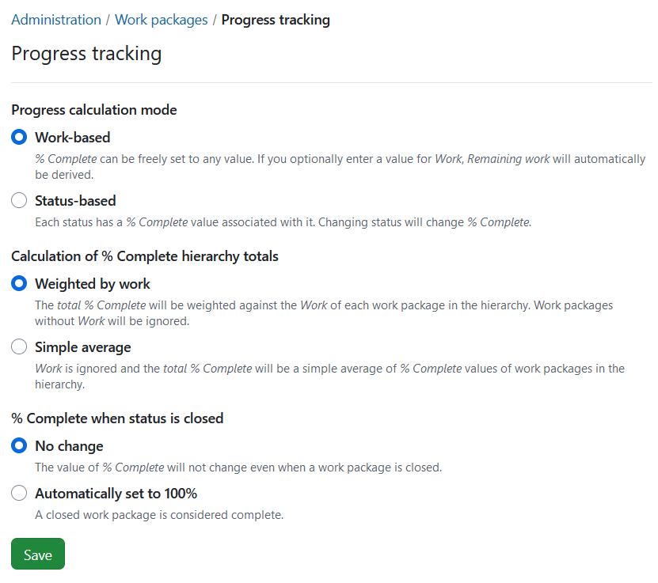
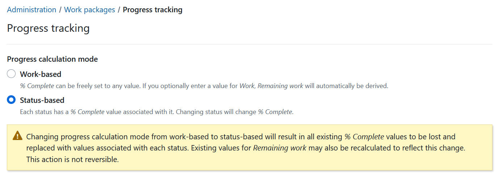

---

sidebar_navigation:
  title: Progress tracking
  priority: 965
description: Manage Work package progress tracking.
keywords: work package progress tracking, percentage complete, % complete
---

# Manage work package progress tracking

To manage the settings for progress tracking in work packages, navigate to  *Administration* → *Work packages → Progress tracking*. 

## Progress calculation mode
*Progress calculation mode* lets you select between *work-based* and *status-based* modes.

- **Work-based mode**: *%&nbsp;Complete* is either set manually or is automatically calculated based on *Work* and *Remaining work* values for that work package, both of which are then necessary to have a value for %&nbsp;Complete. Please refer to [progress tracking user guide](../../../user-guide/time-and-costs/progress-tracking/#work-based-progress-reporting) for more details and calculation examples.
- **Status-based mode**: you will have to define fixed %&nbsp;Complete values for each [work package status](../work-package-status), which will update automatically when team members update the status of their work packages.

 > [!NOTE]
 > When switching progress calculation mode from one to another, you will see a warning message.
 >
 > - Changing progress calculation mode from work-based to status-based will result in all existing *% Complete* values to be lost and replaced with values associated with each status. Existing values for *Remaining work* may also be recalculated to reflect this change. This action is not reversible.
 >
 > - Changing progress calculation mode from status-based to work-based will make % Complete a non-editable field whose value is derived from Work and Remaining work. Existing values for % Complete are preserved. If values for Work and Remaining work were not present, they will be required in order to change % Complete.

## Calculation of % Complete hierarchy totals

*Calculation of % Complete hierarchy totals* lets you determine how the values of the *% Complete* will be calculated in work package hierarchies.

- **Weighted by work**: The total *% Complete* will be weighted against the *Work* of each work package in the hierarchy. Work packages with no *Work* values are not included into the calculation.

- **Simple average**: The total *% Complete* is calculated by averaging the *% Complete* values of all work packages, regardless of their *Work* values. *Work* is not factored into the calculation.

## % Complete when status is closed

*% Complete when status is closed* lets you chose what happens to % Complete when you close a work package (even in the work-based mode).

- **No change** - if you select this option, the value of *% Complete* will not change even when a work package is closed.
- **Automatically set to 100%** - if you select this option, work package will be considered complete when closed.
