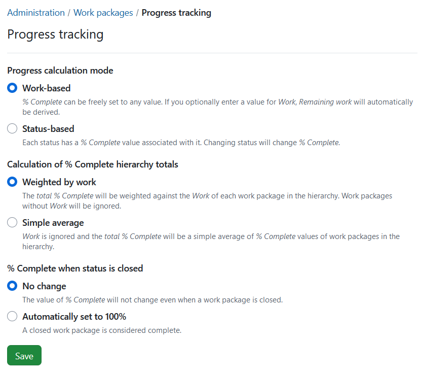
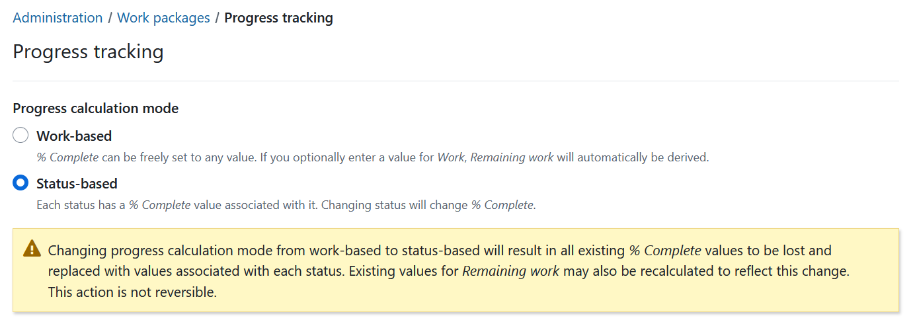

---

sidebar_navigation:
  title: Progress tracking
  priority: 400
description: Manage Work package progress tracking.
keywords: work package progress tracking, percentage complete, % complete
---

# Manage work package progress tracking

To manage the settings for progress tracking in work packages, navigate to  _Administration_ → _Work packages_ → _Progress tracking_. 

## Progress calculation mode

_Progress calculation mode_ lets you select between _work-based_ and _status-based_ modes.

- **Work-based mode**: _%&nbsp;Complete_ is either set manually or is automatically calculated based on _Work_ and _Remaining work_, if they exist. Please refer to [progress tracking user guide](../../../user-guide/time-and-costs/progress-tracking/#work-based-progress-reporting) for more details and calculation examples.
- **Status-based mode**: you will have to define fixed %&nbsp;Complete values for each [work package status](../work-package-status), which will update automatically when team members update the status of their work packages.

> [!NOTE]
> When switching progress calculation mode from one to another, you will see a warning message.
>
> - Changing progress calculation mode from work-based to status-based will result in all existing _% Complete_ values to be lost and replaced with values associated with each status. Existing values for _Remaining work_ may also be recalculated to reflect this change. This action is not reversible.
> - Changing progress calculation mode from status-based to work-based will make the _% Complete_ field freely editable. If you optionally enter values for _Work_ or _Remaining work_, they will also be linked to _% Complete_. Changing _Remaining work_ can then update _% Complete_.

## Calculation of % Complete hierarchy totals

_Calculation of % Complete hierarchy totals_ lets you determine how the values of the _% Complete_ will be calculated in work package hierarchies.

- **Weighted by work**: The total _% Complete_ will be weighted against the _Work_ of each work package in the hierarchy. Work packages with no _Work_ values are not included into the calculation.

- **Simple average**: The total _% Complete_ is calculated by averaging the _% Complete_ values of all work packages, regardless of their _Work_ values. _Work_ is not factored into the calculation.

## % Complete when status is closed

_% Complete when status is closed_ lets you chose what happens to % Complete when you close a work package (even in the work-based mode).

- **No change** - if you select this option, the value of _% Complete_ will not change even when a work package is closed.
- **Automatically set to 100%** - if you select this option, work package will be considered complete when closed.
