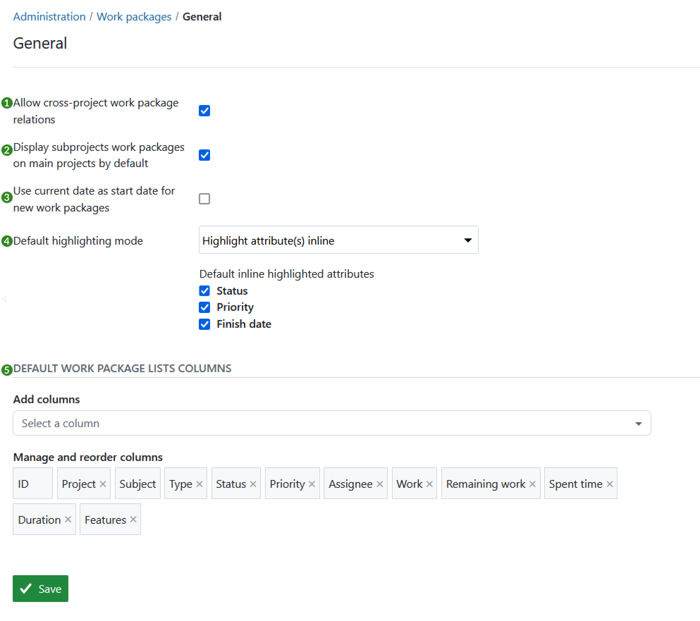
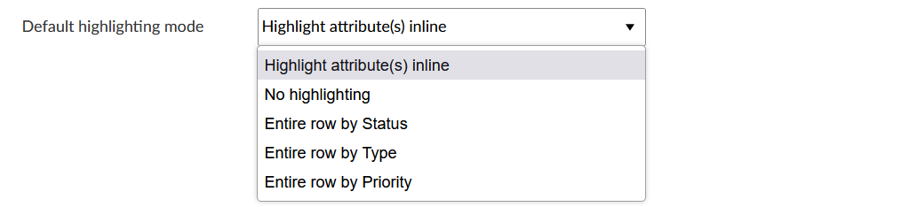

---
sidebar_navigation:
  title: Settings
  priority: 999
description: Work package settings in OpenProject.
keywords: work package settings, work package configuration
---
# Work package settings

To change basic settings for work package tracking in OpenProject, navigate to **Administration → Work packages → Work packages settings**.

You can adjust the following:

1. **Allow cross-project work package relations**, i.e. that work packages created in one project can have relations to work packages in another project, for example parent-children work packages.
2. **Display subprojects work packages in main projects** by default. This way the work packages of subprojects will always be visible in the main project if a user has the corresponding role in the subproject to see work packages.
3. **Use current date as start date for new work packages**. This way the current date will always be set as a start date if your create new work packages. Also, if you copy projects, the new work packages will get the current date as start date.
4. **Default highlighting mode** (Enterprise add-on) defines which should be the default [attribute highlighting](../../../user-guide/work-packages/work-package-table-configuration/#attribute-highlighting-enterprise-add-on) mode, e.g. to highlight the following criteria in the work package table. This setting is only available for Enterprise on-premises and Enterprise cloud users.

   

5. Customize the appearance of the work package lists to **define which work package attributes are displayed in the work package lists by default and in what order**.

Do not forget to save your changes with the green **Save** button at the bottom.
