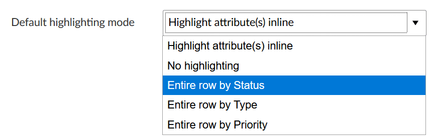
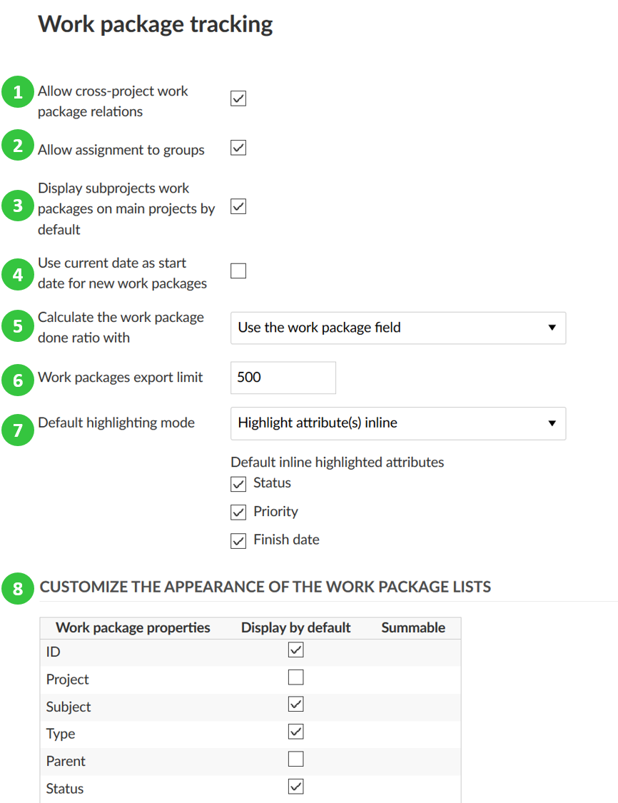

---
sidebar_navigation:
  title: Settings
  priority: 999
description: Work package settings in OpenProject.
robots: index, follow
keywords: work package settings
---
# Work package settings

To change basic settings for work package tracking in OpenProject, navigate to the -> *Administration* -> *Work packages* -> *Settings*.

You can adapt the following under settings:

1. **Allow cross-project work package relations**, i.e. that work packages  created in one project can have relations to work packages in another  project, for example parent-children work packages.

2. **Allow assignment of work packages to groups**. See [here](../../users-permissions/groups) how to manage groups.

3. **Display subprojects work packages in main projects** by default. This way the work packages of subprojects will always be visible in the main project if a user has the corresponding role in the subproject to see work packages.

4. **Use current date as start date for new work packages**. This way the current date will always be set as a start date if your create new work packages. Also, if you copy projects, the new work packages will get the current date as start date.

5. **Calculate the work package done ratio with** ... defines how the **Progress %** field is calculated for work packages. If you choose “disable”, the filed will not be shown. If you  select “Use the work package field”, the Progress % field can be manually set in 10% steps  directly in the work package  attribute. If you opt for „Use the work package status“, the Progress % field is chosen based on the [status of a work package](../work-package-status). In this case a % done value is assigned to every status (for example, “tested” is assigned 80%),  which is then adapted if the status changes.

6. **Work package export limit**. This setting defines how many work packages you can export at the same time, for example in the the work package lists.

7. **Default highlighting mode** (premium feature) defines which should be the default [attribute highlighting](../../../user-guide/work-packages/work-package-table-configuration/#attribute-highlighting-premium-feature) mode, e.g. to highlight the following criteria in the work package table. This setting is only available for Enterprise and Cloud Edition customers.

   

8. Customize the appearance of the work package lists to **define which work package properties are displayed in the work package lists by default** and for which properties sums are displayed.

Do not forget to save your changes with the blue **Save** button at the bottom.

