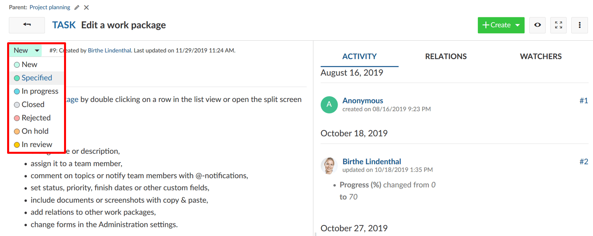
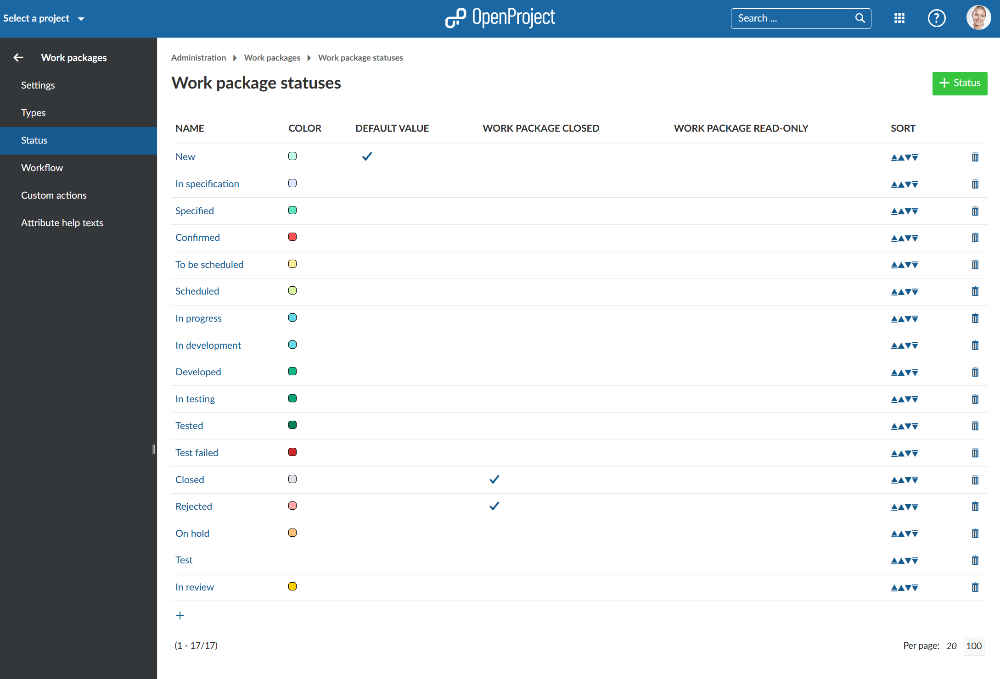
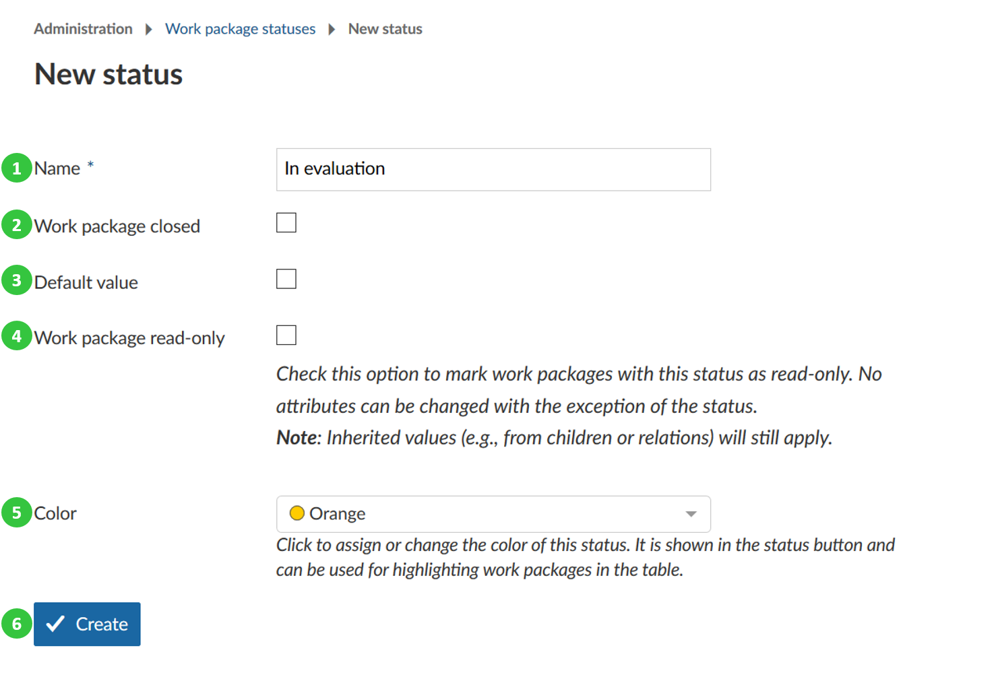
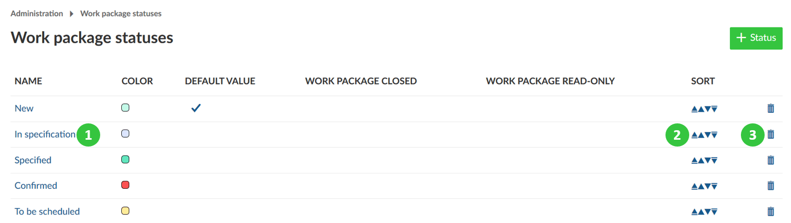

---
sidebar_navigation:
  title: Status
  priority: 970
description: Manage Work package status.
robots: index, follow
keywords: work package status
---

# Manage work package status

Work packages can have various status depending on their types, e.g. tasks can have the status new, in progress, done, on hold, rejected, closed. Or any other status which you would need.

The status can be set at the top of the work package details view or in the list view in the corresponding column.

The status field can be configured under *Administration ->* *Work packages* -> *Status*. You will see the list of all the existing work package status in the system. You can add new status or change the name and order of existing status. 
To learn about the options for configuring the transition from one status to another navigate to [Manage work package workflows](../work-package-workflows).

## Create a new work package status

To create a new work package status click the green ***+ New Status*** icon. 

A new window will open, where you will be able to specify the following:

1. Name the new work package status.
2. Define if the new work package status closes a work package (e.g. relevant when filtering for closed for packages), e.g. a work package status "rejected" will set a work package technically on closed and it will not appear in the default work package list with Open Work packages.
3. Define if this status is set as default value when creating new work packages. BEWARE: If you decide to set the new status as default it will impact all work packages, existing and future ones. See more below.
4. Check if this status sets a **work package in read-only mode**. This means no work package attributes can be changed except the status.
5. Set a **color** for the work package status. The color appears in the status button of the work packages or in the work package table.
6. Save the new status by clicking **Create**.

## Setting a new status as default value

When you decide to set the new status as default status please note the following impact it has:

- The default status value will affect all work packages.
- All work packages will have the new default status value set as their initial status value.
- OpenProject defined "New" as the default status value for work packages. That means it is the first status in the workflow of all standard work packages. If you change the default status value, you would also need to consider changing the workflow of all work packages as your new default status value will now be the first status in the workflow. Consequently, you need to define, what the next status in the workflow will be. Otherwise you will not be able to change a work package's status.

## Edit, re-order or remove a work package status

1. To **edit** an existing work package type click on the work package name. 
2. To **sort** the status, e.g. in the status drop-down list of the work packages, click on the arrows to move the status up or down in the list.
3. To **delete** the work package type click on the delete icon.

**Note**: A new status needs to be activated in the [work package workflows](../work-package-workflows) in order to appear in the status drop down of a work package.

