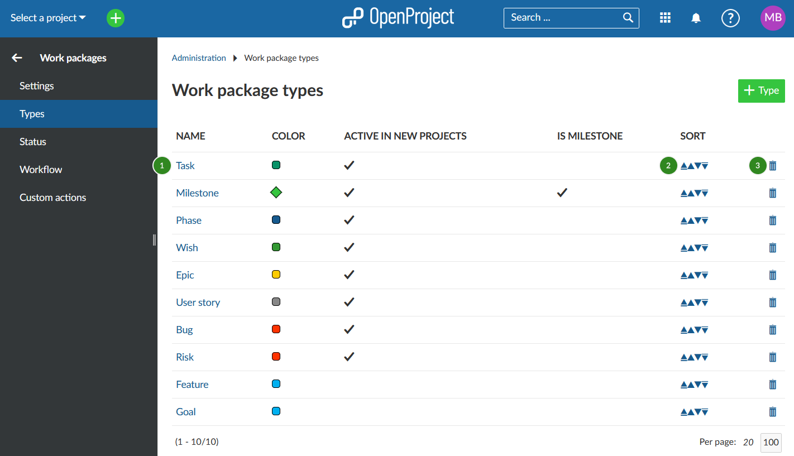
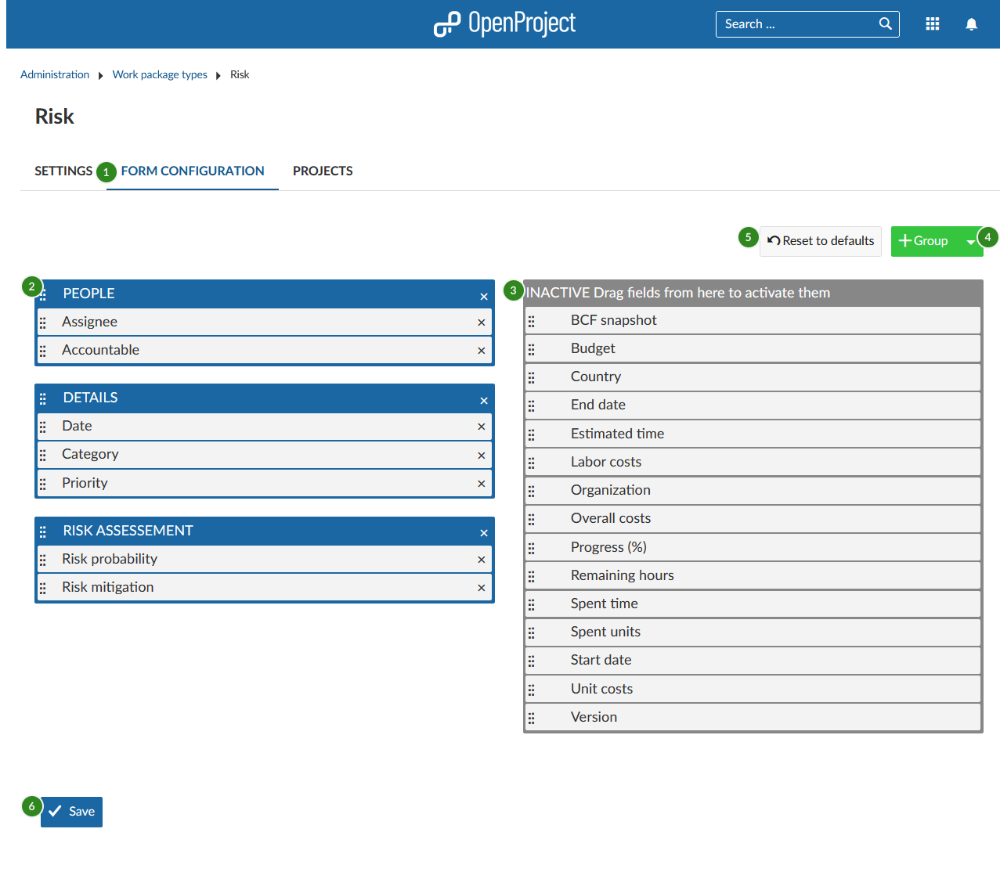
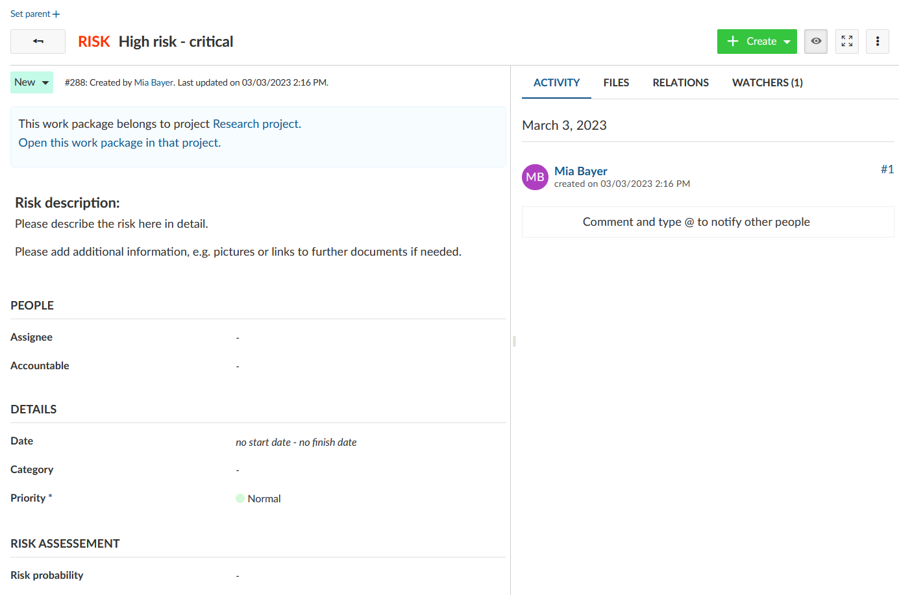
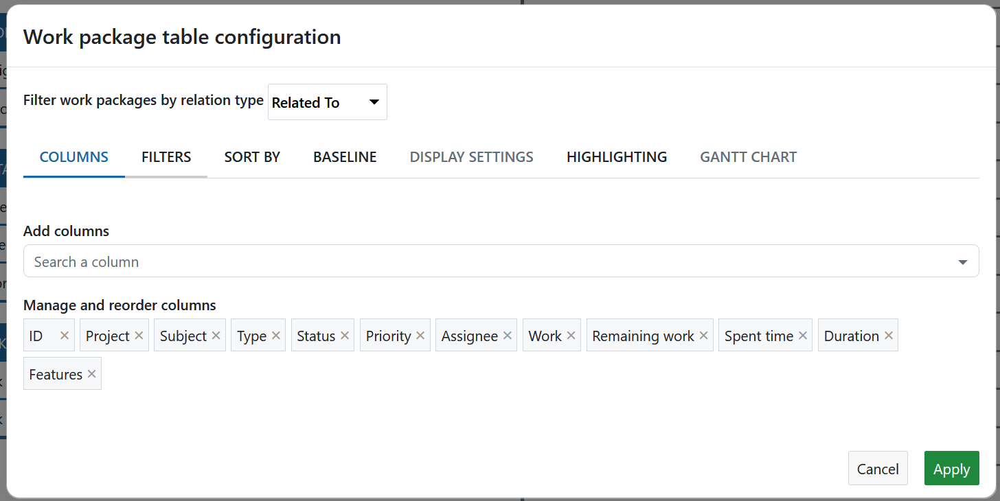
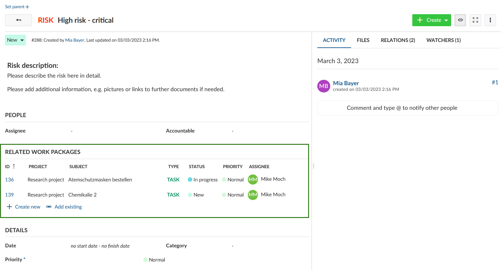

---
sidebar_navigation:
  title: Types
  priority: 980
description: Configure work package types in OpenProject.
keywords: work package types
---

# Manage work package types

You can have as many work package types in the system as needed, e.g. Tasks, Bugs, Ideas, Risks, Features.

In the **Administration -> Work packages -> Types** you can add or edit the work package types.

You will see a list of all work package types in the system.

1. Click the work package type name to **edit an existing work package type**.
2. Click the arrows (up or down) to change the order how work package types should be displayed, e.g. in the list when creating new work packages or when changing the type.
   The work package type you moved to the top of the list is the current default type and will be selected when you create a new work package.
3. Delete work package types.

## Create new work package type

Click the green **+ Type** button to add a new work package type in the system, e.g. Risk.

1. Give the new work package type a **name** that easily identifies what kind of work should be tracked.
2. Choose whether the type should be displayed in the [roadmap](../../../user-guide/roadmap/) by default.
3. Choose a **color** from the drop-down list which should be used for this work package type in the Gantt chart. You can configure new colors [here](../../colors).
4. Select if the work package type should be **active in new projects by default**. This way work package types will not need to be [activated in the project settings](../../../user-guide/projects/project-settings/work-package-types/) but will be available for every project.
5. Choose whether the type should be a **milestone**, e.g. displayed as a milestone in the Gantt chart with the same start and finish date.
6. You can **copy a [workflow](../work-package-workflows)** from an existing type.
7. You can enter a **default text for the work package description field**, which always be shown when creating new work package from this type. This way, you can easily create work package templates, e.g. for risk management or bug tracking which already contain certain required information in the description.
8. Click the **Create** button to add the new type.

## Work package form configuration (Enterprise add-on)

You can freely **configure the attributes shown** for each work package type to decide which attributes are shown in the form and how they are grouped.

> [!NOTE]
> Some parts of the Work package form configuration are an Enterprise add-on and only available for the [OpenProject Enterprise cloud](https://www.openproject.org/enterprise-edition/#hosting-options) and the [Enterprise On-premises edition](https://www.openproject.org/enterprise-edition/).
> The Enterprise edition allows you to customize form configuration with these additional features:
>
> - **Add new attribute groups**
> - **Rename attribute groups**
> - **Add table of related work packages to a work package form**

To configure a type, first select the type from the list of types (see above) and select the tab **Form configuration**.

Active attributes shown in blue color on the left will be displayed in the work package form for this type.
You can then decide for each attribute which group it should be assigned to (using drag and drop or removing it by clicking the remove  icon). You can also rename attribute groups simply by clicking on their name or re-order attribute groups with drag and drop.

Inactive attributes shown in the grey color on the right. Attributes which have been removed are shown in the **Inactive** column on the right. This column also includes [custom fields](../../custom-fields) which have been created. The custom fields also can be added with drag and drop to the active form (the blue part on the left) to be displayed in the form.

To add additional group, click the **+ Group** button and select **Add attribute group**. Give the new group a name. You can then assign attributes (e.g. custom fields) via drag and drop. Note that adding attribute groups is only possible with the [OpenProject Enterprise on-premises](https://www.openproject.org/enterprise-edition/) and the [OpenProject Enterprise cloud](https://www.openproject.org/enterprise-edition/#hosting-options).

In case you made a mistake, click the **Reset to defaults** button to reset all settings to the original state.

Finally, **save** the settings to apply them.

If you then create a new work package of this type, the input form will have exactly these attributes selected in the form configuration.

In this case, all attributes in the blue area on the left are displayed under the corresponding attribute group.

Watch the following video to see how you can customize your work packages with custom fields and configure the work package forms:

<video src="https://openproject-docs.s3.eu-central-1.amazonaws.com/videos/OpenProject-Forms-and-Custom-Fields-1.mp4" type="video/mp4" controls="" style="width:100%"></video>

## Add table of related work packages to a work package form (Enterprise add-on)

Also, you can add a table of related work packages to your work package form. Click the green **+ Group** button and choose **Add table of related work package** from the drop-down list.

> [!NOTE]
> Adding a table of related work package in OpenProject is an Enterprise add-on and can only be used with [Enterprise cloud](../../../enterprise-guide/enterprise-cloud-guide/) or [Enterprise on-premises](../../../enterprise-guide/enterprise-on-premises-guide/). An upgrade from the free Community edition is easily possible.

Now, you can configure which related work packages should be included in your embedded list, e.g. child work packages or work packages related to this work package, and more. Then you can configure how the list should be filtered, grouped, etc. The configuration of the work package table can be done according to the [work package table configuration](../../../user-guide/work-packages/work-package-table-configuration/).

Click the green **Apply** button to add this work package list to your form.

The embedded related work package table in the work package form will look like this. Here, the work packages with the chosen relation will be shown automatically (based on the filtered criteria in the embedded list) or new work packages with this relation can be added.

## Activate work package types for projects

Under **Administration -> Work packages -> Types** on the tab **Projects** you can select for which projects this work package type should be activated.

The **Activated for new projects by default** setting in the Types will only activate this type for new projects. For existing projects, the type needs to be activated manually.
This can be also configured in the [project settings](../../../user-guide/projects/project-settings).

