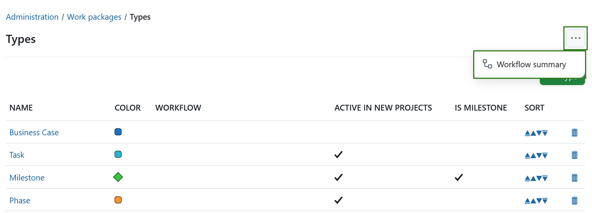
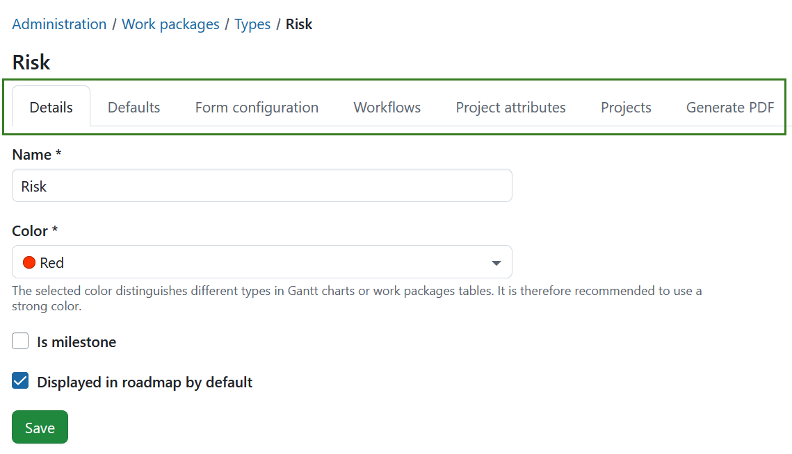

---
sidebar_navigation:
  title: Types
  priority: 800
description: Configure work package types in OpenProject.
keywords: work package types, work package form, related work package, work package table, relations, pdf export, automatic subject, workflows
---

# Manage work package types

In OpenProject, you can create and manage as many work package types as needed, such as Tasks, Bugs, Ideas, Risks, and Features.

To add or modify work package types, navigate to _Administration → Work packages → Types_.

Here, you will see a list of all existing work package types.

1. Click on a work package type name to **edit an existing type**.
2. Use the up and down arrows to **reorder work package types**. The type at the top of the list becomes the default and is automatically selected when creating a new work package.
3. Click the delete icon to **remove a work package type**.

### Workflow summary

On the work package types overview page, click the **(...)** menu in the upper-right corner and select **Workflow summary** to open an overview of the configured workflows.

For more information, see [Configure workflows](workflows/#workflow-summary).

## Create new work package type

Click the green **+ Type** button to add a new work package type in the system, e.g. Risk.

1. Give the new work package type a **name** that easily identifies what kind of work should be tracked.
2. Choose a **color** from the drop-down list which should be used for this work package type in the Gantt chart. You can configure new colors [here](../../design/#set-a-new-color).
3. Choose whether the type should be a **milestone**, e.g. displayed as a milestone in the Gantt chart with the same start and finish date.
4. Choose whether the type should be displayed in the [roadmap](../../../user-guide/roadmap/) by default.
5. Select if the work package type should be **active in new projects by default**. This way work package types will not need to be [activated in the project settings](../../../user-guide/projects/project-settings/work-packages/#work-package-types) but will be available for every project.
6. You can **copy a workflow** from an existing type.
7. Click the **Save** button to add the new type.

## Edit a work package type

To edit an existing work package type, select it from the list of work package types.

The configuration of a work package type is divided into seven tabs:

- **Details** — configure the basic settings of the work package type.
- **Defaults** — configure default text and automatic subjects for new work packages of this type.
- **Form configuration** — configure which attributes are displayed in the work package form and how they are arranged.
- **Workflows** — configure available statuses and status transitions for different roles. 
- **Project attributes** — configure which project attributes are displayed in work packages of this types.
- **Projects** — select the projects in which the work package type is activated. 
- **Generate PDF** — configure how work packages of this type are exported as PDF.

### Details

The **Details** tab contains the basic settings of the work package type. These are the same settings that are available when creating a new work package type.

### Defaults

The **Defaults** tab allows you to configure **default text for the work package description field**. This text is automatically displayed in the **Description** field when a user creates a new work package of this type. This way, you can easily create work package templates, e.g. for risk management or bug tracking, that already contain certain required information in the description.

In the Enterprise edition, you can also configure automatically generated work package subjects.

[feature: work_package_subject_generation ]

Please refer to [this guide](automatic-subjects) for a detailed description of automatically generated work package subjects in OpenProject.

### Form configuration

You can customize the work package form for each work package type to display the attributes most relevant to your team's workflow. Attributes can be added, removed, and arranged within the form as needed.

In the Enterprise edition, you can also create and rename sections and add a related work packages table.

[feature: edit_attribute_groups ]

To configure the work package form for a type, open the **Form configuration** tab.

For detailed instructions, see [Configure the work package form](form-configuration).

### Workflows

A workflow defines the status transitions that are available for a work package type and role.

To configure the workflow for a type, open the **Workflows** tab.

For detailed instructions, including default transitions, transitions when the user is the author or assignee, and the workflow summary, see [Configure workflows](workflows).

### Project attributes

You can display **[project attributes](../../projects/project-attributes/)** in a dedicated tab within work packages. This allows editing project-level information directly from a work package.

Please note that only users with necessary permissions can see or edit the project attributes within a work package.

To configure this, open the **Project attributes** tab.

For detailed instructions, see [Display project attributes in work package forms](project-attributes).

### Projects

The **Projects** tab allows you to select for which projects a work package type should be activated.

For detailed instructions, see [Activate work package types for projects](projects).

### Generate PDF

The **Generate PDF** tab allows you to configure how a single work package of this type is exported as a PDF.

For detailed instructions, see [Configure PDF exports for work package types](pdf-export).