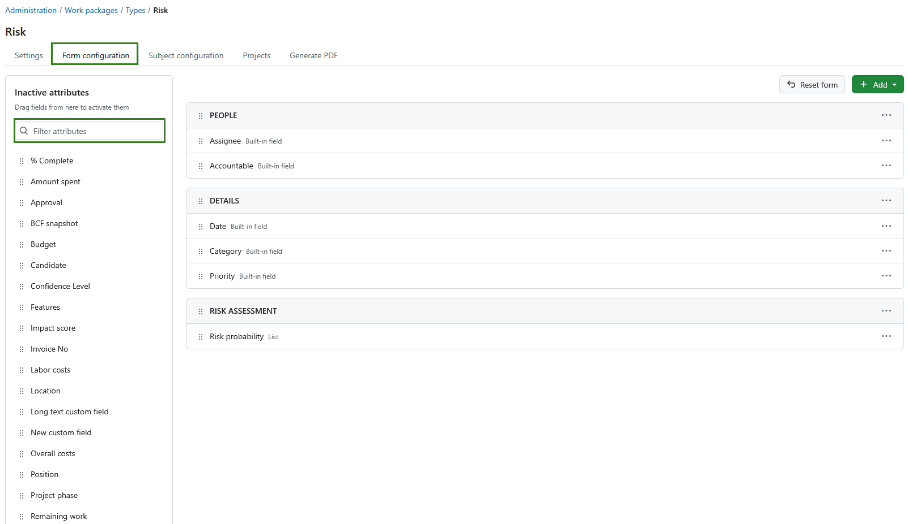
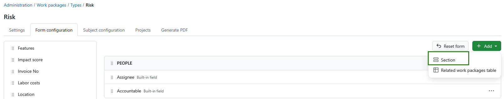
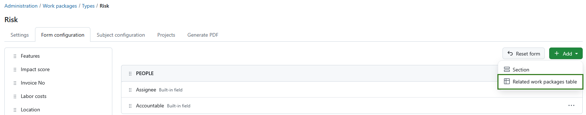
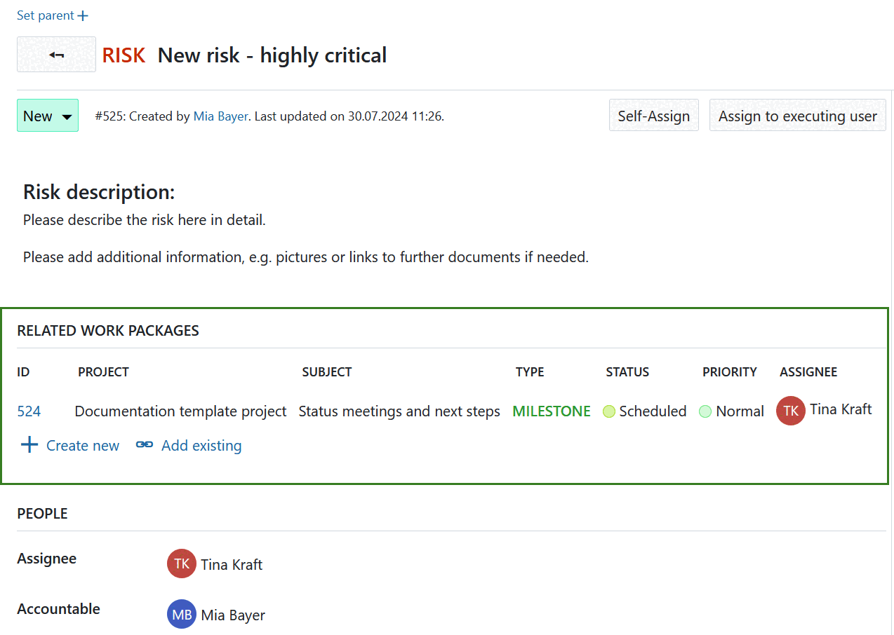

---
sidebar_navigation:
  title: Form configuration
  priority: 800
description: Configure work package forms for work package types in OpenProject.
keywords: work package form, form configuration, work package types, attributes, custom fields, related work packages
---

# Work package form configuration (Enterprise add-on)

You can customize the work package form for each work package type to display the attributes most relevant to your team's workflow. Attributes can be added, removed, and arranged within the form as needed.

In the Enterprise edition, you can also create and rename sections and add a related work packages table.

[feature: edit_attribute_groups ]

To configure the work package form for a type, navigate to **Administration → Work packages → Types**, select a type, and open the **Form configuration** tab.

The form preview on the right shows the attributes that are currently displayed when creating or editing work packages of this type. Attributes are organized into sections.

On the left side are all available attributes and [custom fields](../../../custom-fields) that are not currently used in the form. You can filter them using the search field.

To customize the form:

- Add attributes and custom fields by dragging them from the left side into the desired section.
- Remove attributes from the form using the **(...)** menu next to the attribute.
- Reorder attributes and sections using drag and drop or the available move options from the **(...)** menu.
- Rename sections using the **(...)** menu.

> [!NOTE]
> If you use custom fields, remember that they must also be activated for the relevant projects before they can be used.

To add a new section, click **+ Add** and select **Section**. Enter a name for the section and then drag attributes into it.

To add a related work packages table, click **+ Add** and select **Related work packages table**.

If you want to restore the default form layout for this type, click **Reset form**. This resets the entire form configuration, including all sections and attribute assignments.

Changes are saved automatically. Users creating or editing a work package of this type will see the form exactly as configured.

Watch the following video to see how you can customize your work packages with custom fields and configure the work package forms:

<video src="https://openproject-docs.s3.eu-central-1.amazonaws.com/videos/OpenProject-Forms-and-Custom-Fields-1.mp4"></video>

## Add table of related work packages to a work package form (Enterprise add-on)

You can add a related work packages table to your work package form. Click the **+ Add** button and select **Related work packages table**.

[feature: work_package_query_relation_columns ]

You can configure which related work packages should be displayed in the table, for example child work packages or work packages with a specific relation type. You can also define how the table is filtered, grouped, sorted, and displayed. Configure the table in the same way as a regular [work package table](../../../../user-guide/work-packages/work-package-table-configuration/).

When you have finished configuring the table, click **Apply** to add it to the form.

The related work packages table is then displayed directly in the work package form. It automatically shows work packages that match the configured relation and filters. Users can also create new related work packages directly from the table.

