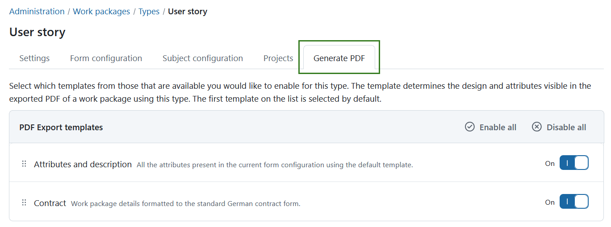

---
sidebar_navigation:
  title: Generate PDF
  priority: 400
description: Configure PDF exports for a work package type in OpenProject.
keywords: work package PDF, PDF export, work package types, PDF templates, PMflex Artefact, automatic artefact export
---

# Configure PDF exports for work package types

Under **Administration → Work packages → Types**, select a work package type and open the **Generate PDF** tab to configure how a single work package of this type is exported as a PDF. The tab contains two sections: the available export templates and the automatic artefact export.

## Activate templates for PDF exports

Here you can select which PDF export templates are available for this work package type.

The template determines the design and attributes visible in the exported PDF of a work package using this type. The first template on the list is selected by default.

Use the toggle next to a template to enable or disable it, or use **Enable all** and **Disable all** to switch every template at once. Changes are saved immediately.

Drag a template by its handle to change the order of the list. The order determines the sequence in the **Template** dropdown menu of the export dialog, and the first enabled template is preselected there.

If no template is enabled, users cannot generate a PDF for a work package of this type: the export dialog states that no template has been enabled and the download button stays disabled.

> [!TIP]
> See [work package PDF export guide](../../../../user-guide/work-packages/exporting/work-package-pdf/) for more details on what each of the templates contains.

## Automatic artefact export

In addition to exporting on demand, OpenProject can generate a PMflex Artefact PDF automatically whenever the status of a work package of this type changes. Select one of the following options:

- **Off** - no PDF is generated automatically. This is the default.
- **Save as work package file attachment** - the generated PDF is saved as a file attachment to the work package. The new attachment is also recorded in the work package Activity.
- **Upload file to external file storage and add file link to work package** - the generated PDF is uploaded to the project's automatically-managed Nextcloud storage and linked from the work package. Work packages in projects without such an external storage configured are skipped. This option can only be selected if an [automatically-managed Nextcloud storage](../../../files/external-file-storages/) is configured for the instance.

The selection is saved immediately.

> [!NOTE]
> The automatic export always uses the PMflex Artefact template, regardless of which templates are enabled for manual exports above.