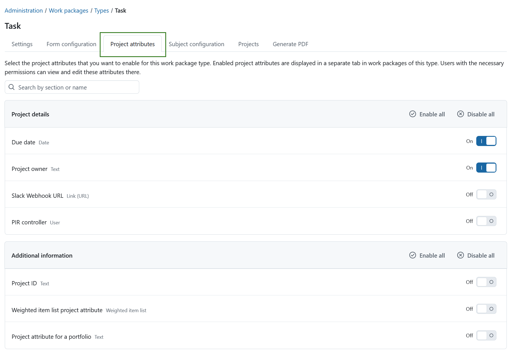

---
sidebar_navigation:
  title: Project attributes
  priority: 600
description: Configure which project attributes are displayed in work packages for a work package type in OpenProject.
keywords: project attributes, work package types, work package form, project overview, PDF export
---

# Display project attributes in work packages

You can display **[project attributes](../../../projects/project-attributes/)** in a dedicated tab within work packages. This allows editing project-level information directly from a work package.

Please note that only users with necessary permissions can see or edit the project attributes within a work package.

To configure this, go to **Administration → Work packages → Types**, select a work package type, open the **Project attributes** tab, and select which project attributes should be displayed for this work package type.

The tab lists all available project attribute sections and their attributes.

Use the On/Off toggle next to each project attribute to show or hide it in the **Project attributes** tab for the selected work package type.

You can also use the **Enable all** and **Disable all** buttons displayed next to each section title to show or hide all project attributes within that section at once.

If your instance contains many project attributes, use the search field to quickly find a specific attribute.

> [!NOTE]
> This setting only controls which project attributes are displayed in the **Project attributes** tab of a work package for the selected work package type. It does **not** affect which project attributes are displayed on the project's overview page. The project overview uses its own display configuration.
>
> Read more about configuring project attributes for the [project overview page](../../../../user-guide/projects/project-settings/project-attributes/).

> [!IMPORTANT]
>
> The same project attributes are used in both the project overview and work packages. Any changes made to a project attribute from within a work package are reflected **everywhere the attribute is displayed**.

Displaying project attributes in work packages is particularly useful for **PDF exports**, as the project attributes shown in the work package are also included in the exported document.