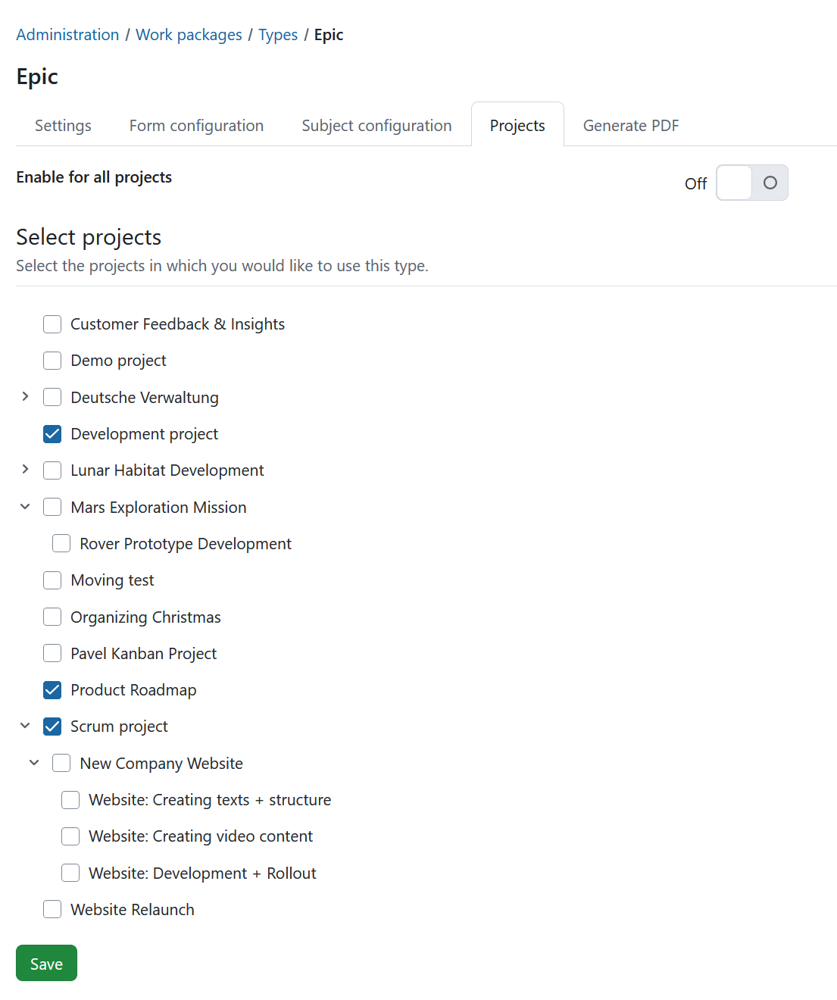

---
sidebar_navigation:
  title: Projects
  priority: 500
description: Configure for which projects a work package type is activated in OpenProject.
keywords: work package types, projects, activate work package type, project settings
---

# Activate work package types for projects

Under **Administration → Work packages → Types**, select a work package type and open the **Projects** tab to select for which projects the work package type should be activated.

The **Enabled for new projects by default** setting (which can be selected when creating or editing a work package type) only activates the type for newly created projects. It does not activate the type for existing projects.

For existing projects, work package types can also be activated manually in the [project settings](../../../../user-guide/projects/project-settings/). There, work package types can be enabled or disabled on a per-project basis.

To activate a work package type for all projects, enable the **Enable for all projects** switch.

If **Enable for all projects** is disabled, a list of projects is displayed. Select the projects for which the work package type should be available and click **Save**.

