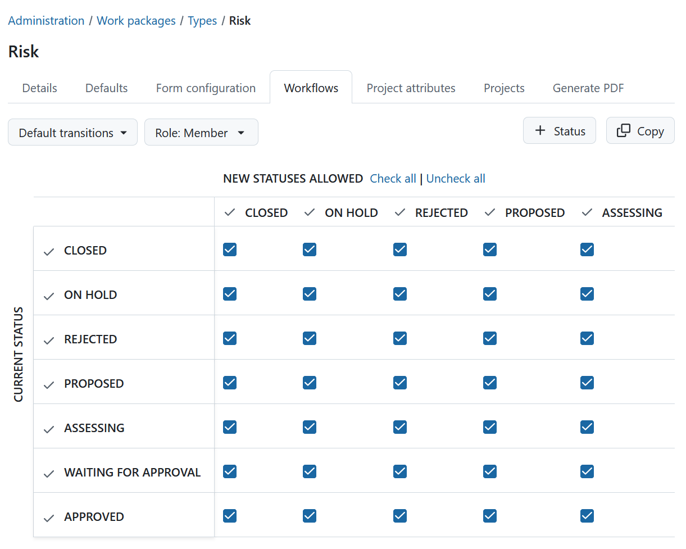
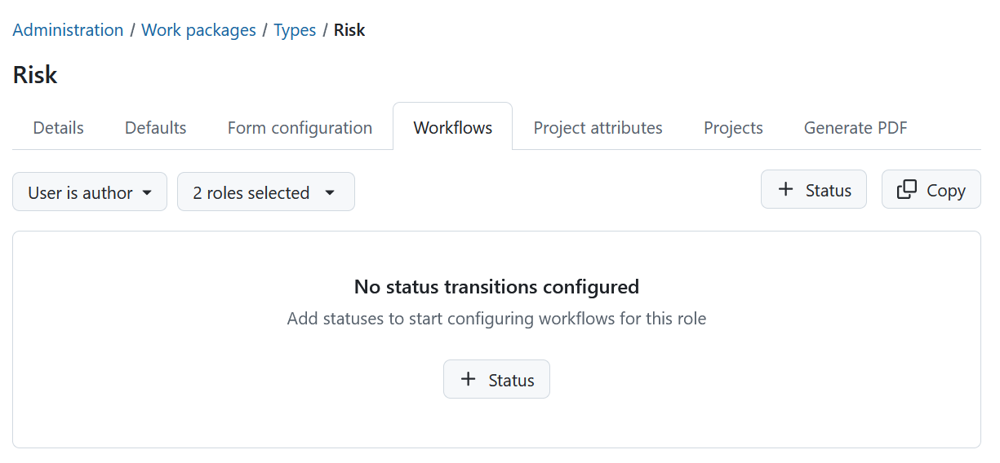
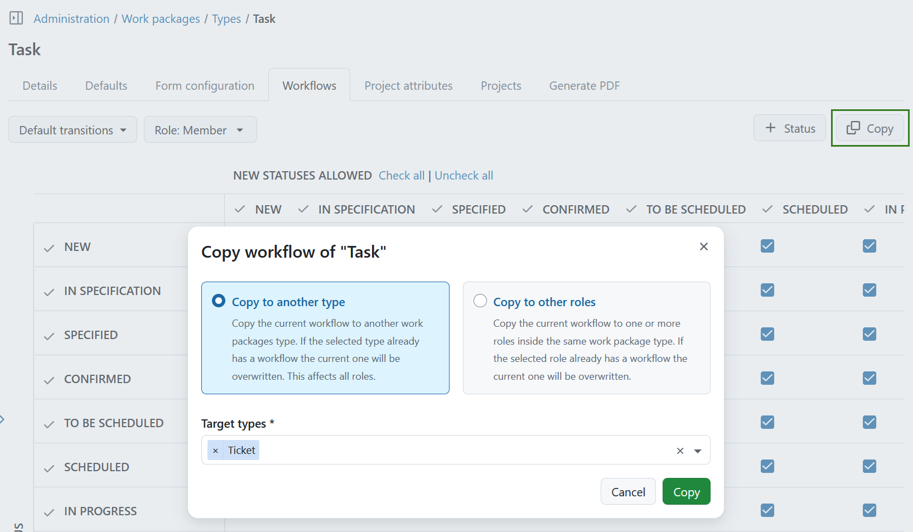

---

sidebar_navigation:
  title: Workflows
  priority: 700
description: Manage Work package workflows.
keywords: work package workflows
---

# Configure workflows

A **workflow** in OpenProject defines the allowed transitions between work package statuses for a role and a work package type.

This means that the available status transitions can differ depending on both the work package type and the user's [role in a project](../../../users-permissions/roles-permissions).

To configure a workflow, navigate to **Administration → Work packages → Types**, select the work package type you want to edit and open the **Workflows** tab.

## Configure status transitions

1. Select which transitions you want to configure from the **Workflow transitions** dropdown:
   - **Default transitions**
   - **User is author**
   - **User is assignee**

   **Default transitions** define the status changes that users with the selected role can make for work packages of this type.

   **User is author** and **User is assignee** allow you to configure additional status transitions that are available when the user is the author or assignee of the work package.

2. Select the **role** or **roles** for which you want to configure the workflow from the select panel. The workflow table will update automatically when switching roles. The role panel will also update to reflect the selected number of roles. When multiple roles are selected, the checkboxes of the workflow table assign transitions for all. When only some of the selected roles have the transition, the checkboxes are marked as partial.

   

3. Define which **statuses** are available for this type:
   - Click **+ Status** to add or remove statuses.
   - Select the statuses you want to associate with this type and apply your changes.
   - Removing a status will make it unavailable for this type and delete existing workflow transitions for it.
   - Newly added statuses will appear in the workflow table immediately and can be configured before saving.

> [!NOTE]
> If a status has no transitions configured, it will be removed automatically when saving.

4. Configure the allowed status transitions in the workflow table:
   - The matrix shows the **current status in the rows** and the **new status in the columns**.
   - Read transitions from rows to columns, e.g. if the cell at the intersection of **NEW (row)** and **IN PROGRESS (column)** is checked, a transition from **NEW → IN PROGRESS** is allowed.
   - To allow transitions in both directions, ensure both corresponding cells are checked.

5. Click **Save** to apply your changes.

If you try to leave the page with unsaved changes, OpenProject asks whether you want to save or discard them.

If no statuses are configured for a role yet, an empty state is shown asking that you add statuses.

## Copy an existing workflow

You can copy an existing workflow by clicking **Copy** in the workflow overview. You can choose between two options:

### Copy to another type

Select **Copy to another type** to copy the current workflow to one or more other work package types.

Select the **Target types** from the dropdown. You can select multiple target types.

If a selected type already has a workflow, the existing workflow will be overwritten. The workflow is copied for **all roles**.

### Copy to other roles

Select **Copy to other roles** to copy the current workflow to one or more roles within the same work package type.

The **Source role** is preselected and cannot be changed. Select one or more **Target roles** from the dropdown.

If a selected target role already has a workflow, the existing workflow will be overwritten.

The copied workflow can be modified afterwards to adjust the transitions between statuses for the target type or role.

## Workflow summary

The workflow summary provides an overview of the configured status transitions across work package types and roles.

To open it, navigate to **Administration → Work packages → Types**, click the **(...)** menu in the upper-right corner and select **Workflow summary**.

Select a **work package type** and **role** to see the corresponding workflow.

The workflow summary displays the current status in the rows and the possible new statuses in the columns. The checkmarks indicate which status transitions are allowed for the selected combination of work package type and role.

> [!TIP]
> For more examples of using workflows in OpenProject, see [this blog article](https://www.openproject.org/blog/status-and-workflows/).