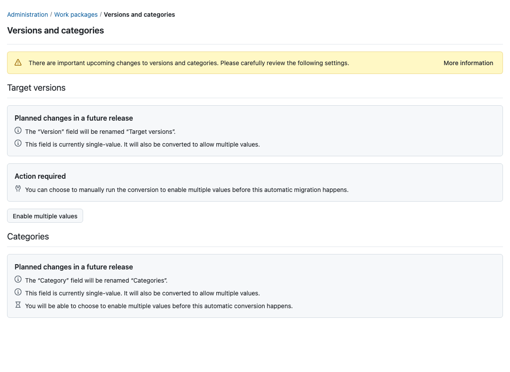
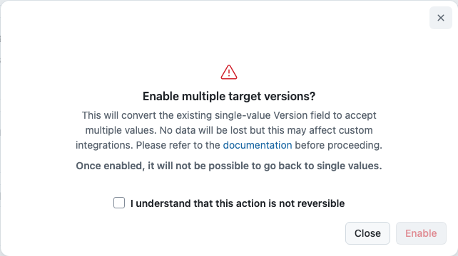

---
sidebar_navigation:
  title: Multiple target versions
  priority: 860
description: Enable multiple target versions on work packages and prepare API clients for the change.
keywords: target versions, multiple versions, version field, versions and categories, migration
---

# Multiple target versions

The **Version** field on work packages is being renamed **Target versions** and converted from a single-value field to a multi-value field. A work package can then be assigned to more than one version at a time, for example when a fix ships in several release lines or a feature spans two milestones.

For existing instances this conversion does not happen silently. Administrators can run it manually at a time of their choosing, before it is applied automatically in a future release. This page describes the change, how it affects users and API clients, and how to run the migration.

> **Note**: Enabling multiple target versions is **not reversible**. Once work packages can hold several target versions, there is no unambiguous way to reduce them back to a single value.

## What is changing

| Before                                 | After                                                 |
| -------------------------------------- | ----------------------------------------------------- |
| Field is named **Version**             | Field is named **Target versions**                    |
| A work package has at most one version | A work package can have any number of target versions |

The **Category** field will undergo a similar change (renamed **Categories**, converted to multiple values) in a later release. The settings page already announces this; no action is possible or required for categories yet.

## How users are impacted

- The field appears as **Target versions** everywhere it was previously labelled **Version**: work package forms, tables, filters, exports and notifications.
- The field accepts multiple values. Users who only ever assign one version can keep working exactly as before.
- Existing assignments are untouched: a work package that had version "Sprint 3" before the conversion has the target version "Sprint 3" after it.

## Migration guide

The conversion happens in one of three ways, whichever comes first:

1. **Manually from the administration UI.** Navigate to _Administration → Work packages → Versions and categories_. While the conversion is still pending, the **Target versions** section offers an **Enable multiple values** button behind a confirmation dialog that spells out the irreversibility. The conversion then runs as a background job; the page reports progress and completion by itself. On most instances it finishes within seconds.

   

   

2. **Through the configuration.** The setting behind the switch is `work_package_multiple_versions` and can be set through the configuration file or an environment variable, like any other setting (see [advanced configuration](../../installation-and-operations/configuration/)). When overridden this way, the settings page explains that the switch is controlled by the configuration and does not offer the button.

   ```shell
   OPENPROJECT_WORK__PACKAGE__MULTIPLE__VERSIONS=true
   ```

3. **Automatically.** A future OpenProject release will apply the conversion during the upgrade on instances that have not enabled it yet. The release notes will announce which version this is. Enabling manually beforehand lets you pick the moment and validate your integrations at your own pace.

During the conversion, work packages whose version assignment needed to be repaired receive a system-generated journal entry so their change history stays consistent. No notifications are sent for these entries.

## Updating API clients

Work packages in API v3 carry versions in two link properties:

- **`targetVersions`** is the new authoritative property: an array of version links.
- **`version`** remains for compatibility and continues to hold a single version link derived from the target versions.

A work package response contains both:

```json
{
  "_links": {
    "version": {
      "href": "/api/v3/versions/10",
      "title": "Sprint 3"
    },
    "targetVersions": [
      {
        "href": "/api/v3/versions/10",
        "title": "Sprint 3"
      },
      {
        "href": "/api/v3/versions/479",
        "title": "Sprint 1"
      },
      {
        "href": "/api/v3/versions/520",
        "title": "Version shared globally in project"
      }
    ]
  }
}
```

To write target versions, send the array in a form or PATCH request:

```json
{
  "lockVersion": 2,
  "_links": {
    "targetVersions": [
      { "href": "/api/v3/versions/10" },
      { "href": "/api/v3/versions/479" }
    ]
  }
}
```

Clients that read or write only the single `version` link keep working after the conversion. Clients that manage version assignments should switch to `targetVersions` to see and set all values. The work package schema advertises which of the two attributes forms should present, so schema-driven clients adapt automatically.

### Filters

- The existing `version` filter matches work packages that have the given version among their target versions.
- Once multiple target versions are enabled, an additional `targetVersion` filter is available with the same semantics.
- Both filters support the usual list operators as well as the open, closed and locked version status operators.

<!-- TODO (docs team): please review the API section and expand it once the remaining API changes are finalized. -->
