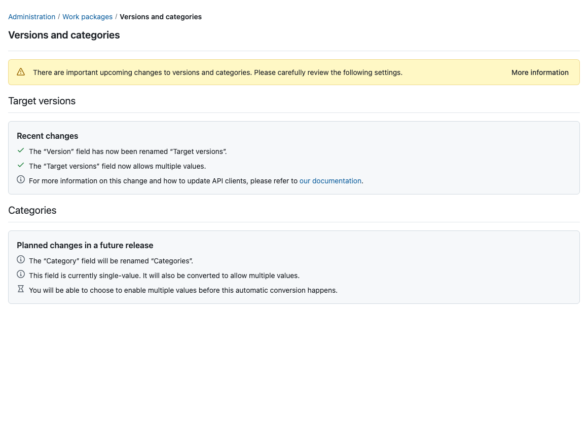

---
sidebar_navigation:
  title: Multiple target versions
  priority: 860
description: Enable multiple target versions on work packages and prepare API clients for the change.
keywords: target versions, multiple versions, version field, versions and categories, migration
---

# Multiple target versions

The **Version** field on work packages is being renamed **Target versions** and converted from a single-value field to a multi-value field. This lets a work package be assigned to more than one version at a time, for example when a fix ships in several release lines.

For existing instances this conversion does not happen silently. Administrators are informed about the upcoming changes and can choose to run the conversion manually before it is applied automatically in a future release. This page explains what changes, how to enable multiple values, and what API clients need to know.

> **Note**: Enabling multiple target versions is **not reversible**. Once a work package can hold several target versions, there is no unambiguous way to reduce it back to a single value.

## What is changing

| Before | After |
|--------|-------|
| Field is named **Version** | Field is named **Target versions** |
| A work package has at most one version | A work package can have any number of target versions |

The **Category** field will undergo a similar change (renamed **Categories**, converted to multiple values) in a later release. The settings page already announces this; no action is possible or required for categories yet.

## Versions and categories settings page

Navigate to _Administration → Work packages → Versions and categories_.

A warning banner at the top of the page announces the upcoming changes. The **More information** button leads back to this page.

The **Target versions** section shows one of three states:

### Action required

The conversion has not run yet. The section lists the planned changes and offers an **Enable multiple values** button.


Clicking **Enable multiple values** opens a confirmation dialog. Because the conversion cannot be undone, you have to confirm a checkbox before the **Enable** button becomes active.


### Conversion in progress

After confirming, the conversion runs as a background job and the section shows a progress indicator. The page updates itself; there is no need to reload. On most instances the conversion completes within seconds.

### Recent changes

Once the conversion has finished, the section confirms that the field has been renamed and now allows multiple values.



## What the conversion does

- Every existing version assignment is preserved: a work package that had version "Sprint 3" before the conversion has the target version "Sprint 3" after it.
- Work packages whose version assignment needed to be repaired during the conversion receive a system-generated journal entry, so their change history stays consistent. No notifications are sent for these entries.
- The conversion is one-way. There is no switch to return to single-value versions.

## Enabling via configuration file

The setting behind the switch is `work_package_multiple_versions`. Like any other setting it can be set through the configuration file or an environment variable instead of the user interface:

```yaml
# config/configuration.yml
work_package_multiple_versions: true
```

```shell
OPENPROJECT_WORK__PACKAGE__MULTIPLE__VERSIONS=true
```

When the setting is overridden this way, the settings page explains that the switch is controlled by the configuration and does not offer the **Enable multiple values** button. See [advanced configuration](../../installation-and-operations/configuration/) for how settings map to environment variables.

## Updating API clients

Work packages in API v3 expose target versions in two ways:

- The `targetVersions` link collection carries all target versions of a work package. Clients can write it by sending an array of version links.
- The single `version` link remains available for compatibility with existing clients.

The work package schema advertises which of the two attributes forms should present, depending on whether multiple target versions are enabled on the instance.

Clients that only read the `version` link keep working after the conversion. Clients that manage version assignments should switch to `targetVersions` to see and set all values.

<!-- TODO (docs team): expand with request/response examples and filter guidance once the API changes are finalized. -->
