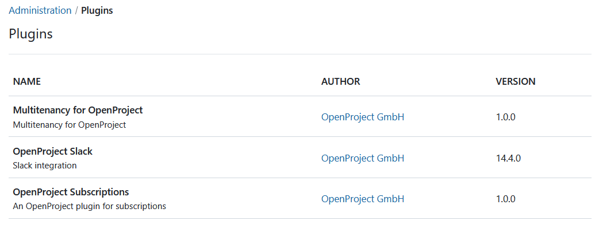

---
sidebar_navigation:
  title: Plugins
  priority: 300
description: Configure plugins in OpenProject.
keywords: plugins
---
# Plugins

The OpenProject configurations contains a certain amount of plugins which are listed under *Administration* -> *Plugins*.

We recommend to use the plugins as suggested in our deployment packages. You will get more detailed information (about current changes, author, etc.) if you follow the links.

If you want to write your own plugin, please follow our respective [development guide](../../development/create-openproject-plugin).
