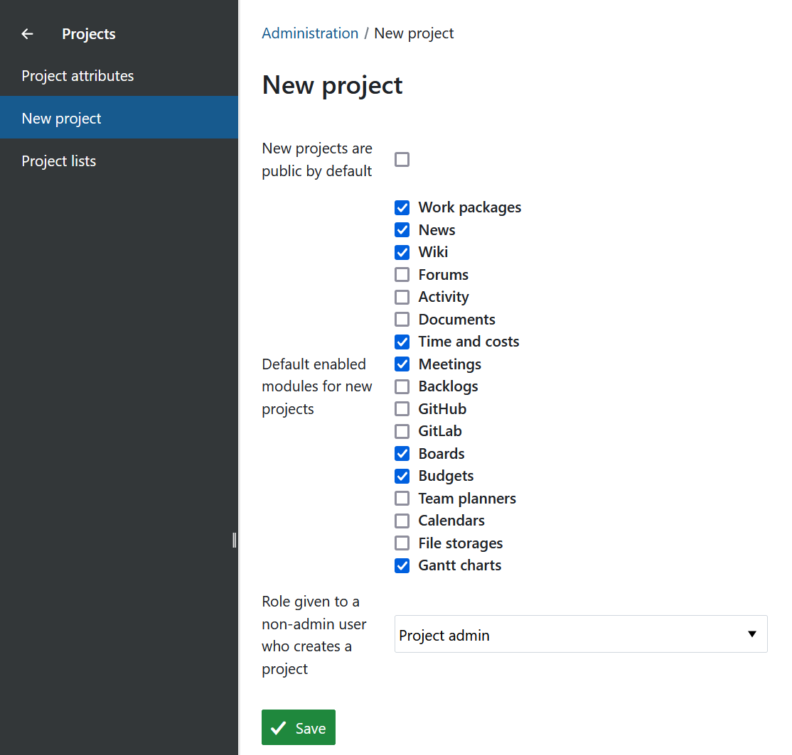

---
sidebar_navigation:
  title: New project
  priority: 200
description: Choose which modules are enabled by default for new projects and the role given to non-admin users who create a project
keywords: new project, settings, default, modules
---

# New project

To set defaults for new projects, navigate to **Administration settings** → **Projects** → **New project**.

You will find the following options on this page:

**New projects are public by default**: Check this option to make new projects public by default when they are created. If this is unchecked, all new projects will be private by default and will have to be marked as public manually.

- **Default enabled modules for new projects:** The checked modules will be enabled by default when a new project is created. Project admins can enable or disable specific modules later.
- **Role given to a non-admin users who creates project**: The default role you want to assign *in the project* to the user that created it (if this user is not an instance admin). By default, the default role is 'Project admin'.

Once you make your modifications, click on **Save** to apply the settings instance-wide.
