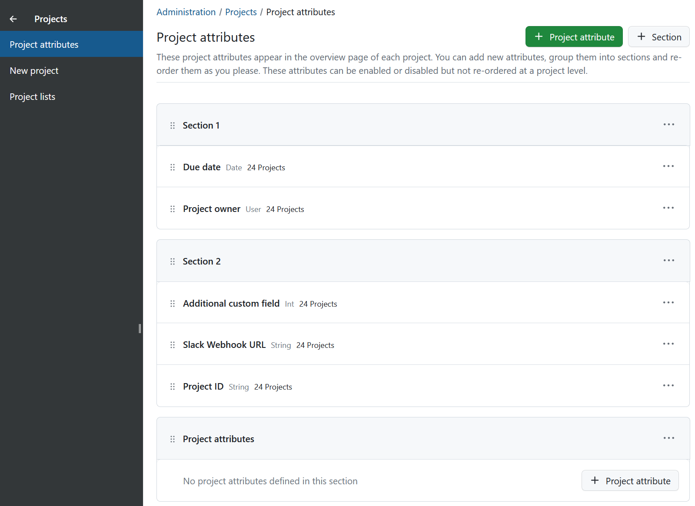
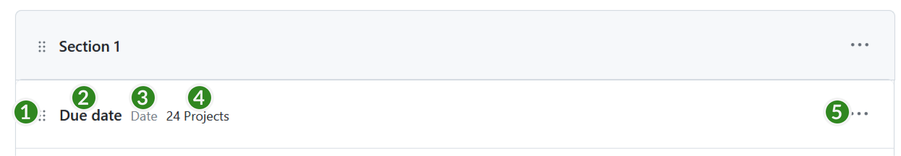
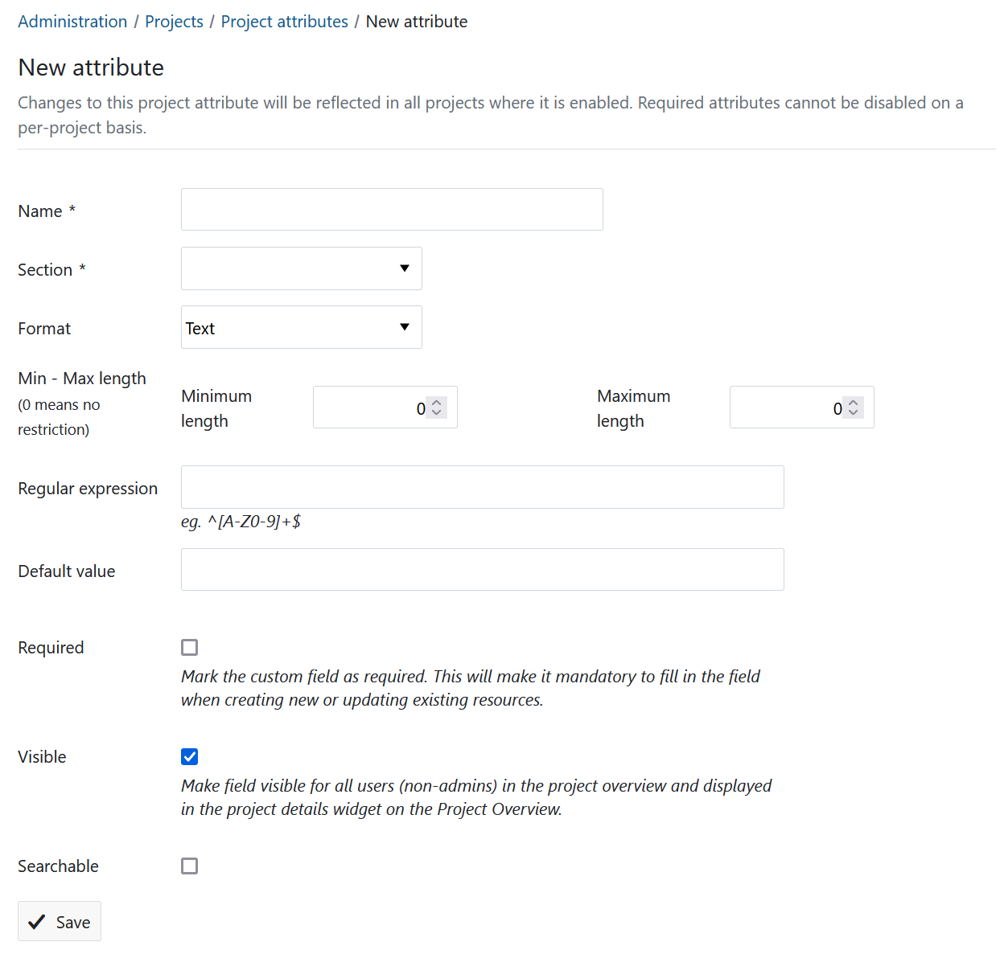
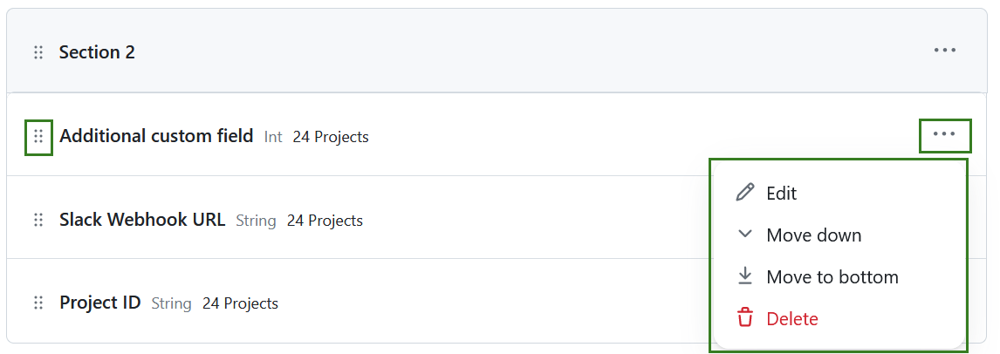
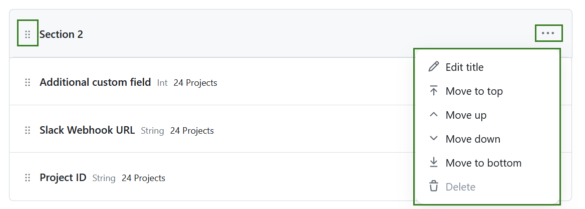

---
sidebar_navigation:
  title: Project attributes
  priority: 300
description: Viewing, creating and modifying project attributes in OpenProject
keywords: project attributes, create, project settings
---

# Project attributes (Enterprise add-on)

> **Please note:** Project attributes are an Enterprise add-on and will only be displayed here for Enterprise on-premises and Enterprise cloud.

Project attributes are custom fields that allow you to communicate key information relevant to a project in the [Project Overview](../../../user-guide/project-overview) page.

>**Note**: Prior to version 14.0, these were called "project custom fields" and described under the [Custom fields](../../custom-fields/custom-fields-projects/) page. Starting with 14.0, there is now a new entry in the administration section called 'Project attributes' under 'Projects'. 

This page describes how to create, order and group project attributes and is directed at instance administrators. If you want know how to enable and set the values for project attributes at a project level, please refer to the [Project Overview](../../../user-guide/project-overview) page of the user guide.

## View project attributes

To view all existing project attributes, navigate to **Administration settings** → **Projects** → **Project attributes**. 

Each project attribute will be displayed in individual rows, which contain:

1. The drag handle
2. The project attribute name
3. Format
4. Number of projects using the attribute
5. More button

Attributes may also be contained in [sections](#sections). 

## Create a project attribute
To create a new project attribute, click on the **+ Project attribute** button in the top right corner. 

This will display the "New attribute" form with these options:

- **Name**: This is the name that will be visible in the [Project Overview](../../../user-guide/project-overview) page.

- **Section:** If there are sections, you can pick where this new project attribute should appear. [Learn about sections](#sections) for more information.

- **Format**: You can pick from nine different types of fields: text, long text, integer, float, list, date, boolean, user and version. 

  > **Note**: You cannot change this once the project attribute is created.

- **Format options:** Depending on the type you choose, you might have additional options, such as minimum and maximum width, default value or regular expressions for validation.

- **Required**: Checking this makes this project attribute a required field in projects where it is enabled, i.e. it cannot be left empty.

- **Visible**: Checking this field makes the attribute visible to non-admins. 

  > **Note**: This is enabled by default. Only disable this if you want this field to be invisible to non-admin users.

- **Searchable**: Checking this makes this project attribute (and its value) available to the search engine and filters.

## Modify project attributes 

You can edit existing attributes under **Administration settings** → **Projects** → **Project attributes**.

Click on the  More icon to the right of each project attribute to edit, re-order or delete a project attribute. 

>**Note:** Deleting a project attribute will delete it and the corresponding values for it from all projects.

You can also use the drag handles to the left of each project attribute to drag and drop it to a new position. 

>**Note**: Project admins can chose to enable or disable a project attribute from their project, but they cannot change the order. The order set in this page is the order in which they will appear in all projects.

## Sections

You can group project attributes into sections to better organise them. 

You can click on more icon to the right of each section to rename it, delete it or change its order.

> **Note**: A section can only be deleted if no project attributes were assigned to it.

You can drag any existing project attribute into a section to move it there. You may also drag and drop entire sections up and down to re-order them.

>**Note:** If a project attribute belongs to a section, it will be displayed within that section in _all_ projects. 

