---
sidebar_navigation:
  title: Project attributes
  priority: 300
description: Viewing, creating and modifying project attributes in OpenProject
keywords: project attributes, create, project settings, attribute help text, help text, help attribute, hierarchy, calculated value, weighted item list
---

# Project attributes

Project attributes are custom fields shown on the [Project home](../../../user-guide/projects/project-home/) page. They allow you to communicate key information relevant to a project.

> [!NOTE]
> Prior to version 14.0, these were called "project custom fields" and described under the [Custom fields](../../custom-fields/#add-a-custom-field-to-one-or-multiple-projects) page. Starting with 14.0, they are referred to as _project attributes_.

This page describes how instance administrators can create, order, and group project attributes, and assign them to projects. For instructions on editing project attribute values within a project, see the [Project home](../../../user-guide/projects/project-home/) page.

## View project attributes

To view all existing project attributes, navigate to **Administration settings** → **Projects** → **Project attributes**.

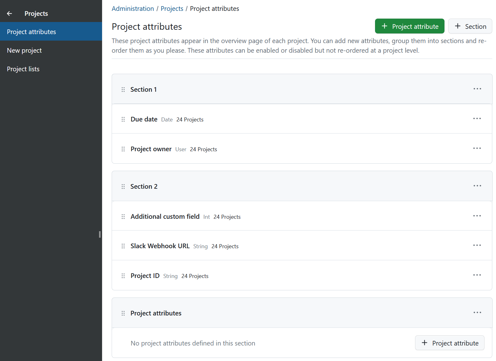

Project attributes are organized into [sections](#sections). Each attribute row contains:

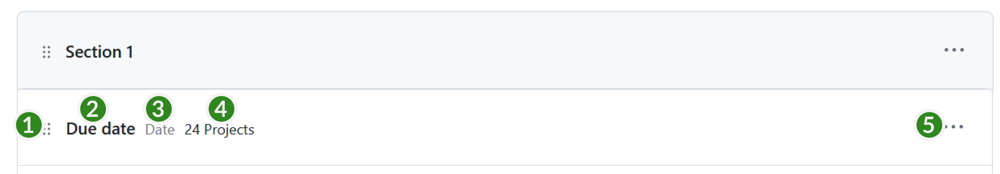

1. Drag handle
2. Project attribute name
3. Format
4. Number of projects using the attribute
5. More button

An empty section will display a button to add a project attribute.

## Sections

At least one section must exist before project attributes can be created.

To add a section:

1. Click **+ Add** in the top right corner.
2. Select **Section**.

Name the section and save it.

Each section includes a location selector defining where it appears on the Project home page:

- **Side panel** — Shows the section and its attributes in the right-hand panel.
- **Main area** — Shows the section and its attributes as a widget in the central area.

Use the **More** menu on the right side of the section header to rename, delete, or reorder a section.

> [!TIP]
> A section can only be deleted if it contains no attributes.

Attributes can be dragged between sections. Entire sections can be reordered via drag and drop. Use the drag and drop handle to the left of the section name.

> [!TIP]
> Attributes always appear in the section they are assigned to across _all_ projects.

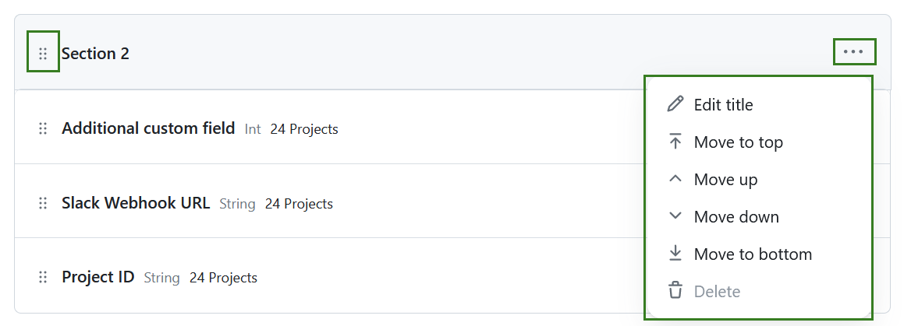

## Create a project attribute

To create a new project attribute, click on the **+ Add** button in the top right corner, select **Project attribute** and select the project attribute format from the list of available options.

> [!IMPORTANT]
> You cannot change the project attribute format once the project attribute is created.

You can pick from multiple [project attribute formats](#project-attribute-formats). Depending on the chosen format, you can define additional parameters, such as minimum and maximum width, default value or regular expressions for validation.

This is an example of new project attribute with a format _List_.

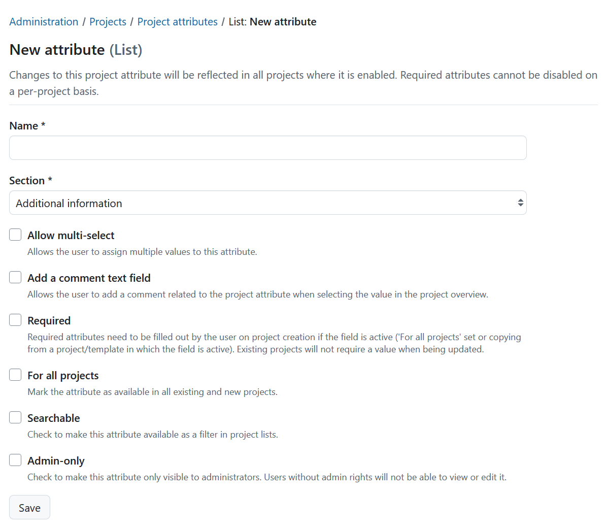

- **Name**: This is the name that will be visible in the [Project home](../../../user-guide/projects/project-home/) page, if the custom field is activated on that project.

- **Section:** If there are sections, you can pick where this new project attribute should appear. [Learn about sections](#sections) for more information.

- **Allow multi-select**: Allows the user to assign multiple values to this custom field.

- **Add a comment text field**: Allows the user to add a comment related to the project attribute when selecting the value in the project overview.

- **Possible values**: Add, define, arrange or remove possible values for this project attribute.

- **Required**: Checking this enables this project attribute and makes it required for all projects. It cannot be deactivated at a project level. Existing projects will not require a value when being updated.

  > [!IMPORTANT]
  >
  > Project attributes of type **Boolean** and **Calculated value** can **NOT** be set to be required.

- **For all projects**: Mark the attribute as available in all existing and new projects.

- **Admin-only**: If you enable this, the project attribute will only be visible to administrators. All other users will not see it, even if it is activated in a project.

- **Searchable**: Checking this makes this project attribute (and its value) available as a filter in project lists.

Once you create a project attribute, you can [enable it for specific projects](#enable-project-attributes) and [define help text](#define-project-attribute-help-text).

## Project attribute formats

There are multiple format options for project attributes in OpenProject. You can select one of the following formats:

- **Boolean** - creates a project attribute, that is either true or false. It is represented by a checkbox that can be checked or unchecked.
- **Calculated value** (Enterprise add-on) - creates a project attribute that enables automatic computations based on formulas using numeric project attributes, for example from **Weighted item lists**.
- **Date** - creates a project attribute, which allows selecting dates from a date picker.
- **Float** - creates a project attribute for rational numbers.
- **Hierarchy (Enterprise add-on)** -  creates a project attribute, which allows selecting one or multiple items from a hierarchical list structure. The structure can be created in the _Items_ tab of the project attribute.
- **Integer** - creates a project attribute for integers.
- **Link (URL)** - creates a project attribute for URLs.
- **List** - creates a project attribute with flat list options.
- **Text** - creates a project attribute in text format with the specified length restrictions.
- **Long text** - creates a project attribute for cases where longer text needs to be entered.
- **User** - creates a project attribute, which allows selecting users that are allowed to access the entity containing the project attribute.
- **Version** - creates a project attribute, which allows selecting one or multiple versions. Versions are created on the project level in _Backlogs_ module.
- **Weighted item list (Enterprise add-on)** - creates a project attribute similar to the _Hierarchy_ type, but with underlying numerical values used for project evaluation (e.g., **calculated values project attributes**. Please keep in mind that **weighted item lists** custom fields can't be used as multi-select.

### Hierarchy project attribute (Enterprise add-on)

[feature: custom_field_hierarchies ]

Project attributes of the **Hierarchy** type function in the same way as work package custom fields of the **Hierarchy** type. For detailed information, please refer to [Work package custom fields documentation](../../custom-fields/#hierarchy-custom-field-enterprise-add-on).

### Weighted item list project attribute (Enterprise add-on)

[feature: weighted_item_lists ]

Weighted item list project attributes function similarly to the **Hierarchy** type. They let you define a structured list of items arranged in a hierarchy for users to choose from.

To set up a project attribute of the **Weighted item list** type, follow the same procedure as when adding a standard project attribute and select the Weighted item list option.

Adding and modifying items within a weighted item list works in the same way as for a hierarchy project attribute.

In contrast to Hierarchy, items in a weighted item list do not include a Short value but instead require a Weight.

This numeric value is required and can be used in calculations — for example, within a project attribute of type Calculated value

### Calculated value project attribute (Enterprise add-on)

[feature: calculated_values ]

**Calculated values** enable automatic computations based on formulas using numeric and boolean project attributes, including scores from Weighted item lists or even other calculated values. The computed result is displayed directly on the project overview and in the project list. It automatically updates whenever one of its source attributes (e.g., Benefit or Effort in the example below) is changed. This allows teams to calculate project scores and prioritize consistently across the portfolio.

To set up a project attribute of the **Calculated value** type, follow the same procedure as when adding a standard project attribute and select the _Calculated value_ option. Define the name, section it will appear in and the calculation formula.

In the example below, a project attribute called **Initiative score (calculated)** is determined by this formula: `(Strategic fit * 0.4) + (User benefit * 0.4) - (Effort * 0.2)`.

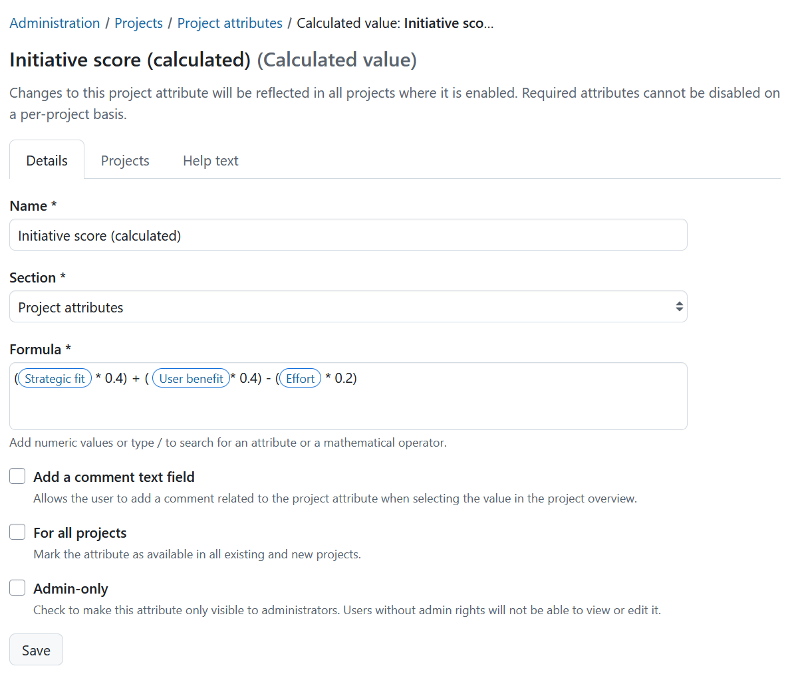

#### Understanding formulas for Calculated value attributes

When you create a "Calculated value" project attribute, you write a formula that does the math for you, similar to a formula in a spreadsheet. The formula can pull in numbers from other project attributes (like integers, decimals, yes/no fields, weighted list scores, or even other calculated values) and combine them.

Here's a plain-language guide to what you can put in a formula.

##### Basic values you can type in

- **Numbers**: whole numbers like `42`, or decimals like `3.14` or `.1`.
- **True/False**: written in all caps as `TRUE` or `FALSE`.

##### Order of operations (what gets calculated first)

Just like in math class, some operations happen before others. Multiplication happens before addition, for example. If you want to force something to happen first, wrap it in parentheses.

- `5 + 3 * 2` gives you `11` (the multiplication happens first)
- `(5 + 3) * 2` gives you `16` (the parentheses force the addition first)

##### Math symbols you can use

| Symbol | What it does | Example |
|---|---|---|
| `+` | Adds two numbers | `1 + 2` → `3` |
| `-` | Subtracts one number from another | `5 - 2` → `3` |
| `-` (in front of a number) | Flips a number negative | `-x` |
| `*` | Multiplies | `4 * 3` → `12` |
| `/` | Divides | `9 / 3` → `3.0` |
| `%` | Finds the remainder after dividing | `7 % 3` → `1` |
| `%` (after a number) | Turns a number into a percentage | `7 + 1%` → `7.01` |
| `^` | Raises a number to a power | `9 ^ 0.5` → `3.0` |

##### Useful built-in calculations

| Name | What it does | Example |
|---|---|---|
| `ABS` | Strips the negative sign off a number | `ABS(-5)` → `5` |
| `AVG` | Averages the numbers you give it | `AVG(1, 2)` → `1.5` |
| `MAX` | Picks the biggest number | `MAX(3, 1, 2)` → `3` |
| `MIN` | Picks the smallest number | `MIN(3, 1, 2)` → `1` |
| `ROUND` | Rounds to the nearest whole number (or to however many decimals you specify) | `ROUND(1.5)` → `2` |
| `ROUNDDOWN` | Always rounds down | `ROUNDDOWN(1.5)` → `1` |
| `ROUNDUP` | Always rounds up | `ROUNDUP(1.5)` → `2` |
| `SUM` | Adds up all the numbers you give it | `SUM(1, 2, 3)` → `6` |

##### Comparing two values

These check whether something is true and give you back `TRUE` or `FALSE`.

| Symbol | What it checks | Example |
|---|---|---|
| `<` | Is the first number smaller? | `1 < 2` → `TRUE` |
| `>` | Is the first number bigger? | `2 > 1` → `TRUE` |
| `<=` | Is it smaller or equal? | `2 <= 2` → `TRUE` |
| `>=` | Is it bigger or equal? | `2 >= 2` → `TRUE` |
| `<>` or `!=` | Are they different? | `1 != 2` → `TRUE` |
| `=` or `==` | Are they the same? | `2 = 2` → `TRUE` |

##### Combining true/false conditions

These only work with `TRUE`/`FALSE` values (not numbers).

| Name | What it does | Example |
|---|---|---|
| `AND` | True only if everything you give it is true | `TRUE AND TRUE AND FALSE` → `FALSE` |
| `OR` | True if at least one thing you give it is true | `FALSE OR FALSE OR TRUE` → `TRUE` |
| `NOT` | Flips true to false and vice versa | `NOT(TRUE)` → `FALSE` |
| `XOR` | True only if an odd number of things are true | `XOR(TRUE, FALSE, FALSE)` → `TRUE` |

##### Making decisions in a formula

**`IF`** — pick one of two outcomes depending on a condition:

`IF(1 > 2, 123, 456)` → since `1 > 2` is false, this gives `456`

**`SWITCH`** — check a value against a list of possibilities, and use the matching result:

`SWITCH(200, 100, 1, 200, 2, 3)` → `200` matches the second option, so this gives `2`

(If none of the options match and you didn't provide a fallback default at the end, the formula is invalid.)

**`CASE ... WHEN ... THEN ... ELSE ... END`** — does the same thing as `SWITCH`, just written differently:

`CASE 200 WHEN 100 THEN 1 WHEN 200 THEN 2 ELSE 3 END` → `2`

(If nothing matches and there's no `ELSE`, the formula is invalid.)

**Example put together**: a formula like `(Strategic fit * 0.4) + (User benefit * 0.4) - (Effort * 0.2)` takes three project attributes, weights each one, and combines them into a single score — useful for ranking projects by priority.

## Modify project attributes

You can edit existing attributes under **Administration settings** → **Projects** → **Project attributes**.

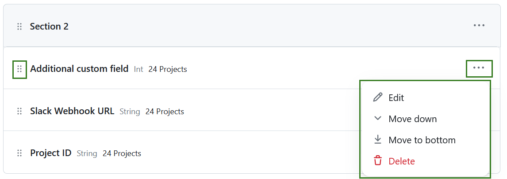

Click on the  More icon to the right of each project attribute to edit, re-order or delete a project attribute.

> [!CAUTION]
> Deleting a project attribute will delete it and the corresponding values for it from all projects.

You can also use the drag handles to the left of each project attribute to drag and drop it to a new position.

> [!NOTE]
> Project admins can chose to enable or disable a project attribute from their project, but they cannot change the order. The order set in this page is the order in which they will appear in all projects.

## Enable project attributes

Under **Administration settings** → **Projects** → **Project attributes** select the _More_ menu and select _Edit_ or simply clicking on the name of the project attribute. This will open a detailed view of the project attribute you selected.

The _Details_ tab will allow you to edit the name, section and visibility, and enable a comment text field.

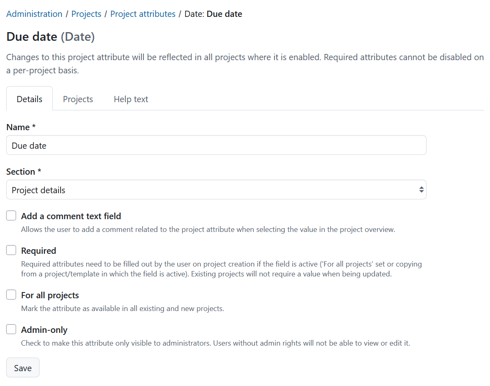

The _Projects_ tab will show a list of all the projects this project attributes was activated in.

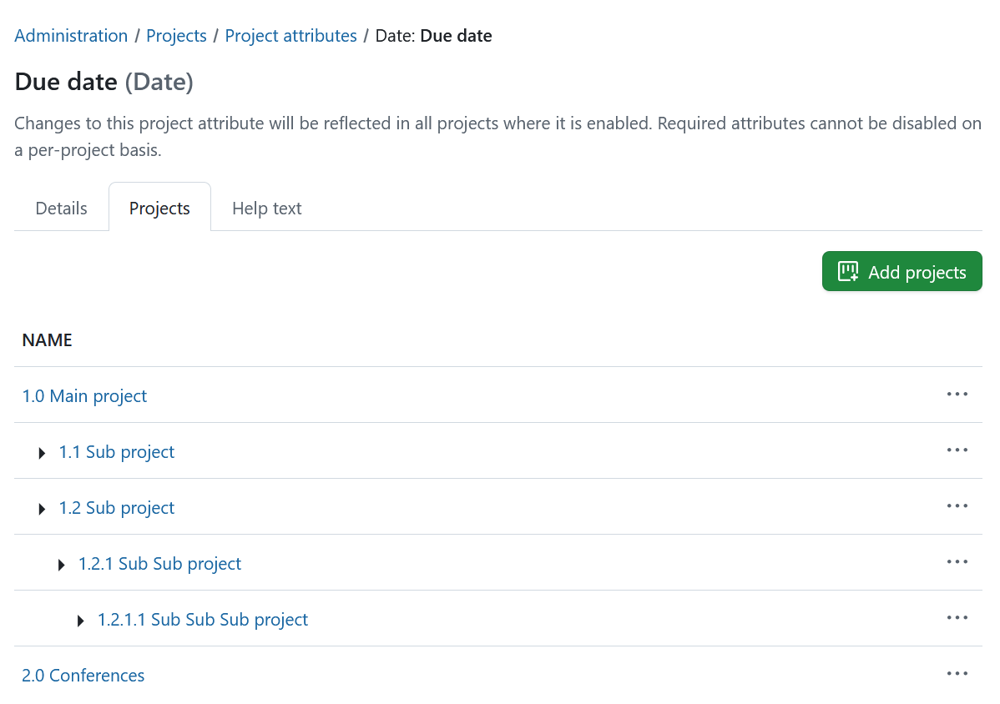

You can remove a project attribute from a specific project by selecting the **More** menu at the end of the line and clicking the _Remove from project_ option.

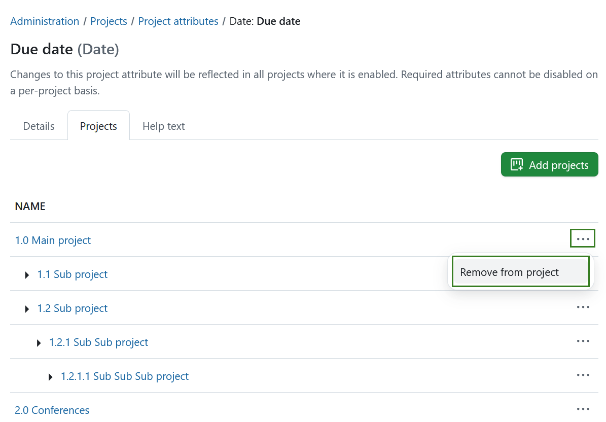

To add this project attribute to a specific project click the **+Add projects** button. A modal will appear allowing you to search for projects to add this project attribute into. Please note that the projects in which the project attribute is already activated will be shown disabled in that selection. You can include subprojects.

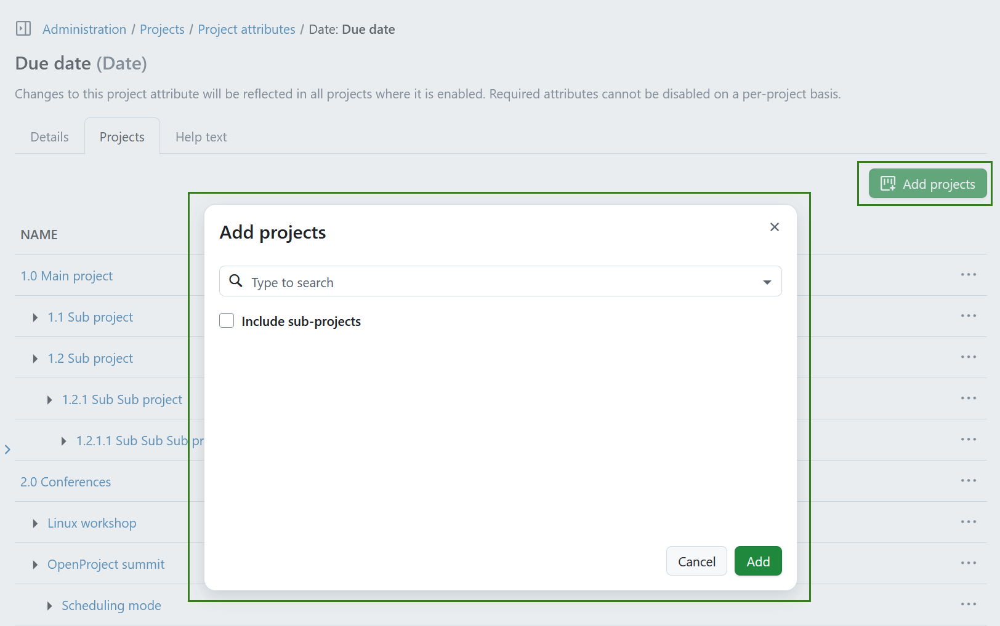

> [!NOTE]
> It is not possible to add or remove a project attribute, if a project attribute is set to be required.

## Define project attribute help text

To define field caption and help text click on a project attribute and navigate to **Help text** tab. Here you can define the following:

- **Caption** - a short text that will be displayed as project attribute caption to provide context.
- **Help text** - a longer text that will be shown when a user hovers over a question mark next to the project attribute name. Here you can provide more detailed explanation. This is a required field.
- **Attachments** - attach files or images to illustrate a project attribute.

> [!IMPORTANT]
> Any text and images you add here will be publicly visible to all logged in users.

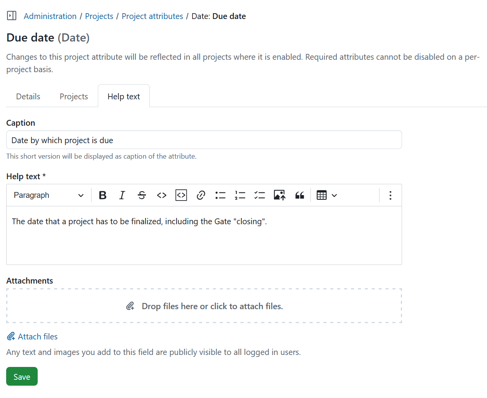
