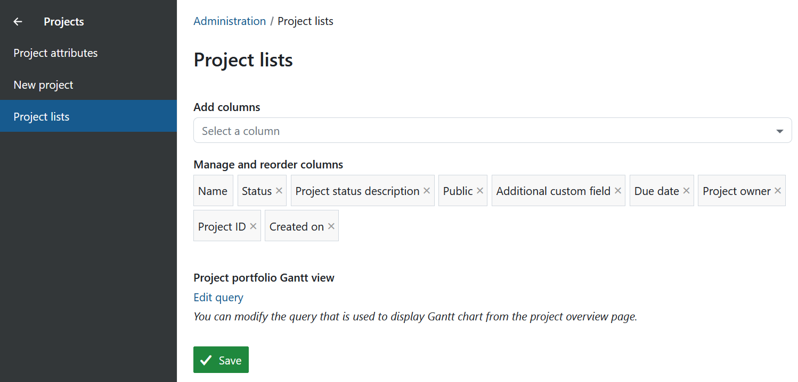
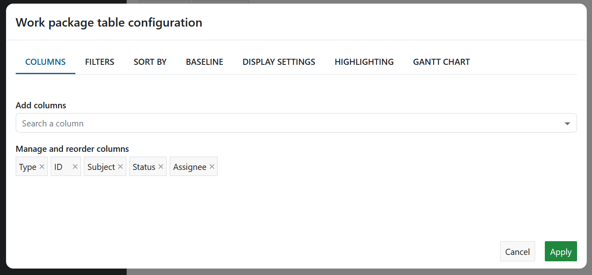

---
sidebar_navigation:
  title: Project lists
  priority: 100
description: Define which project attributes should be visible as columns in the cross-project global project lists and Gantt views
keywords: project attributes, project lists, columns, gantt
---

# Project lists

OpenProject lets users access Project lists, which allow them to get an overview of all projects to which they have access. This page describes how to modify the columns displayed in each project list. For more information on using project lists, read our [user guide on Project lists](../../../user-guide/projects/project-lists).

To configure project lists, navigate to **Administration settings** → **Projects** → **Project lists**.

## Modify and add columns

> [!NOTE]
>
> The ability to configure which project attributes are visible as columns in project lists is an Enterprise add-on and will only be displayed here for Enterprise on-premises and Enterprise cloud.

Here, you can view a list of *chips*, or little rectangles with names of project attributes. Each one represents a column in the Project list tables. You can drag and drop these around to change the order in which they appear.

To add a new project attribute as a column, click on the field with the label **Add columns** (where it says *Select a column*). You will be shown a list of existing project attributes. You can type in a keyword to search through this list and find the project attribute you would like to add.

## Project portfolio Gantt view

OpenProject lets users view a list of projects as a Gantt chart. You can edit the default query that is used to display this Gantt chart by clicking on the **Edit query** link. This displays a modal that lets you modify the visible the columns, filters, sort order and other view configuration options.

