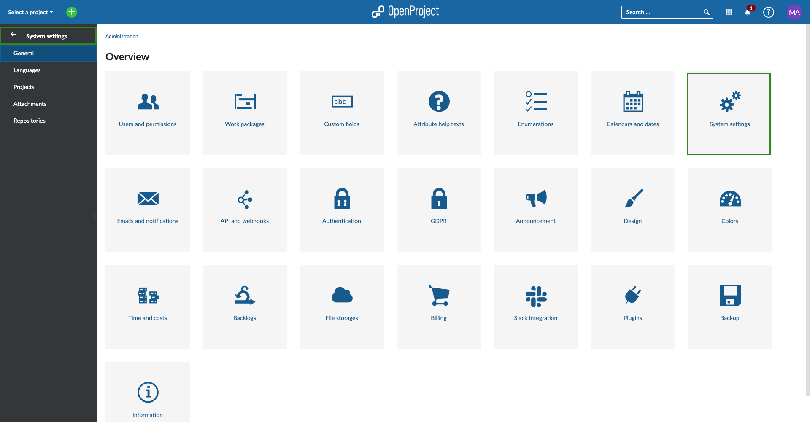

---
sidebar_navigation:
  title: System settings
  priority: 930
description: System settings in OpenProject.
keywords: system settings
---
# System settings

System settings allow you to configure a number of options concerning your OpenProject installation, such as host name, languages, defaults for new work package and projects and file attachments.

To modify these settings, navigate to **Administration → System settings**.

## Overview

| Topic                              | Content                                                      |
| ---------------------------------- | :----------------------------------------------------------- |
| [General](general-settings)        | How to configure general system settings, e.g. a welcome text block on the application landing page, attachment size, and much more. |
| [Languages](languages)             | How to configure languages.                                  |
| [Project](project-system-settings) | Settings for new projects.                                   |
| [Attachments](attachments)         | Settings for attachments.                                    |
| [Repositories](repositories)       | How to integrate SVN or GIT repositories.                    |

