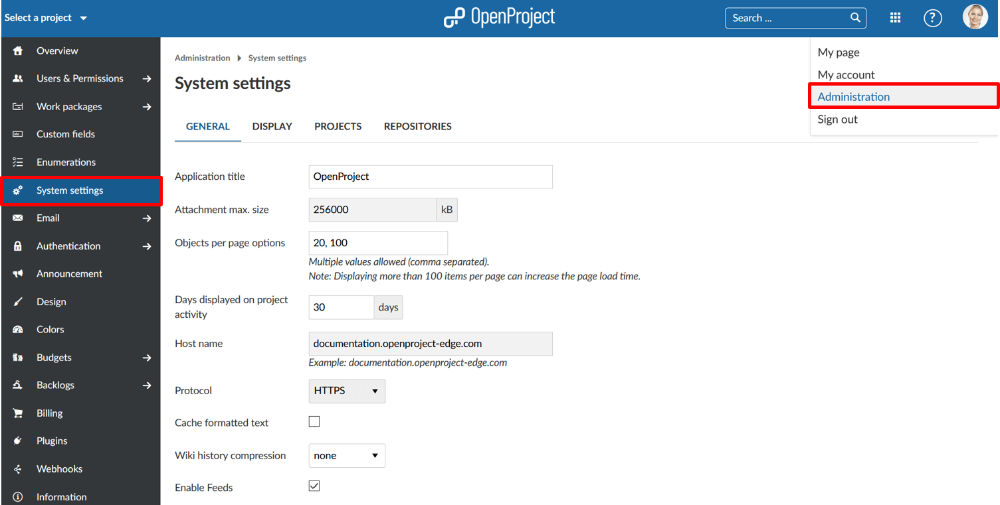

---
sidebar_navigation:
  title: System settings
  priority: 780
description: System settings in OpenProject.
robots: index, follow
keywords: system settings
---
# System settings

There are various project overarching settings that are referred to as **system settings**. To adapt these system settings, navigate to your user name and select -> *Administration* -> *System settings*.

## Overview

| Popular Topics                                      | Description                                                  |
| --------------------------------------------------- | :----------------------------------------------------------- |
| [General settings](general-settings)                | How to configure general system settings, e.g. a welcome text block on the application landing page, attachment size, and much more? |
| [Display settings](display-settings)                | How to configure languages, date and time formats, week start, and more? |
| [System projects settings](project-system-settings) | How to set default project modules and more?                 |
| [Repositories](repositories)                        | How to integrate SVN or GIT repositories?                    |

