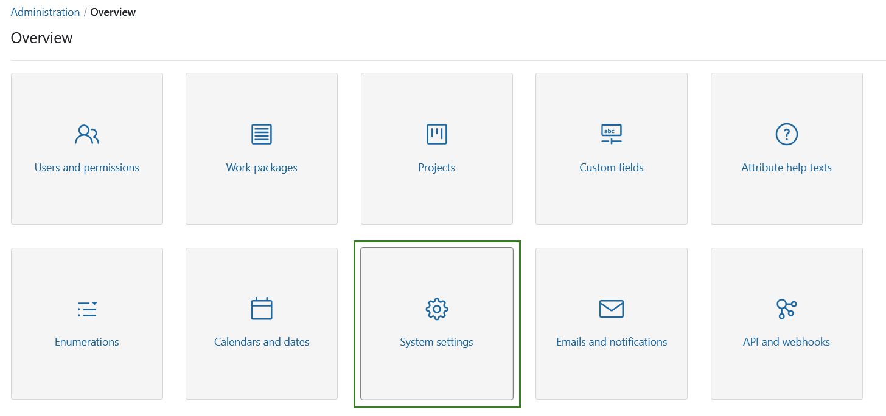

---
sidebar_navigation:
  title: System settings
  priority: 920
description: System settings in OpenProject.
keywords: system settings
---
# System settings

System settings allow you to configure a number of options concerning your OpenProject installation, such as host name, languages, defaults for new work package and projects and file attachments.

To modify these settings, navigate to **Administration → System settings**.

## Overview

| Topic                                | Content                                                      |
| ------------------------------------ | :----------------------------------------------------------- |
| [General settings](general-settings) | Manage general OpenProject settings, including the welcome page, attachment size limits, and other global options. |
| [Languages](languages)               | Select languages for your OpenProject installation.          |
| [Exports](exports)                   | Configure CSV export settings and data export options in OpenProject. |
| [External link](external-links)      | Configure how OpenProject handles external links and login requirements before users can leave the application. |
| [Project](../projects)               | Define the default settings for new OpenProject projects.    |
| [Repositories](repositories)         | Connect Git and SVN repositories to OpenProject for version control integration. |
