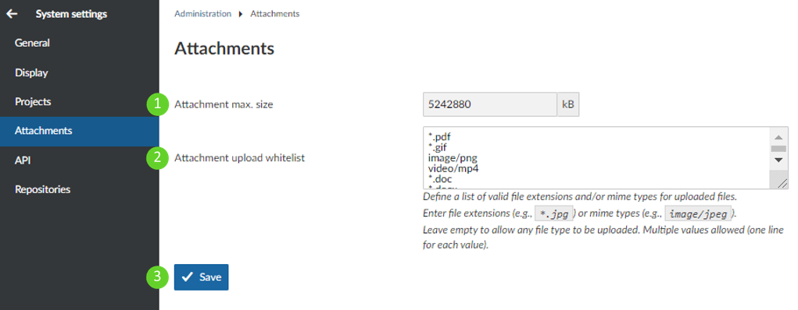

---
sidebar_navigation:
  title: Attachments settings
  priority: 940
title: Attachments settings
description: Settings for max attachment size and allowed file types
robots: index, follow
keywords: Attachments Settings

---

# Attachments - Max size and allowed file types

1. Here you can increase or decrease **maximum attachment size** (in kB)

2. The box next to **Attachment upload whitelist** is an open-entry text box in which some common file formats are pre-populated by default. The file formats in this list are specifically whitelisted or allowed to be attached to work packages. 
   If you wish, you can add additional file formats. Use only one file format entry per line, and keep to the following cadence:  
   
   ​																			*****.[**file extension**]
   
   Example: To add mp3-files to the whitelist, your entry would be "***.mp3**".
   
2. Do not forget to **save** your changes.

   

