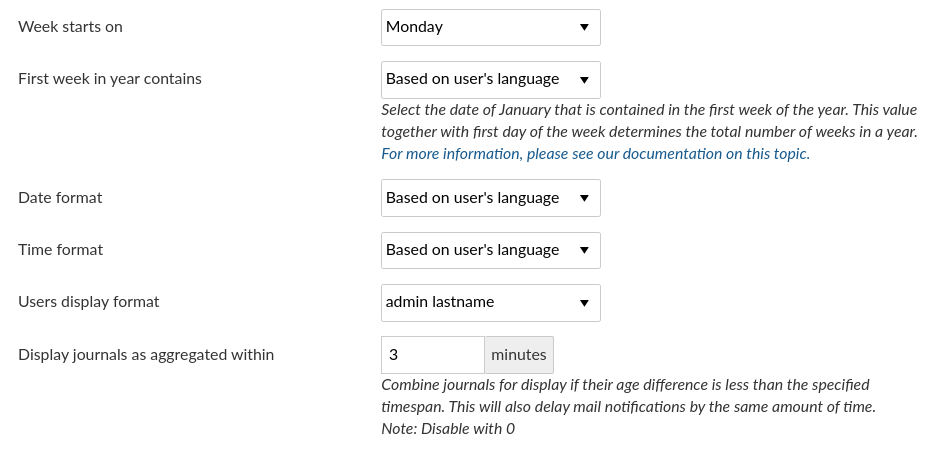

---
sidebar_navigation:
  title: Language and display settings
  priority: 900
description: Display settings in OpenProject.
robots: index, follow
keywords: display settings
---
# Language and display settings

You can configure display settings in OpenProject. Under System settings on the tab **Display** you can configure the following options.

## Configure available languages

Choose the languages which you want to activate for your system. Those languages which you will check will appear in the language settings of the user profiles and can be set for the system.

At the moment there are more than 30 languages available.

**Note**: Many languages are translated by the Community. We highly appreciate if you want to [help translating OpenProject to your language](../../../development/translate-openproject).

You can [choose your language in your user profile](../../../getting-started/my-account/#change-your-language).

## Time and date formatting

Change time and date formats in OpenProject and configure the display of journal aggregation.

- **Week starts on**: Configure what date the week starts (e.g. in the calendar view). Default is based on user's language. You can also choose to start a week always on Monday, Sunday or Saturdays.
  If you set Week starts on, you must also set the First week in year or will probably get inconsistencies in week numbering in calendars and the gantt chart.
- **First week in year contains**: Select the day that needs to be contained in the first week of the year. This value is used together with _Week starts on_ to determine the first week of the year. 
  - For europoean ISO-8601 standard, set Week starts on to `Monday` and First week in year to `Thursday`. 
  - For US and Canda, set Weekt starts on to `Sunday` and Day of Year to `6`.
  - If you leave both on `Based on user's language`, the information provided by moment.js will be used: For more information, please also see [this document from moment.js](https://momentjscom.readthedocs.io/en/latest/moment/07-customization/16-dow-doy/).
  - For more information on the way the first week of the year is computed according to ISO standards, see https://en.wikipedia.org/wiki/ISO_week_date#First_week
- **Date format**: default is based on user's language. You can choose various formats to display dates in the system.
- **Time format**: default is based on user's language. You can choose various formats to display time in the system.
- **Users display format**: default is Firstname Lastname. You can change to various different formats.
- **Display journals as aggregated within** will enable you to choose a time to combine journals of this timespan, e.g. for work package notifications. This way if you do several updates at in a short period of time, you will not receive a notification for each update but only a notification for the chosen period.
- Do not forget to **save** your changes.

