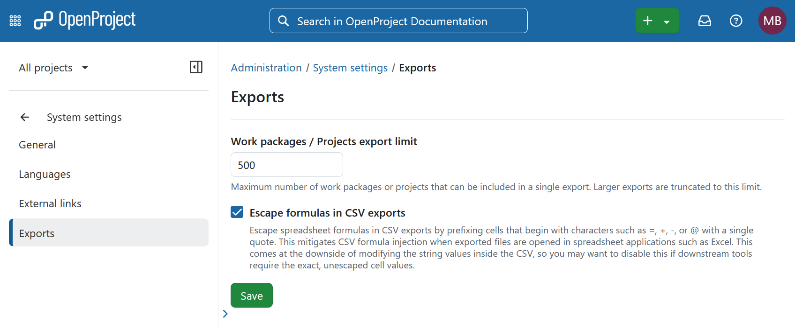

---
sidebar_navigation:
  title: Exports
  priority: 600
description: Configure export settings in OpenProject, including export limits and CSV security options.
keywords: exports, csv, export settings, csv security, formula injection
---
# Exports

In OpenProject you can configure export limits and improve the security of CSV exports. To do that, navigate to _Administration →  System settings →  Exports_.

## Limit work packages export

To specify the maximum number of work packages or projects that users can export in a single operation, enter the desired limit number and **save** your changes.

## Escape control characters in CSV exports

This setting is **enabled by default**. It helps protect users from **CSV formula injection** when exported files are opened in spreadsheet applications.

When enabled, OpenProject escapes values that begin with control characters commonly interpreted as formulas, including:

- `=`
- `@`
- `\t` (tab)
- `\r` (carriage return)
- `-`
- `+`

Numeric and currency values, such as `-5.00` or `-1.234,56 €`, remain unchanged so they can still be processed correctly by spreadsheet applications.

To disable this protection, clear the checkbox and **save** your changes.

> [!IMPORTANT] 
>
> No universal standard exists for preventing CSV formula injection. When enabled, this setting modifies exported values to reduce the risk of spreadsheet applications interpreting them as formulas. While this provides an additional layer of protection, it cannot guarantee complete mitigation in every application or workflow.
