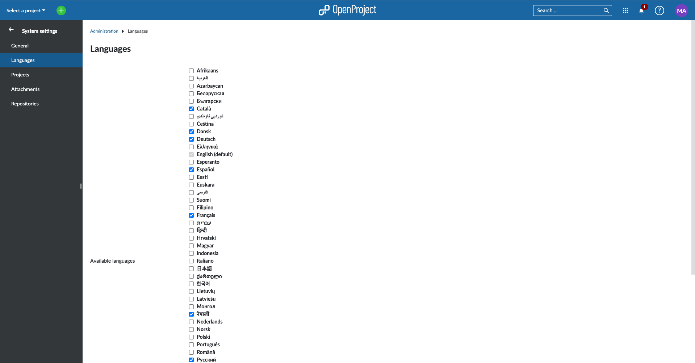

---
sidebar_navigation:
  title: Languages
  priority: 960
description: Languages in OpenProject.
keywords: languages
---
# Languages

The Languages page lets you select languages you would like to activate from the list of those that are available. These languages are then available to individual users via their user settings and as the default language for the instance.

At the moment there are over 30 languages available.

> [!NOTE]
> Many languages are translated by the community. We highly appreciate if you want to [help translating OpenProject to your language](../../../development/translate-openproject).

You can [choose your language in your user profile](../../../user-guide/my-account/#change-your-language).
