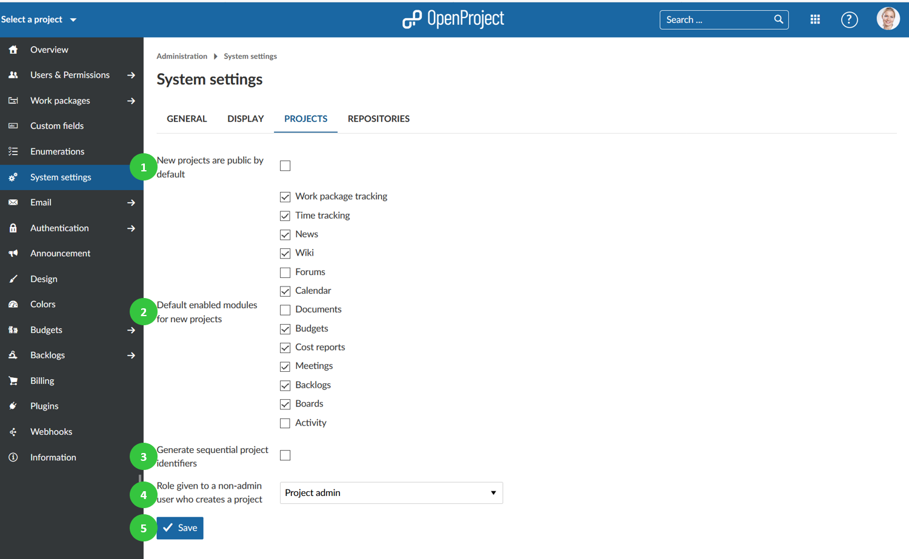

---
sidebar_navigation:
  title: Project system settings
  priority: 800
description: Project system settings in OpenProject.
robots: index, follow
keywords: project system settings
---
# Project system settings

To adapt system project settings, go to System settings on the tab **Projects** you can configure the following options.

1. Check if **new projects are public by default**. This means that users without an account can access the project without login.
2. Select **which modules should be activated for newly created projects per default**.
3. Choose whether **sequential project identifiers should be created**. If this option is ctivated, a project identifier for the next project will be offered automatically, based on the existing project name. For example, if a project “Myproject1” was created, “Myproject2” will be offered as identifier for the next project.
4. The r**ole given to a user in a new project when the user created a new project but is not an admin**. This makes sense when a user receives the permission to create a new project via [global role](../../users-permissions/roles-permissions/).
5. Do not forget to **save** your changes.

