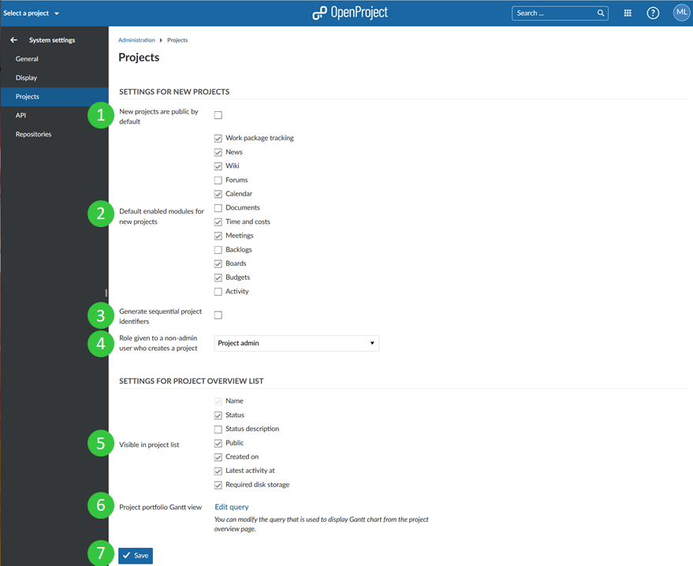

---
sidebar_navigation:
  title: Project system settings
  priority: 800
description: Project system settings in OpenProject.
robots: index, follow
keywords: project system settings
---
# Project system settings

To adapt the system project settings, go to System settings on the tab **Projects** where you can configure the following options.

### Settings for new projects

1. Check if **new projects are public by default**. This means that users without an account can access the project without login.
2. Select **which modules should be activated for newly created projects per default**.
3. Choose whether **sequential project identifiers should be created**. If this option is activated, a project identifier for the next project will be offered automatically, based on the existing project name. For example, if a project “Myproject1” was created, “Myproject2” will be offered as identifier for the next project.
4. The **role given to a user in a new project when the user creates a new project but is not an (global) admin**. This makes sense when a user receives the permission to create a new project via [global role](../../users-permissions/roles-permissions/).

### Settings for the Project Overview List
5. Choose **which columns should be visible** in the Project Overview List by default.
6. Define the **settings for the Gantt chart view** displayed when clicking on "Open as Gantt view" in the Projects Overview List. You can choose filters, columns, sortings and more to configure the view. For more information on how the configuration works please refer to the instructions for the [work package table configuration](../../../user-guide/work-packages/work-package-table-configuration/) in the User Guide.
7. Do not forget to **save** your changes.

