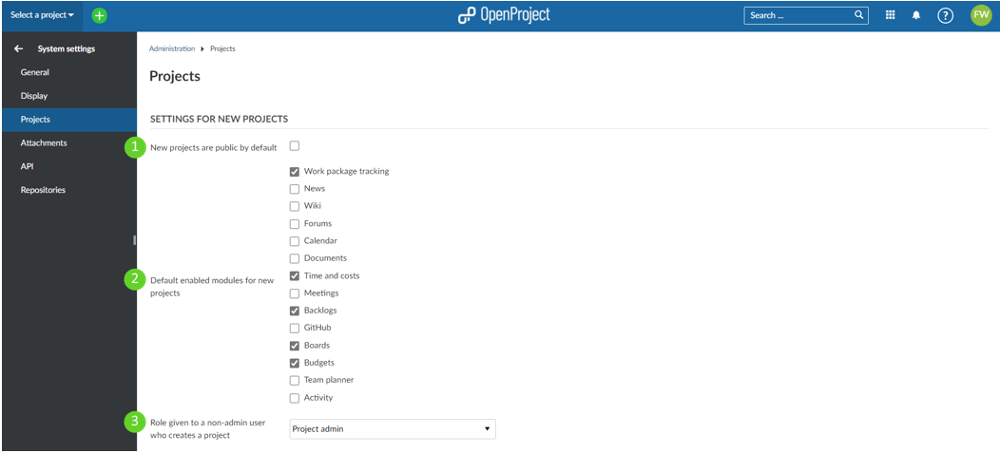
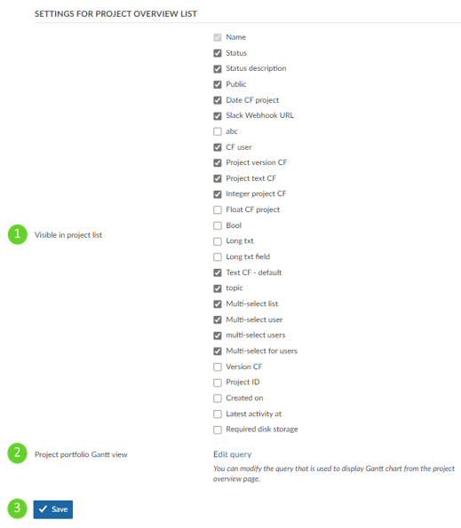

---
sidebar_navigation:
  title: Project system settings
  priority: 950
description: Project system settings in OpenProject.
robots: index, follow
keywords: project system settings
---
# Project system settings

To adapt the system project settings, navigate to *Administration -> System settings -> Projects* where you can configure the following options.

## Settings for new projects

1. Check if **new projects are public by default**. This means that users without an account can access the project without login.
2. Select **which modules should be activated for newly created projects by default**.
3. The **role given to a user in a new project when the user creates a new project but is not an (global) admin**. This makes sense when a user receives the permission to create a new project via [global role](../../users-permissions/roles-permissions/#global-roles).

## Settings for the Projects Overview List
1. Choose **which columns should be visible** in the Projects Overview List by default.
2. Define the **settings for the Gantt chart view** displayed when clicking on "Open as Gantt view" in the [Projects Overview List](../../../user-guide/projects/#global-projects-overview---view-all-projects). You can choose filters, columns, sorting and more to configure the view. For more information on how the configuration works please refer to the instructions for the [work package table configuration](../../../user-guide/work-packages/work-package-table-configuration/) in the User guide (as the basic principles are the same).
3. Do not forget to **save** your changes.
   
