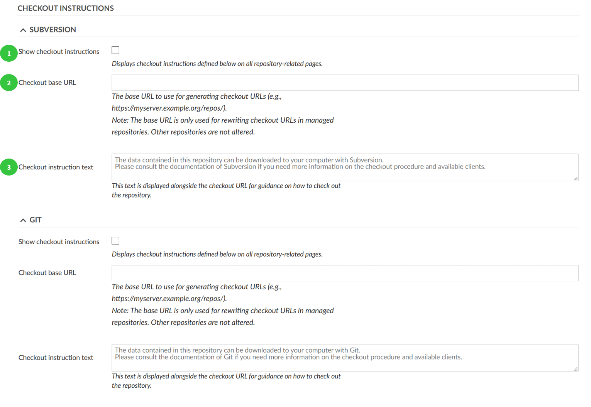
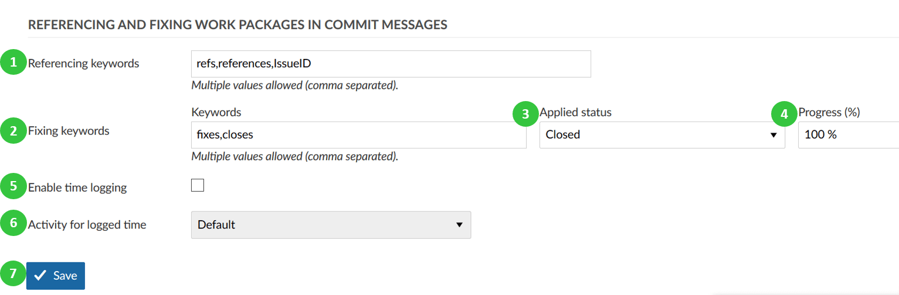

---
sidebar_navigation:
  title: Repositories settings
  priority: 500
description: Repositories settings in OpenProject.
robots: index, follow
keywords: repository settings
---
# Repositories settings

To adapt repositories settings, go to System settings on the tab **Repositories** you can configure the following options.

1. **Autofetch repository changes**. This option allows to automatically show commits in an OpenProject Repository.
2. **Repository disk size cache**. In order to cache the repository disk size (displayed e.g. in repository page).
3. **Enable repository management web service**. This option allows communication with SVN- or Git-Clients. If it is deactivated, a repository cannot be created.
4. **Define an API key**. This API key is created once and used for communication with an SVN or Git client.
5. Select which **SCM** you want to enabled. You can choose **Git** and/or **Subversion**.
6. **Automatic repository vendor type**. Specify the default repository type which is used in new projects.
7. **Define repositories encodings**.
8. Define the **maximum number of revisions to be displayed on file log**.
9. Define the **maximum number of files displayed in the repository browser**.
10. **Enable caching for authentication request of version control software**. This option allows saving the authentication so that a user doesn’t have to authenticate every time a repository is accessed (for  example during commits).

## Checkout instructions for Subversion and GIT

Show checkout instructions for Subversion and GIT.

1. Select whether or not to **display checkout instructions** on the repository page.
2. **Checkout base URL**. Define the base URL to be used for repositories of new projects.
3. **Checkout instruction text**. Used to specify an (optional) instruction text for repositories (can be further specified in project settings).

## Referencing and fixing work packages in commit messages

1. **Define referencing keywords** for work packages in commit messages.  Used to reference keywords used to link revisions to work packages.
2. Define **fixing keywords for work packages** in commit messages. Fixing keywords allow status or progress changes using certain keywords in commit messages, e.g. changing a work pacakge to closed and set to 100%.
3. Define which **status will be applied** to a work package if a fixing word is used in a commit message.
4. Define which **percentage of done is applied** to a work package if a fixing word is used in a commit message for that work package.
5. **Enable time logging**. Activating this option enables [logging time to a work package ](../../../user-guide/time-and-costs/time-tracking/)via commit message.
6. Define **activity for logged time**. This activity is used for time logging via a commit.

7. Do not forger to **Save** all your changes.