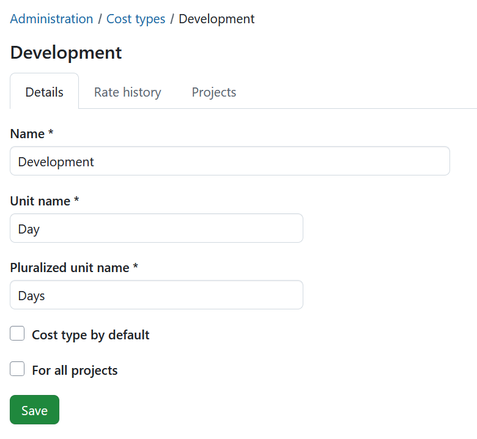
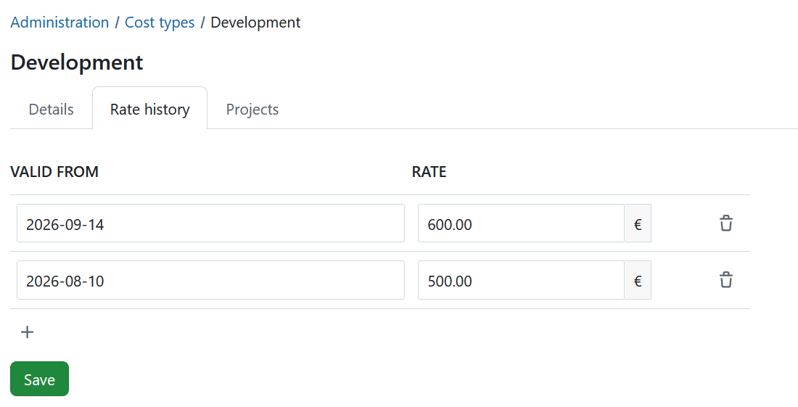
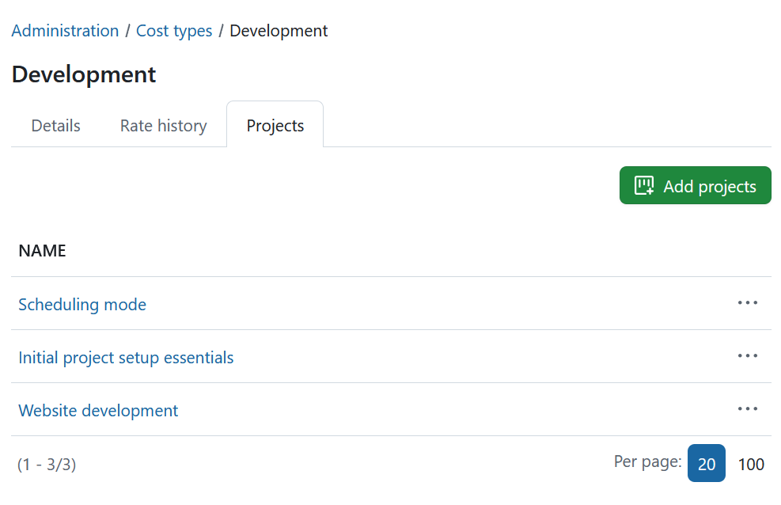

---
sidebar_navigation:
  title: Time and costs
  priority: 850
description: Configure global time tracking settings and limits, cost settings, cost types and time tracking activities in OpenProject.
keywords: time tracking, time entry, time entry restrictions, time entry limits, working hours, non-working days
---
# Time and costs

Navigate to *Administration* -> *Time and costs* to configure global settings for time and cost tracking in OpenProject. You can define settings and limits for logging time, configure cost settings, manage cost types and time tracking activities, and configure the currency used for cost reports.

## Default time and cost settings

To define global settings for logging time and costs, navigate to _Administration_ -> _Time and costs_ -> _Defaults and limits_.

Select the _Time_ tab to configure time logging or the _Costs_ tab to configure cost settings.

### Define default time settings (Enterprise add-on)

[feature: time_entry_time_restrictions ]

Under the _Time_ tab, administrators can configure how users log time and define global restrictions for time entries. These settings apply across all projects.

By default, the time entry limits are disabled, preserving the existing behavior without restrictions.

#### Start and finish times

The **Start and finish times** section controls whether time entries can include specific start and finish times.

- **Allow start and finish times**: Enables users to enter a start and finish time when logging time. If disabled, users can only enter the amount of time spent. When this option is enabled, the calendar view is shown by default on the _My time tracking_ page. When it is disabled, the list view is shown by default.

- **Require start and finish times**: Makes start and finish times mandatory when logging time.

#### Limits

The **Limits** section defines global restrictions for time entries. These restrictions are validated when a time entry is created or changed and apply to all projects.

- **Maximum number of hours per time entry**: Limits the number of hours that can be logged in a single time entry. Enter `0` for no restriction.

- **Maximum number of hours per day**: Limits the total number of hours a user can log on a single day across all time entries. Enter `0` for no restriction.

- **Do not allow logging time on non-working days**: Prevents users from logging time on days defined as non-working days. This includes global non-working days configured by an administrator as well as personal non-working days resulting from the user's individual working time settings.

- **Limit to the user's working hours**: Limits the total number of hours a user can log per day to their effective working hours for that day. Users without defined working times are not restricted by this setting.

- **Do not allow logging for past months**: Prevents users from adding, changing or deleting time entries belonging to a month that has already ended. When enabled, time entries can normally only be modified for the current month.

- **Grace period for past months**: Defines the number of days at the beginning of a new month during which users can still add, change or delete time entries for the previous month. For example, a value of `5` allows users to modify time entries for the previous month through the fifth day of the current month. Enter `0` for no grace period.

Click **Update limits** to save your changes.

### Define default cost settings

1. Configure the **currency used in the system**, for example EUR.
2. **Specify the currency format**, including whether the currency symbol or code should appear before or after the amount, for example `100 EUR` or `$100`.
3. Click **Save** to save your changes.

## Create and manage cost types

You can create and manage **cost types** to [book unit costs to work packages in OpenProject](../../user-guide/time-and-costs/cost-tracking/).

Navigate to _Administration_ -> _Time and costs_ -> _Cost types_ to create and manage cost types.

### Create a cost type

Click the green **+ Cost type** button to create a new cost type.

You can configure the following options:

1. Enter a **name** for the cost type.
2. Define the **unit name** for this cost type, e.g. Euro, piece, day, etc.
3. Set the **pluralized unit name**, e.g. Euros, pieces, days, etc.
4. Define a **current rate**.
5. Choose whether the cost type should be the **default cost type** when booking new unit costs.
6. Choose whether the cost type should be **activated for all projects**. This option is selected by default.

Click **Save** to create the cost type.

### Manage cost types

The cost types overview lists the existing cost types. You can filter the list to show active or locked cost types.

To lock a cost type, click the **lock icon** at the right end of the corresponding row.

> [!TIP]
> You can **lock but not delete** cost types.

### Edit a cost type

Click the name of a cost type to edit it.

The cost type settings are divided into three tabs:

#### Details

The **Details** tab contains the same settings available when creating a cost type. Here you can change its name, unit names, current rate, default status and project activation.

#### Rate history

The **Rate history** tab allows you to define different rates for a cost type and specify when each rate becomes valid.

To add a new rate, click the **+ icon**. Then:

1. Set the **date** from which the new rate should be valid.
2. Enter the **rate** in the specified unit.
3. Click **Save** to apply your changes.

To remove a rate, click the **delete icon** next to it.

#### Projects

The **Projects** tab shows the projects in which the cost type is enabled.

If **For all projects** is selected on the **Details** tab, the cost type is enabled in all projects.

To make the cost type available only in specific projects, uncheck **For all projects** on the **Details** tab and select the relevant projects here.

> [!NOTE]
> Cost types can also be used to book other kinds of units to work packages, such as vacation days, leave or travel days. For example, you can use `1` as a unit to track vacation days against a vacation budget and evaluate them in [cost reporting](../../user-guide/time-and-costs/reporting/).

## Create and manage time tracking activities

To get an overview of existing time tracking activities, navigate to _Administration_ -> _Time and costs_ -> _Time tracking activities_. You can manage the items in the list using the options in the **More (three dots)** menu on the right side. You can also rearrange their order using the drag-and-drop handle on the left.

> [!NOTE]
> To activate the [Activities for time tracking](../../user-guide/projects/project-settings/time-and-costs) in a certain project, navigate to _Project settings -> Time and costs_.

### Create a new time tracking activity

To create a new time tracking activity, click the **+ Add** button in the top-right corner.

Enter a name for the activity and choose whether it should be active. Click **Save** to create the activity.

### Edit or remove a time tracking activity

To **edit** an existing time tracking activity, either click its name or select **Edit** from the **More (three dots)** menu on the right end of the row.

To remove a time tracking activity, open the **More (three dots)** menu on the right end of the row and click on the **delete icon**.