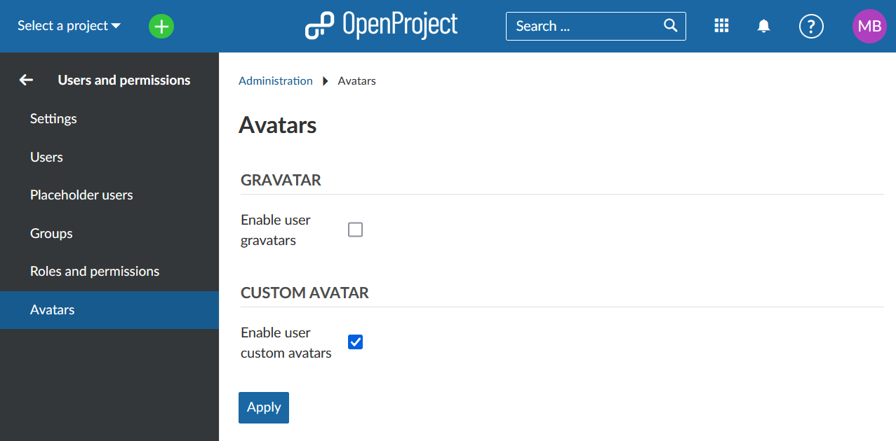

---
sidebar_navigation:
  title: Avatars
  priority: 940
description: Manage Avatars in OpenProject
keywords: Avatars
---
# OpenProject Avatars

To select which type of Avatars can be used in your OpenProject, navigate to **Administration -> Users and permissions -> Avatars**.

You can choose whether to allow user gravatars or enable to upload custom avatars.

The Avatars can be configured via the [user profile](../users).

