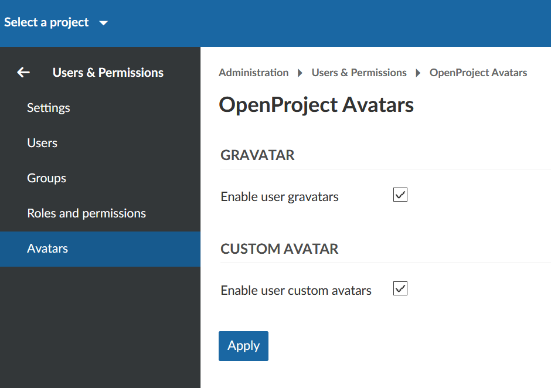

---
sidebar_navigation:
  title: Avatars
  priority: 960
description: Manage Avatars in OpenProject
robots: index, follow
keywords: Avatars
---
# OpenProject Avatars

To select which type of Avatars can be used in your OpenProject, navigate to -> *Administration* -> *Users & Permissions* -> *Avatars*.

You can choose whether to allow user Gravatar or enable to upload custom avatars.

The Avatars can be configured via the [user profile](../users).

