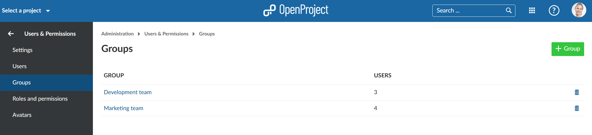
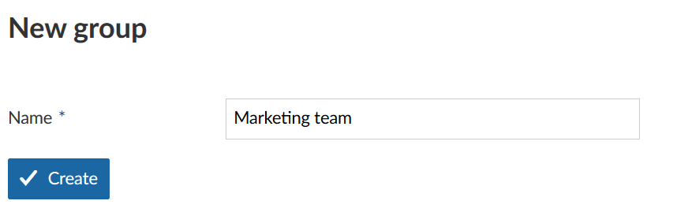
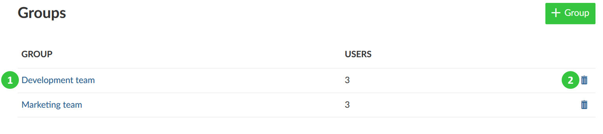
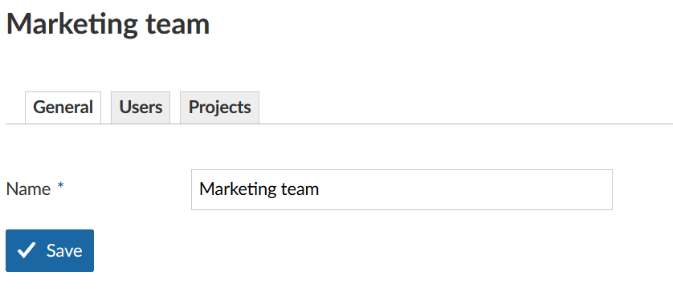
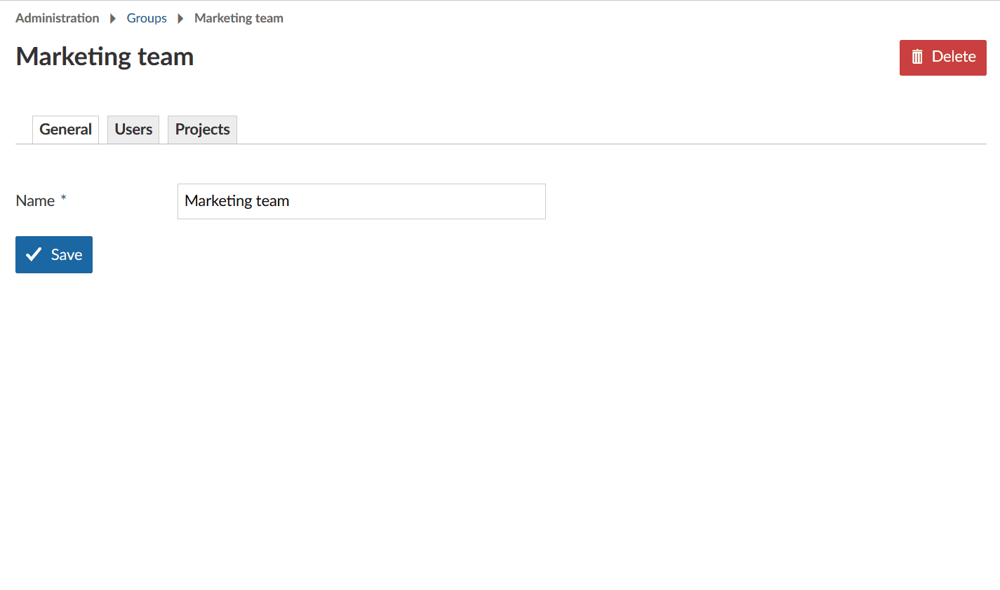

---
sidebar_navigation:
  title: Groups
  priority: 980
description: Manage groups in OpenProject.
robots: index, follow
keywords: manage groups
---

# Manage Groups

OpenProject allows creating tailored project member **groups**, which  grants additional rights to individual users within specific projects. This way, you do not need to add individual users to a project but you can add a user group, e.g. Marketing.
 You can edit the existing groups and create new ones in the system administration. To do that select *Administration -> Users & Permissions -> *Groups*.

**Group** is defined as a list of users which can be assigned to a project with a certain role. New groups can be defined in the admin settings (Modules > Administration).
  

## Add a new group

After selecting the *Groups* from the administration menu, you will see the list of all the existing groups. If no groups  have been created yet, the list will be empty.

Click the green **+ Group** button in order to create a new group in the system.

Give a name for your new group and click the blue **Create** button

## Add users to a group, edit or remove groups

You can add users to a group and edit a group by clicking on the **name of the group** (1) and  remove the group by clicking on **delete** icon in the respective line (2).

After selecting the editing mode, you will be able to **adapt the group name**, **add or remove group members** and the **assignment of groups to projects**.

### Add users to a group

Click the group details and click the **Users** tab. Select the users you want to add to this group from the drop-down list. Click the blue **Add** button.

