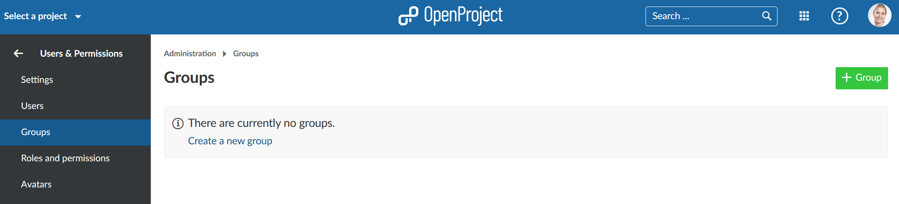

---
sidebar_navigation:
  title: Groups
  priority: 980
description: Manage groups in OpenProject.
robots: index, follow
keywords: manage groups
---

# Manage Groups

A **Group** is defined as a list of users which can be assigned to a project with a selected role. New groups can be defined in Administration -> Users & Permissions -> Groups.

OpenProject allows creating tailored project member **groups**, which  grant additional permissions to individual users within a project. Instead of adding individual users to a project you can add a user group, e.g. Marketing. You can edit the existing groups and create new ones, adding and removing users.

## Add a new group

After selecting **Groups** from the administration menu a list of the existing groups is shown, or a prompt to create a group if none exist.

Click the green **+ Group** button to create a new group.

Give a name for your new group, which must be unique, and click the blue **Create** button. The [project members list](../../getting-started/invite-members) shows groups and users in the selection field, which could affect your choice of names.

## Add users to a group, edit or remove groups

You can add users to a group and edit a group by clicking on the **name of the group** (1) and  remove the group by clicking on **delete** icon in the respective line (2). Deleting a group will remove the role of the group in a project; users with no other roles are removed from the project.

After selecting the editing mode, you can **change the group name**, **add or remove group members** and **assign groups to projects**.

### Add users to a group

Click the **Users** tab. Select the users you want to add to this group from the "New user" drop-down list. Click the blue **Add** button. Users already in the group are not shown in the list.

Adding a user to a group also adds them to projects using that group.

### Add projects to a group

Click the **Projects** tab. Select the projects you want to add this group to from the "New project" drop-down list. Tick the roles that you want the group to have. Click the blue **Add** button. Users in the group are added to that project's members using the role selected.

## Impact of groups on project members

Groups have the following impact on a [project members list](../../getting-started/invite-members) and the [user details](../users). Changes in groups, project members or users may affect the other two.

* the group shows as a separate line on the project members list
* the group members cannot be removed from the members list (no delete icon)
* adding a group with members already in a project member list has the group role added to their project roles
* a project member belonging to a group can have additional roles added individually
* the group role on an individual project member cannot be removed
* adding a user to a group adds that user to the member list of all projects using that group
* deleting the group removes the role from the members of any project using that group. If the user has no other roles it is removed from the project members list
