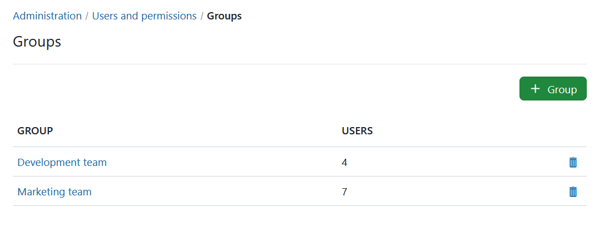
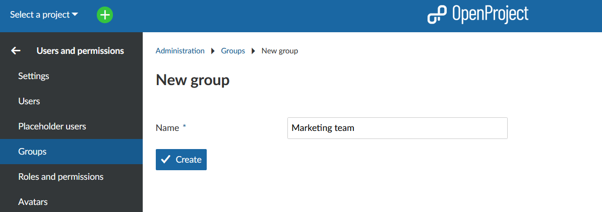
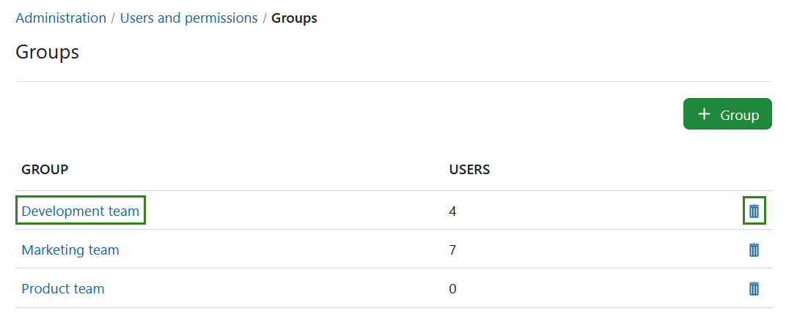
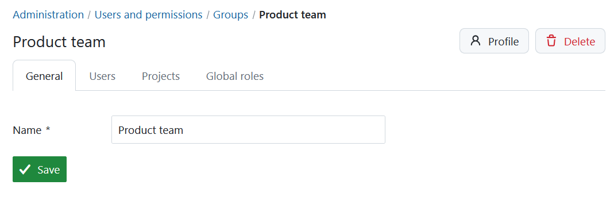
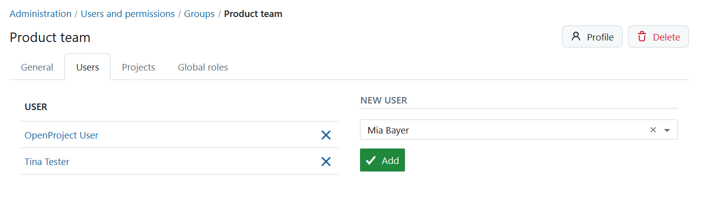
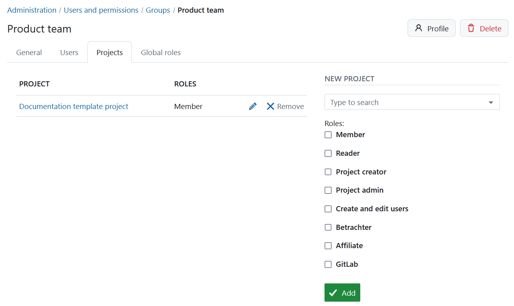
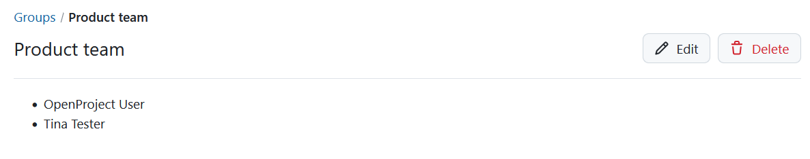

---
sidebar_navigation:
  title: Groups
  priority: 970
description: Manage groups in OpenProject.
keywords: manage groups
---

# Manage Groups

A **Group** is defined as a list of users which can be assigned to a project with a selected role. New groups can be defined in **Administration -> Users and permissions -> Groups**.

OpenProject allows creating tailored project member **groups**, which  grant additional permissions to individual users within a project. Instead of adding individual users to a project you can add a user group, e.g. Marketing. You can edit existing groups, create new ones, add and remove users or delete groups.

## Add a new group

After selecting **Groups** from the administration menu a list of the existing groups is shown, or a prompt to create a group if none exist.

Click the green **+ Group** button to create a new group.

Give a name for your new group, which must be unique, and click the green **Create** button.

## Add users to a group, edit or remove groups

You can add users to a group and edit a group by clicking on the **name of the group** and  delete the group by clicking on **delete** icon in the respective line.

After clicking on a group's name, you can **change the group name**, **add or remove group members** and **assign groups to projects**.

### Add users to a group

Click the **Users** tab. Select the users you want to add to this group from the **New user** drop-down list. Click the green **Add** button. Users already in the group are not shown in the list. Click the **X** next to a user to remove that user from the group.

Adding a user to a group also adds that user to the member list of **all** projects in which this group was assigned a [role](../roles-permissions) (e.g. Member).

Removing a user from a group removes the role from that user in any project using that group. If the user has no other roles (i.e. who were only added as a member of this group and not individually) they are removed from the respective project completely.

### Add a group to projects

Click the **Projects** tab. Select the projects you want to add this group to from the **New project** drop-down list. Tick the roles that you want the group to have. Click the green **Add** button. Users in the group are added to that project's members using the role selected.

### Add global roles to a group

Click the **Global Roles** tab. Select the global roles you want to add to this group. Click the **Add** button.

In order to add a global role to a group, at least one global role needs to be [created](../roles-permissions) in the system (a role with the **Global role** field ticked).

### Delete a group

To delete a group click on the **delete** icon in the respective line of the group list.

Deleting a group removes the role from the members of any project using that group. If a user has no other roles (i.e. who were only added as a member of this group and not individually) he/she is removed from the respective project completely.

## Impact of groups on project members

Groups impact [project members lists](../../../getting-started/invite-members) and [user details](../users). Changes in groups, project members or users may affect the other two.

Find out more about the behavior of groups as project members from a project admin's perspective [here](../../../getting-started/invite-members/#behavior-of-groups-as-project-members).

## Group profile

Similar to users, groups have a profile page which shows their name and members. Each member of a group is only visible for users with the necessary permissions (e.g. user has permission to see this member in a common project or user is system administrator).

The profile page can be accessed via the group's [settings page](#add-users-to-a-group-edit-or-remove-groups), via the overview page of projects the group is a member of and via [mentions](../../../user-guide/work-packages/edit-work-package/#-notification-mention) of the group.
