---
sidebar_navigation:
  title: Organization
  priority: 969
description: Define your company organization by creating departments and assigning users.
keywords: organization, departments, users, hierarchy, resource management, administration
---

# Manage organization

An **Organization** represents your company's organizational structure in OpenProject. It consists of **departments** and **sub-departments**, which can be arranged hierarchically to reflect reporting lines and team structures. Users can be assigned to departments to support resource planning and reporting.

To manage your organization, navigate to **Administration** → **Users and permissions** → **Organization**.

The **Organization** page lets you create and maintain your company's organizational hierarchy.

> [!TIP]
> You can also import an existing organizational structure through [LDAP department synchronization](../../authentication/ldap-connections/ldap-group-synchronization/).

## Organization overview

The page is divided into two parts:

- **My organization** (hierarchy view) on the left.
- **My organization** (table view) on the right.

The hierarchy view displays your departments as a tree structure. Each department can contain multiple sub-departments, allowing you to build your organizational hierarchy.

Selecting a department in the hierarchy updates the table view to display its direct sub-departments and members. This lets you navigate your organizational structure in the hierarchy while viewing and managing the contents of the selected department in the table.

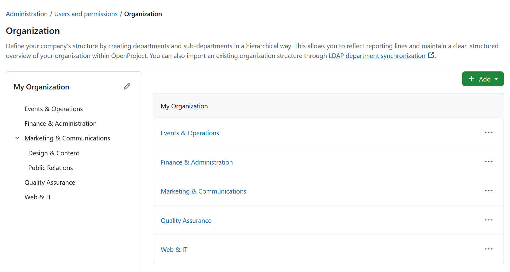

To rename your organization, click the **Edit** icon next to **My organization** on the left.

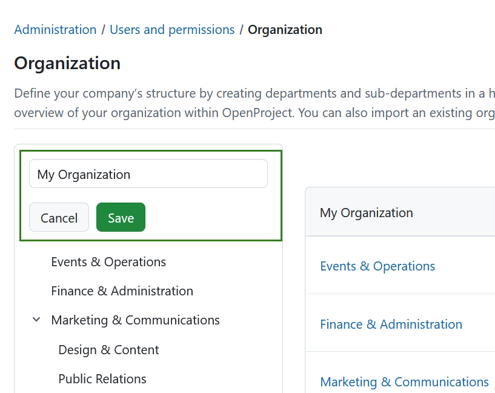

### Create a new department

To create a department, click the **+ Add** button and select **Add department**.

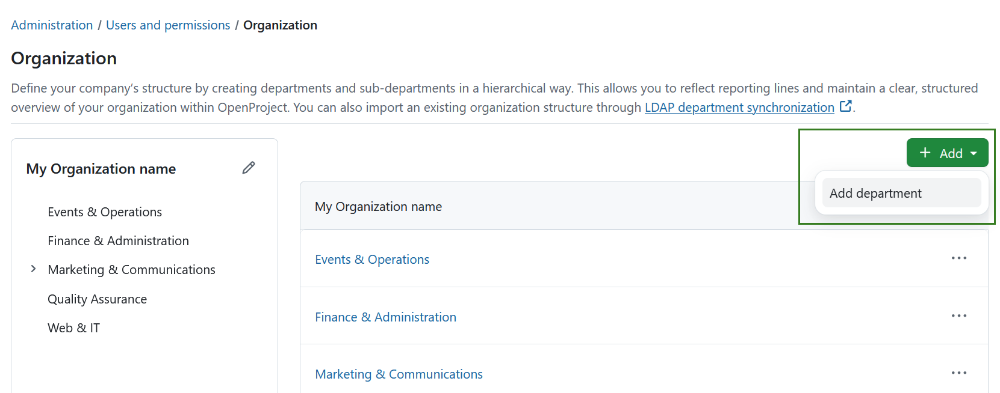

A new editable row appears in the table.

Enter the department name and click **Add** to create the department or **Cancel** to discard your changes.

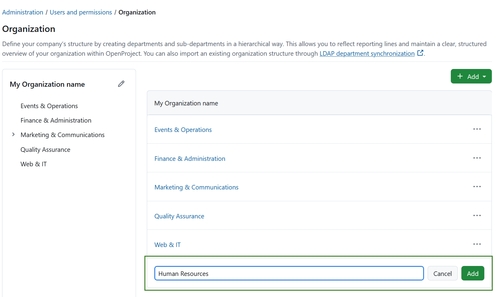

The new department is added to both the hierarchy and table views and opens automatically.

Initially, the department is empty. To start building the department, click the **+ Add** button and select one of the following options:

- **Add department** to create a sub-department.
- **Add user** to assign users to the department.

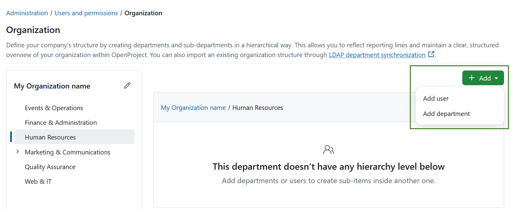

### Manage departments

Click a department in either the hierarchy or the table to open its details.

The department page displays:

- Sub-departments (if any exist)
- Assigned users

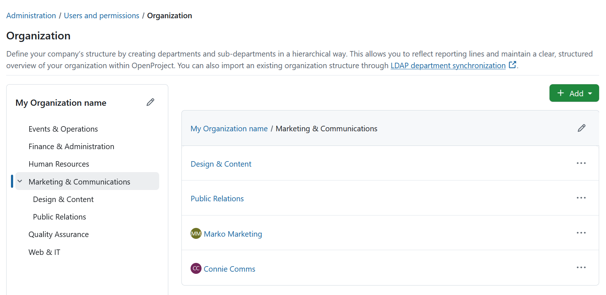

Click the **More** (**⋯**) menu to access the following actions:

- **Edit**
- **Add sub-department**
- **Add user**
- **Change parent**
- **Delete**

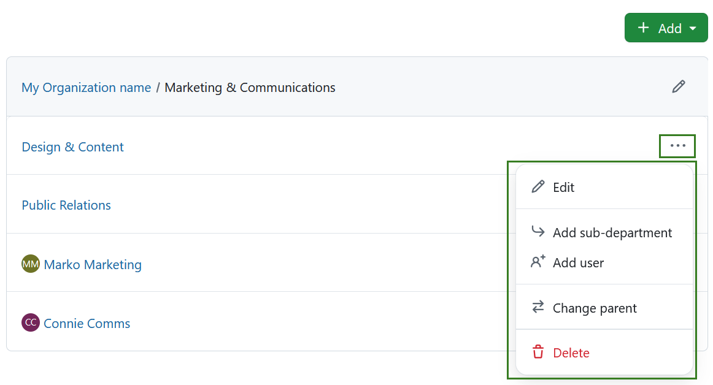

You can rename a department in two ways:

- Click the **Edit** icon next to the department name to open the **Edit department** page.
- Select **Edit** from the **More** (**⋯**) menu.

For more information about editing departments, see the [Department detailed page](#department-detailed-page).

### Add a sub-department

To create a sub-department, open the **More** (**⋯**) menu for a department and select **Add sub-department**.

Enter the department name and click **Add**.

The new department is created beneath the selected parent department.

### Assign users to a department

To assign users to a department, open the **More** (**⋯**) menu and select **Add user**.

Select a user from the dropdown list and confirm your selection.

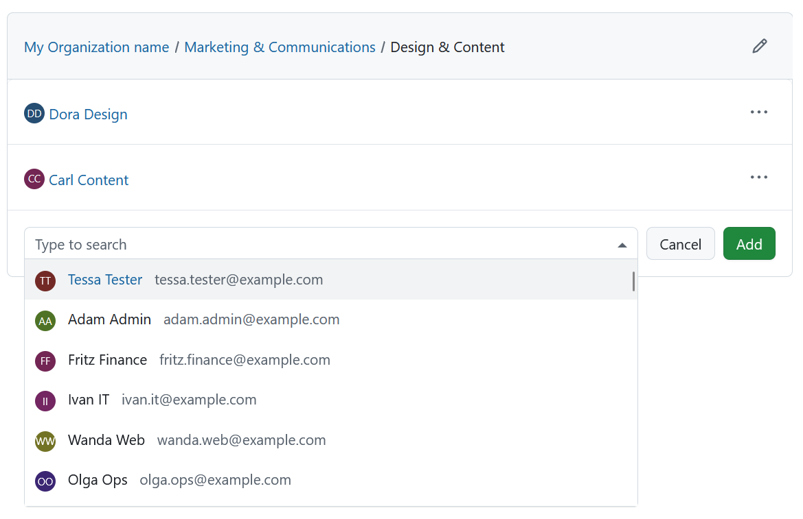

A user can only belong to one department. If a user you are trying to add is already part of another department, you will be asked to confirm the move.

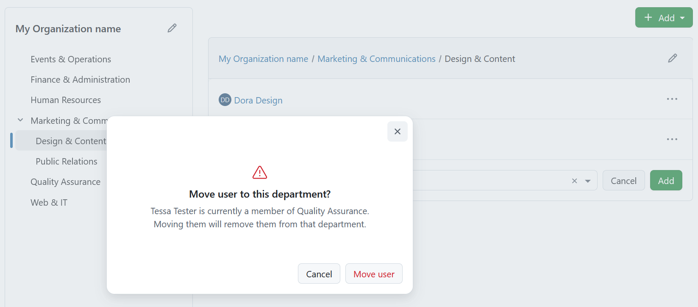

### Change the parent department

You can change the parent department in two ways:

- **From the Organization overview**

Open the **More** (**⋯**) menu for a department and select **Change parent**.

The **Change parent** dialog opens.

Select the new parent department and confirm the change.

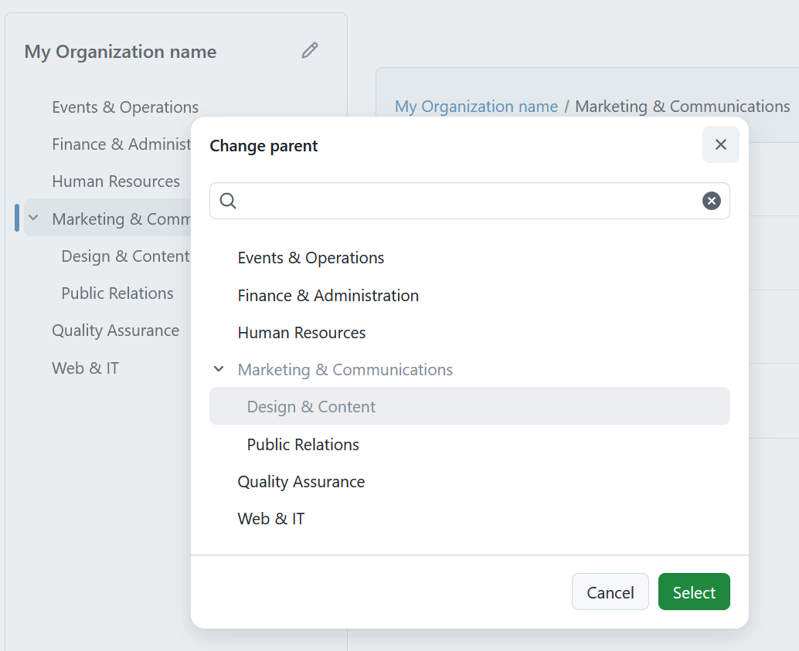

The department is immediately moved to its new position in the hierarchy.

- **From the [Department detailed page](#department-detailed-page)**

Open the **Department detailed** page and select a different department in the **Parent department** field.

Save your changes to update the hierarchy.

### Remove users from a department

Open a department to display its assigned users.

For the user you want to remove, open the **More** (**⋯**) menu and select **Remove user**.

The user is removed from the department but remains an active user in OpenProject.

### Delete a department

You can delete a department in two ways:

- Open the **More** (**⋯**) menu and select **Delete**.
- Open the **Edit department** page and click **Delete**.

Depending on your organization structure, you may first need to move or remove any sub-departments or assigned users before the department can be deleted.

## Department detailed page

The **Department detailed view** allows you to edit department settings, assign projects and global roles, and view the department profile.

To open the page, click the **Edit** icon next to a department name or select **Edit** from the **More** (**⋯**) menu.

The page contains three tabs:

- General
- Projects
- Global roles

### General

The **General** tab lets you edit the department's basic information.

You can update:

- **Name**
- **Parent department**

To make the department a sub-department of another department, select a parent department.

> [!NOTE]
> Setting a parent department will make this department a sub-department of the selected parent department.

Click **Save** to apply your changes.

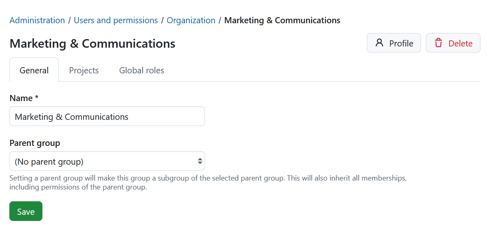

### Projects

The **Projects** tab lets you assign the department to projects.

Click **+ Project** to add the department to a project.

For each project, assign one or more project roles. Departments inherit the same project roles that are available for users and groups.

Managing project memberships for departments works the same way as for groups. For more information, see the **Groups** documentation.

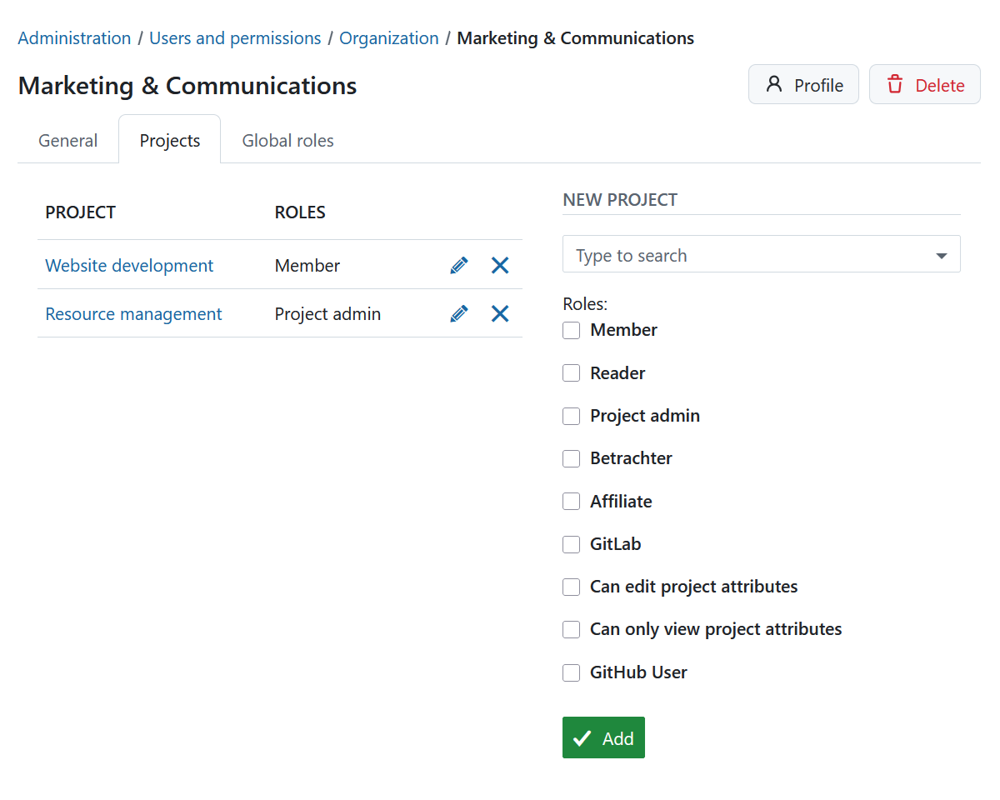

### Global roles

The **Global roles** tab lets you assign global roles to the department.

Click **+ Global role** and select one or more available global roles.

Managing global roles for departments works the same way as for groups.

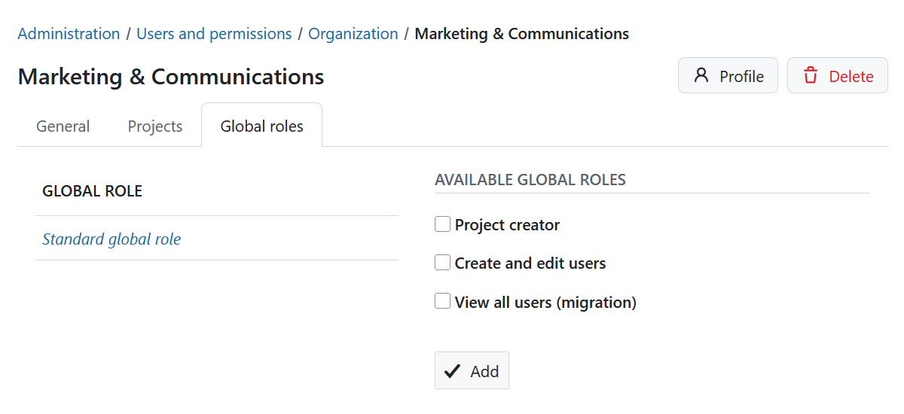

## Department profile

Click the **Profile** button in the upper-right corner of the **Edit department** page to open the department profile.

The profile page shows the users assigned to that department.

From the profile page, you can:

- Click **Edit department** to modify the department.
- Click **Delete** to remove the department.

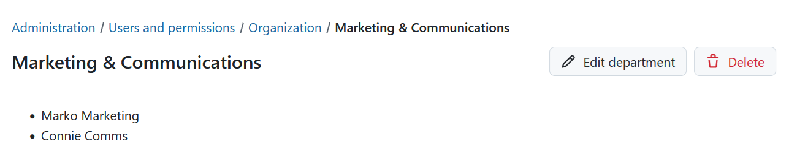