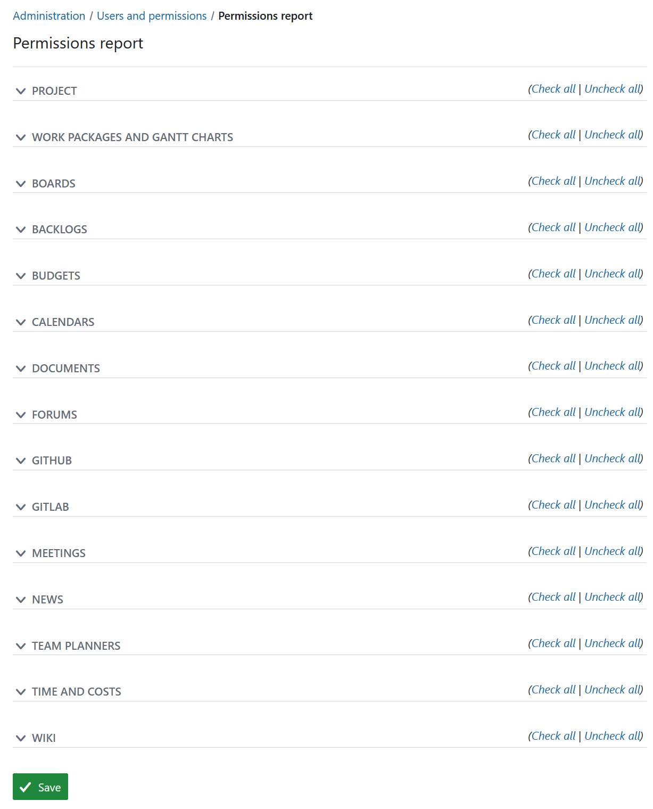
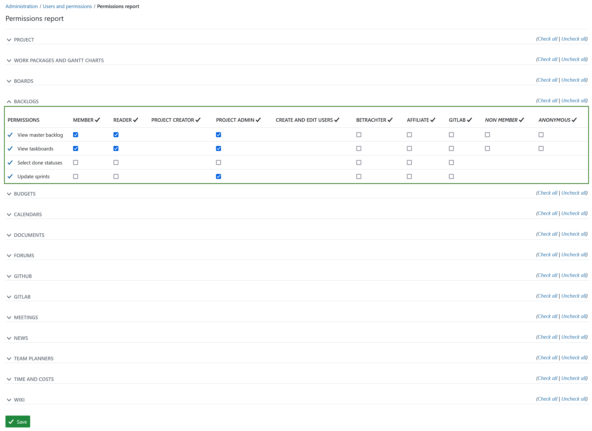

---
sidebar_navigation:
  title: Permissions report
  priority: 950
description: Overview of current roles and permissions in OpenProject.
keywords: roles report, permissions report

---

# Permissions report

## Permissions report overview

In OpenProject administration you can get an overview of the what permissions are currently assigned to which role. To view this **permissions report**, navigate to *Administration -> Users and permissions -> Permissions report*. 

## Edit permissions in permissions report

To edit permissions expand the permissions for a specific module, for example Backlogs and adjust the permissions by checking and unchecking the boxes for respective roles. Don't forget to save the the changes at the bottom of the page.

