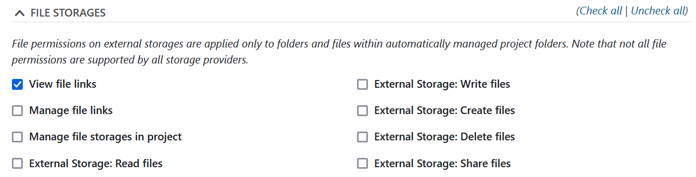

---
sidebar_navigation:
  title: Roles and permissions
  priority: 960
description: Manage roles and permissions in OpenProject.
keywords: manage roles, manage permissions
---
# Roles and permissions

## Users

A user is any individual who can log into your OpenProject instance.

## Permissions

Permissions control what users can see and do within OpenProject. Permission are granted to users by assigning one or more roles to the users.

### File storages permissions

Permissions related to the external file storages are part of the *Projects* and *Work packages and Gantt charts*:

Following are the permissions for file storages within OpenProject:

- **View file links**: Allows a user to see file links to external storages in the Files tab of work packages
- **Manage file links**: Allows a user to create and edit file links to work packages
- **Manage files in project**: Allows a user to add or edit file storages for a project

Following user permissions are set on files and folder in **External Storages**:

- **Automatically managed folders: Read files (Nextcloud, OneDrive/SharePoint)**
- **Automatically managed folders:  Write files (Nextcloud, OneDrive/SharePoint)**
- **Automatically managed folders: Create files (Nextcloud)**
- **Automatically managed folders: Delete files (Nextcloud)**
- **Automatically managed folders: Share files (Nextcloud)**

> [!NOTE]
> Please note that not all file permissions are applicable to all storage providers.

## Roles

A role bundles a collection of permissions. It is an convenient way of granting permissions to multiple users in your organization that need the same permissions or restrictions.

A user can have one or more roles which grant permissions on different levels.

### Administrator

**Administrators** have full access to all settings and all projects in an OpenProject environment. The permissions of the Administrator role can not be changed.

| Scope of the role                                            | Permission examples                                          | Customization options                                        |
| ------------------------------------------------------------ | ------------------------------------------------------------ | ------------------------------------------------------------ |
| Application-level: Full control of all aspects of the application | - Assign administration privileges to other users - Create and restore backups in the web interface - Create and configure an OAuth app - Configure custom fields - Archive projects/restore projects - Configure global roles - Configure project roles | Cannot be changed |

### Global role

**Global roles** allow Administrators to delegate administrative tasks to individual users.

| Scope of the role                                            | Permission examples                                          | Customization options                                        |
| ------------------------------------------------------------ | ------------------------------------------------------------ | ------------------------------------------------------------ |
| Application-level: Permissions scoped to specific administrative tasks (not restricted to specific projects) | - Manage users - Create projects                        | Administrators can create new global roles and assign global permissions to those role |

### Project role

**A project role** is a set of **permissions** that can be assigned to any project member. Multiple roles can be assigned to the same project member. 

>[!NOTE]
>If a module is not enabled in a project it is not shown to a user despite having a permission for it.

| Scope of the role                                            | Permission examples                                          | Customization options                                        |
| ------------------------------------------------------------ | ------------------------------------------------------------ | ------------------------------------------------------------ |
| Project-level: Permissions scoped to individual projects (a user can have different roles for individual projects) | - Create work packages (in a project) - Delete wiki pages (in a specific project) | Create different project roles with individual permission sets |

### Non-member

**Non member** is the default role of users of your OpenProject instance who have not been added to a project. This only applies if the project has been set as [public](../../../user-guide/projects/#set-a-project-to-public) in the project settings. 

>[!NOTE]
The *Non-member* role cannot be deleted.

| Scope of the role                                            | Permission examples                                          | Customization options                                        |
| ------------------------------------------------------------ | ------------------------------------------------------------ | ------------------------------------------------------------ |
| Project-level: Permissions scoped to individual projects for users which are logged in | - View work packages for users that are logged in            | Assign different permissions to the role *Non-member*     |

### Anonymous

OpenProject allows to share project information with **anonymous** users which are not logged in. This is helpful to communicate projects goals and activities with a public community. 

>[!NOTE]
> This only applies if you disabled the need for authentication for your instance and if the project is set as **public**. The *Anonymous* role cannot be deleted.

| Scope of the role                                            | Permission examples                                          | Customization options                                        |
| ------------------------------------------------------------ | ------------------------------------------------------------ | ------------------------------------------------------------ |
| Project-level: Permissions scoped to individual projects for users which are <u>not</u> logged in | - View work packages for users that are not logged in        | Assign different permissions to the role *Anonymous*         |

## Customize roles with individual permissions

Administrators can add new roles with custom permissions or configure existing ones in *Administration* > *Users and permissions* > *Roles and permissions*.

### Permissions report

The permissions report is a good starting point to get an overview of the current configuration of roles and permissions. To open the permissions report, navigate to *Administration* > *Users and permissions* > *Permissions report*.

### Create a new project roles

Administrators can create new project roles in *Administration* > *Users and permissions* > *Roles and permissions*. Click on the green *+Role* button to create a new role.

Complete the following steps:

1. **Name**: must be a new role name.
2. **Global role**: create a new [global role](#create-a-new-global-role).
3. **Copy workflow from**: select an existing role and copy the respective [workflow](../../manage-work-packages/work-package-workflows) to the newly created role.
4. **Permissions**: you can grant permissions which define what the user with the respective role can see and do in the project scope. The permissions are grouped based on the modules.

To create the new role, click on the grey *Create* button at the bottom of the page.

### Create a new global role

Administrators can create new global roles in *Administration* > *Users and permissions* > *Roles and permissions*. In the creation form check the box **Global role**. The form now shows the available global permissions which can be assigned to the new global role:

- [Create projects](../../../getting-started/projects/#create-a-new-project)

> [!TIP]
> To create a subproject for an existing project it also requires the project permission "Create subprojects".

- [Create backups](../../backup/)

- [Create users](../../users-permissions/users/#create-users)

- [Edit users](../users/)

> [!NOTE]
> This allows the *Administrator* to delegate the administration of users to other people that should not have full control of the entire OpenProject installation (Administrator). These users can edit attributes of any users, except administrators. This means they are able to impersonate another user by changing email address to match theirs. This is a security risk and should be considered with caution.

- [Create, edit, and delete placeholder users](../placeholder-users/)

> [!NOTE]
> Users with this global permission cannot automatically see and edit all placeholder user in all projects. It is restricted to the placeholder users in projects in which the user has the respective permission to see or edit project member.

### Edit and delete roles

To edit an existing role, click on the role name in the roles overview table. Make your changes and save the update by clicking on the *Save* button at the bottom of the overview page.

To delete an existing role click on the **delete icon** next to a role in the list.

> [!IMPORTANT]
> Roles that are assigned to a user cannot be deleted.

## FAQ for roles and permissions

### Can Administrators delegate the task to delete users?

No, only Administrators can delete other users.

### Can a user with "Edit users" global permission change administrators attributes?

No, only Administrators can update other Administrators attributes like name or email. This is to prevent the possibility of a user with "Edit users" global permission impersonating an Administrator by changing the email address to match theirs.

### Can I set a default role for a user that creates a new project?

You can set a [default role](../../projects/new-project) that users with this permission will have in a project they created.

### Users do not see the action *Create project* in the main navigation even though they have the create project permission?

This is UX bug tracked in [#50123](https://community.openproject.org/wp/50123).

### What is the difference between a project permission and a global permission?

Project permissions controls what a user can see and do within a project scope. Project permissions are attached to **project roles**. You can grant a user a permission in a specific project by giving the user one or more project roles in a specific project.

Examples for project permissions:

* Create work packages
* Add comments to a work package

Global permissions are system wide. They are attached to **global roles** and controls what a user can do and see independent of a specific project memberships.

### Can I convert a project role to a global role?

No this is not possible. You need to create a new role instead.
