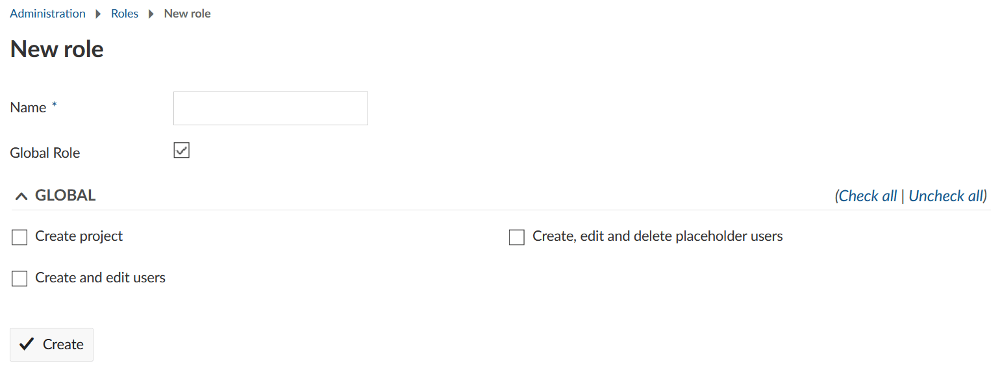
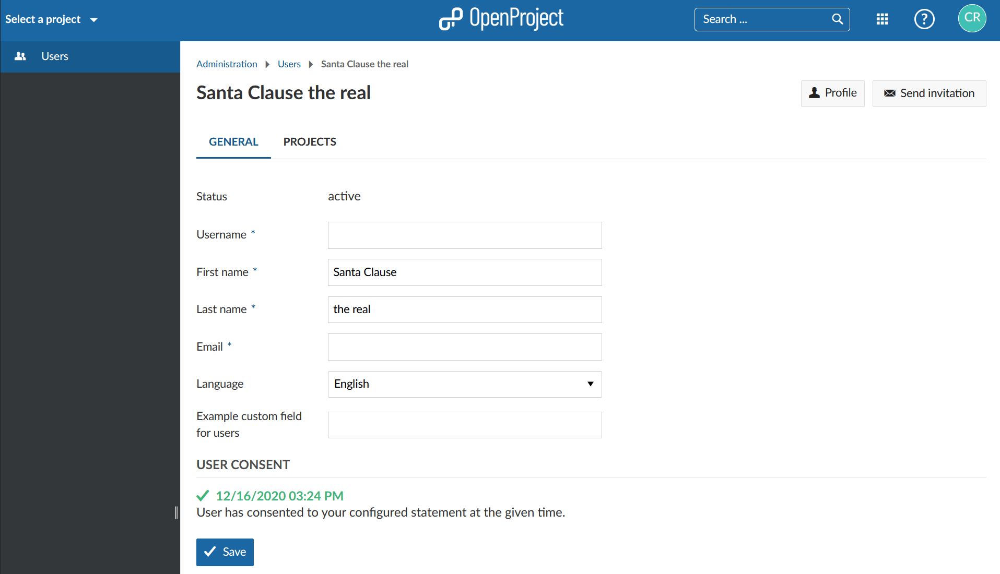
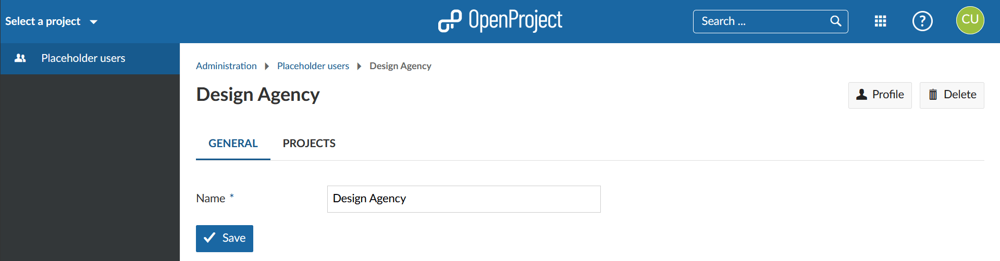

---
sidebar_navigation:
  title: Roles and permissions
  priority: 970
description: Manage roles and permissions in OpenProject.
robots: index, follow
keywords: manage roles, manage permissions
---
# Roles and permissions

A **role** is a set of **permissions** that can be assigned to any project member. Multiple roles can be assigned to the same project member.

When creating a role, the "Global role" field can be ticked, making it a **Global role** that can be assigned to a [users details](../users/#manage-user-settings) and applied across all projects.

| Topic                                           | Content                                                      |
| ----------------------------------------------- | ------------------------------------------------------------ |
| [Permissions](#permissions)                     | What are permissions and how can I access the permissions report? |
| [Create a new role](#create-a-new-role)         | How to create a new (global) role.                           |
| [Edit and remove roles](#edit-and-remove-roles) | How to change and delete existing roles.                     |
| [Global roles](#global-roles)                   | Which global roles are there and what are their significances? |

## Permissions

The permissions are predefined in the system, and cannot be changed. They define what actions a role can carry out. If a user has more than one role (including global and project roles), a permission is granted if it is assigned to any of those roles.

All permissions are shown sorted by OpenProject module in the [create a new role](#create-a-new-role) page or when clicking on an existing role.

### Permissions report

On the bottom of the roles list page there is a link to the **Permissions report**. This shows a grid of existing roles (columns) against permissions (rows); the intersections are ticked if the role has the permission.

A "Check/uncheck all" tick box is shown on each role or permission to allow bulk change. **Be careful, this cannot be undone**. If you make a mistake, do not save the report.

### Project Modules

Note: If a [project module](../../../user-guide/projects/project-settings/modules/) is not enabled for a specific project it is not shown in that project's menu whether the user has permission for that module or not.

## Create a new role

To create a new role, navigate to the administration and select *Users & Permissions -> Roles and permissions* from the menu on the left.

You will see the list of all the roles that have been created so far.

*Non member* is the default role of users of your OpenProject instance who have not been added to a project. This only applies if the project has been set as "public" in the project settings.
*Anonymous* is the default role of users who are not logged in. This only applies if you disabled the need for authentication for your instance and if the project is set as "public".
Those two roles can't be deleted.

After clicking the green **+ Role** button, a form will be shown to define the role and its permissions.

Complete the following as required:

1. **Role name** - must be entered and be a new name.
2. **Global Role** - this role applies to all projects, and can only be assigned in the [user details](../users/#manage-user-settings). Once saved, the decision to make a role a "global role" can't be reverted.
   Ticking this box will show the available [global roles](#global-roles) and hide the regular permission options.
3. **Work packages...** - tick to allow work packages to be assigned to a user with this role. This does not appear for global roles.
4. **Copy workflow from** - select an existing role. The respective [workflows](../../manage-work-packages/work-package-workflows) will be copied to the role to be created.
5. **Permissions** for this role - you can specify the permissions per OpenProject module. Click the arrow next to the module name to expand or compress the permissions list.

Select the permissions which should apply for this role. You can use "check all" or "uncheck all" at the right of a module permissions list. If a module is not enabled in a project it is not shown to a user despite having a permission for it.

Don't forget to click the **Save** button at the bottom of the page.

## Edit and remove roles

To edit a role navigate to the roles overview list and click on the role name (1). If is not a global role it cannot be converted into one.

To remove an existing role click on the delete icon next to a role in the list (2). It cannot be deleted if it is assigned to a user.

## Global roles

To create a global role tick the box "Global Role" when [creating a new role](#create-a-new-role). 

You can choose between these global permissions:

- **Create project**: With this permission users can create new projects even when they are not system administrators.
  [Here](../../system-settings/project-system-settings/#settings-for-new-projects) you can set a default role that users with this permission will have in a project they created.
- **Create and edit users**: Assign this permission to users who should be able to create or invite new users. They also can edit user profiles in a limited way. 
  Users with this permission can add users and edit a user's name, username, email address and language. Additionally, they can can see all users of your OpenProject instance. They can't delete or lock users. 
  They can only see the project membership of users for projects in which they have permission to see the members (e.g. as Project admin or Member). They can only manage project membership of users for projects in which they have permission to manage members (e.g. as Project admin).
  The user profile will look like this for them (user name and email address were redacted): 
- **Create, edit, and delete placeholder users**: Assign this permission to users (e.g. project admins) who should be able to manage [placeholder users](../placeholder-users). 
  Users with this permission can create, edit and delete placeholder users, as well as see all placeholder users in your OpenProject instance.
  **Please note**: They can only see the project membership of placeholder users for projects in which they have permission to see the members (e.g. as Project admin or Member). They can only manage project membership of placeholder users for projects in which they have permission to manage members (e.g. as Project admin).
  A placeholder user's profile will look like this for them: 
- **Administrator**: Technically, the system administrator is also a global role. However, it can't be configured and is assigned to a user in another way. Find out more [here](../users/#general-settings).
