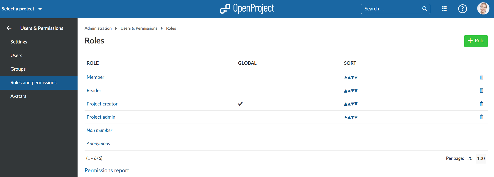
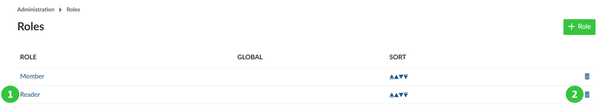

---
sidebar_navigation:
  title: Roles & Permissions
  priority: 970
description: Manage roles and permissions in OpenProject.
robots: index, follow
keywords: manage roles, manage permissions
---
# Roles and permissions

A role is a set of permissions that can be assigned to any project  member. Multiple roles can be assigned to the same project member.

In contrast to “normal” project roles, **Global roles** are project-overarching roles that can be assigend to a user and allow certain actions (for example, creating new projects).

Global roles can be added to a [user profile](../users/#view-user-profile).

## Create a new role

To create a new role, navigate to the administration and select -> *Users & permissions* -> *Roles and permissions* from the menu on the left.

You will see the list of all the roles that have been created so far.

After clicking the green *+ New Role* button a form will open and you will be able to specify the role.

You will then be able to specify the following:

1. Role name
2. Define whether the role is a global one and should be applied to a user on a project-overarching level.
3. Define whether work packages can be assigned to the role
4. Copy the workflow from an existing role. In case you select a role  from the dropdown list, the respective workflows will be copied (i.e.  changing status for work packages)
5. You can specify the permissions per OpenProject module and select the permissions which should apply for this role. You also have the possibility to check all or uncheck all at the right next to a module.

Don’t forget to save the new role at the bottom of the page.

## Edit and remove roles

To edit a role navigate to the roles overview list and click on the  role name (1). To remove an existing role click on the delete button next to a role in the list (2).

       