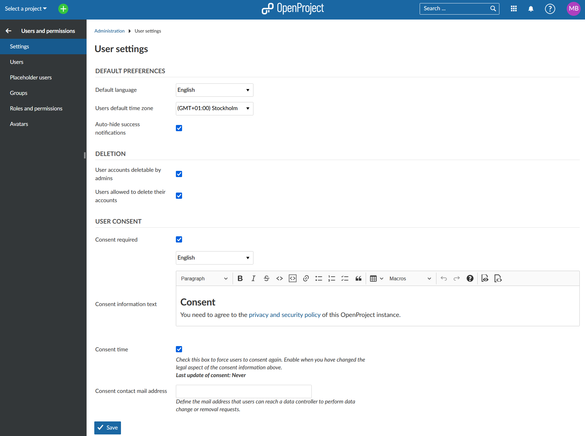
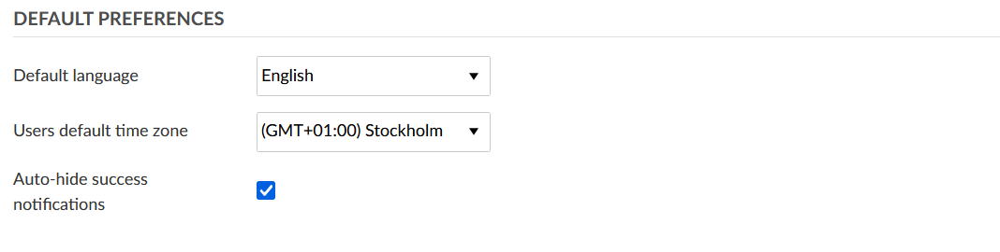
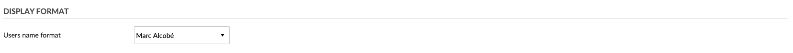
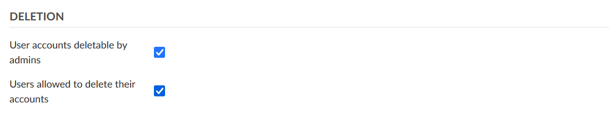
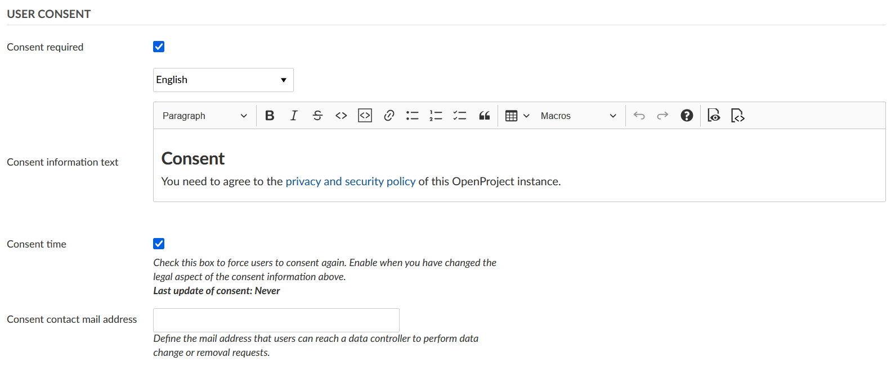

---
sidebar_navigation:
  title: User settings
  priority: 999
description: Configure user settings in OpenProject.
keywords: user settings
---

# User settings

The user settings sections covers general settings, such as the default language, user deletion and user consent.

User settings are accessible by administrators from the OpenProject **Administration**.

| Topic                                       | Content                    |
| ------------------------------------------- | -------------------------- |
| [Default preferences](#default-preferences) | User default preferences.  |
| [Display format](#display-format)           | Users name format.         |
| [User deletion](#user-deletion)             | Who can delete users.      |
| [User consent](#user-consent)               | User privacy and security. |

## Default preferences

The **Default preferences** section covers default user settings.

Here, you can specify the default language for new users as well as the default time zone.

The default language is displayed for users when they first sign into OpenProject. They can then choose a different language.

You can also choose if success notifications (e.g. on the work package page) should be hidden automatically.

These settings can be changed by users in their **My Account** page later on.

## Display format

The **Display format** section covers how users name format should be displayed.

## User deletion

In the **User deletion** section you can determine who should be able to delete user accounts.

By default, only admins are able to delete accounts. If this option is activated, admins can navigate to the user list, select a user account and click on the **Delete** option on the upper right side to delete an account.

Additionally, you can select the option **Users allowed to delete their accounts**. If this option is activated, users can delete their own user accounts from the **My account** page.

If you want to prevent users from deleting their own accounts, it is recommended to deactivate this option.

## User consent

Data privacy and security is a priority in OpenProject. In order to comply with GDPR regulation, a consent form can be configured in OpenProject. When the option **Consent required** is checked, a user consent form is shown for users when they sign into OpenProject for the first time.

By default, OpenProject's privacy and security policy is referenced in the consent form. If you have any additional information you would like your users to consent to, you can link it in the **Consent information text** section.

Furthermore, you can provide the email address of a consent contact. This user can then be notified when a data change or data removal is required.
