---
sidebar_navigation:
  title: User attributes
  priority: 979
description: How to create and manage user attributes in OpenProject.
keywords: user attributes, user custom field
---

# User attributes

**User attributes** in OpenProject allow administrators to extend user profiles with additional information, such as job titles, skills, certifications or spoken languages. These attributes can be displayed on user profiles and on user cards in the [Resource management module](../../../user-guide/resource-management).

## View user attributes

To view all existing user attributes, navigate to **Administration settings → Users and permissions→ User attributes**.

From this page you can:
- create and manage custom user attributes
- group attributes into sections
- choose which attributes are displayed on user cards

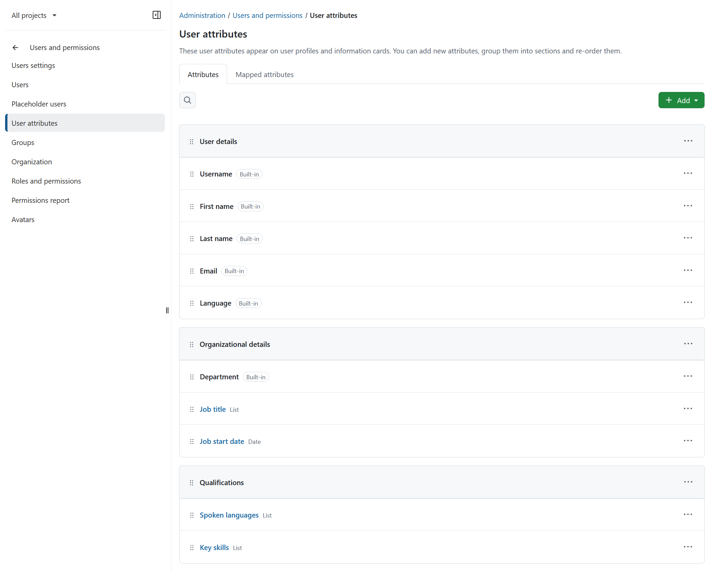

User attributes are grouped into two tabs: [Attributes](#attributes) and [Mapped attributes](#mapped-attributes). 

## Attributes

The **Attributes** tab lists all configured user attributes. User attributes are organized into [sections](#sections). Each attribute row contains:

1. Drag handle 
2. User attribute name 
3. Format 
4. **More (...)** menu icon

### Sections

To add a section:

1. Click **+ Add** in the top right corner. 
2. Select **Section**.

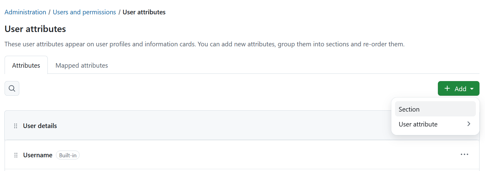

Name the section and save it. 

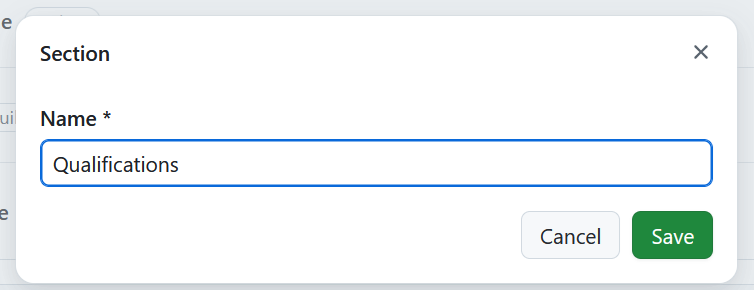 

Use the **More** menu on the right side of the section header to rename, delete, or reorder a section.

> [!TIP]
> A section can only be deleted if it contains no attributes.

Attributes can be dragged between sections. Entire sections can be reordered via drag and drop. Use the drag and drop handle to the left of the section name.

> [!TIP]
> Attributes always appear in the section they are assigned to across _all_ user profiles.

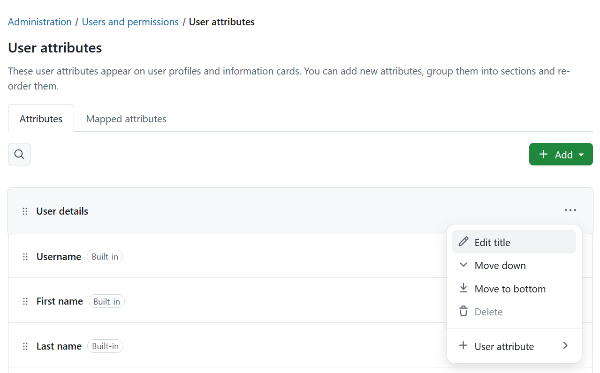

### Attribute types

OpenProject provides built-in and custom user attributes.

Built-in attributes include:
- Username
- First name
- Last name
- Email
- Language
- Department

You can also create any number of custom user attributes, for example:
- Job title
- Spoken languages
- Key skills
- Job start date

Select the **More (...)** menu to manage an attribute.

Built-in attributes can only be moved within the list (up, down, to top or to bottom). Custom attributes can additionally be edited and deleted. 
> [!NOTE]
> Built-in user attributes cannot be deleted.

### Create a user attribute

To create a new user attribute, click on the **+ Add** button in the top right corner, select **User attribute** and select the user attribute format from the list of available options. 

> [!IMPORTANT]
> You cannot change the user attribute format once the user attribute is created.

You can pick from multiple [user attribute formats](#user-attribute-formats). Depending on the chosen format, you can define additional parameters, such as minimum and maximum width, default value or regular expressions for validation.

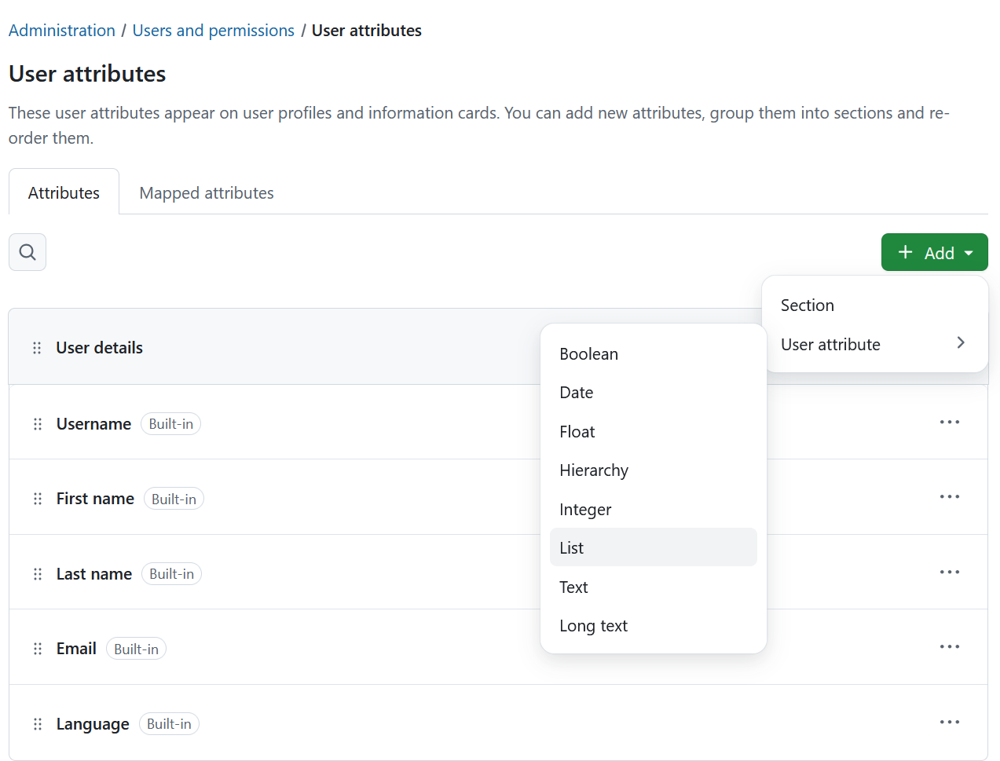

The following example shows a user attribute with the **List** format.

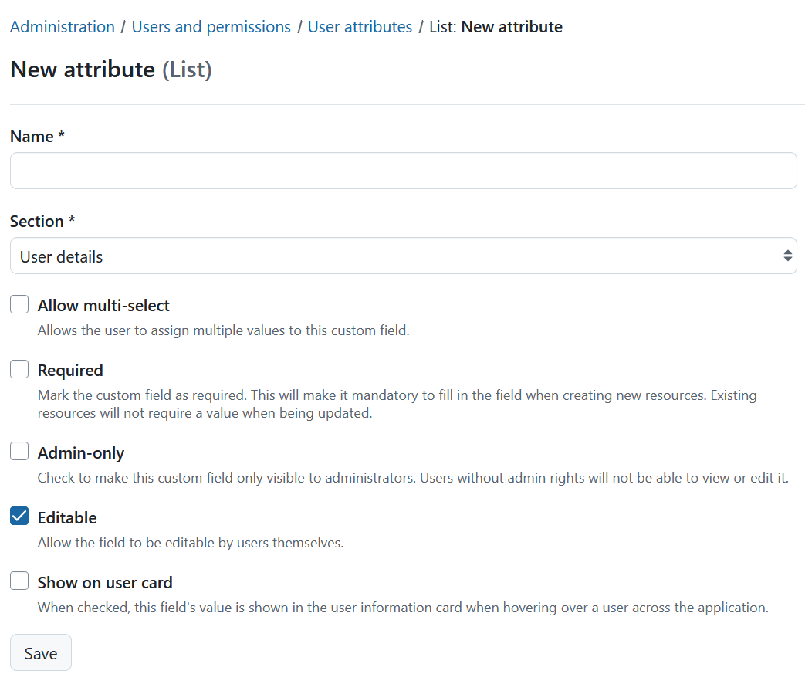

- **Name**: The name displayed for the user attribute on user profiles and wherever the attribute is shown. 
- **Section**: If sections have been created, you can choose which section the user attribute belongs to. See [Sections](#sections) for more information. 
- **Allow multi-select**: Allows the user to assign multiple values to this custom field. 
- **Required**: Checking this enables this user attribute and makes it required for all users. It cannot be deactivated at a user level. Existing users will not require a value when being updated.

  > [!IMPORTANT]
  > User attribute of type **Boolean** can **NOT** be set to be required. 

- **Admin-only**: If you enable this, the user attribute will only be visible to administrators. All other users will not see it.
- **Editable**: Allows users to edit the attribute themselves.
- **Show on user card**: Displays the attribute on user information cards throughout the application, including the Resource management module.

Once you create a user attribute, you can [define help text](#define-user-attribute-help-text) and the list items.

### User attribute formats
There are multiple format options for user attributes in OpenProject. You can select one of the following formats:

- **Boolean** - creates a user attribute, that is either true or false. It is represented by a checkbox that can be checked or unchecked. 
- **Date** - creates a user attribute, which allows selecting dates from a date picker.
- **Float** - creates a user attribute for rational numbers.
- **Hierarchy (Enterprise add-on)** -  creates a user attribute, which allows selecting one or multiple items from a hierarchical list structure. The structure can be created in the _Items_ tab of the user attribute after the creation.
- **Integer** - creates a user attribute for integers.
- **List** - creates a user attribute with flat list options. 
- **Text** - creates a user attribute in text format with the specified length restrictions.
- **Long text** - creates a user attribute for cases where longer text needs to be entered.

#### Hierarchy user attribute (Enterprise add-on)

[feature: custom_field_hierarchies ]

User attributes of the **Hierarchy** type function in the same way as work package custom fields of the **Hierarchy** type. For detailed information, please refer to [Work package custom fields documentation](../../custom-fields/#hierarchy-custom-field-enterprise-add-on).

### Edit a user attribute

To edit a custom user attribute:

1. Select the **More (...) ** menu.
2. Select **Edit**.

Update the attribute settings as required.

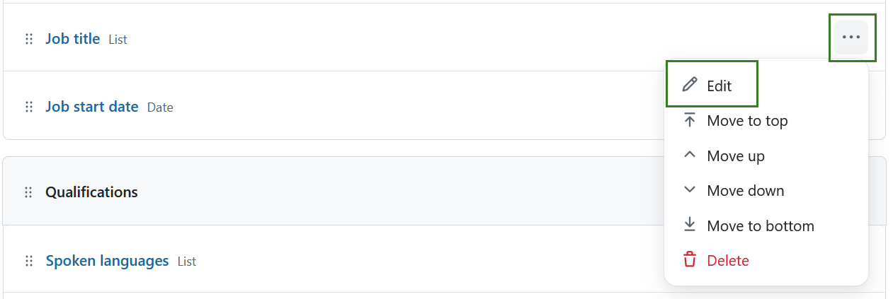

### Reorder user attributes

User attributes appear in the order configured on this page.

To change the order, select the **More (...) ** menu next to an attribute and choose:

- Move to top
- Move up
- Move down
- Move to bottom

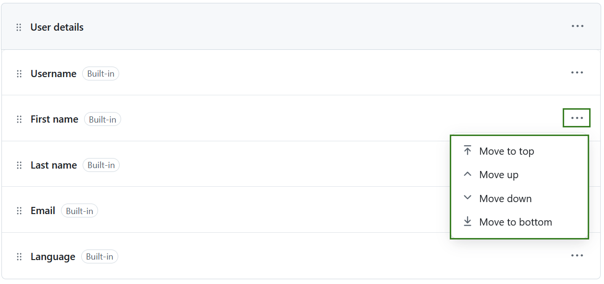

### Define user attribute help text

To define a field caption and help text, click on a user attribute and navigate to the **Help text** tab. Here you can define the following:

- **Caption** - a short text that will be displayed as user attribute caption to provide context.
- **Help text** - a longer text that will be shown when someone hovers over a question mark next to the user attribute name. Here you can provide more detailed explanation. This is a required field.
- **Attachments** - attach files or images to illustrate a user attribute. 

> [!IMPORTANT]
> Any text and attachments added here are visible to all logged-in users.

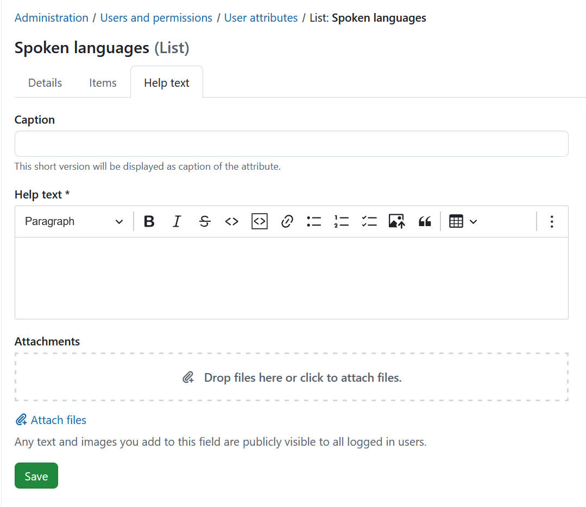

### Delete a user attribute

Only custom user attributes can be deleted.

To delete a user attribute:

1. Select the **More** menu (...).
2. Select **Delete**.
3. Confirm the deletion.

Deleting a user attribute permanently removes it from all user profiles.

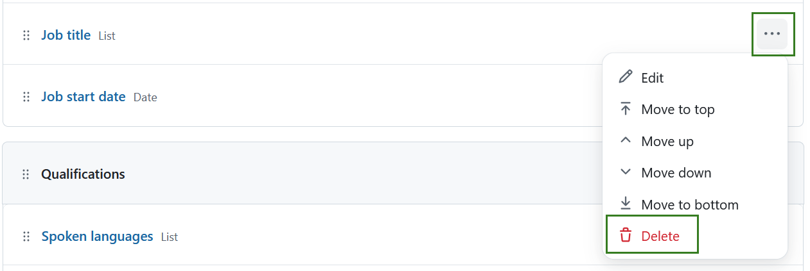

## Mapped attributes

The **Mapped attributes** tab lets you assign specific purposes to custom user attributes. Each purpose can be assigned to only one user attribute, and each user attribute can be mapped to only one purpose.

Currently, OpenProject supports the following mapped attribute:

| Purpose | Description |
| --- | --- |
| **Job title** | Displays each user's job title next to their name in several places, such as user cards. |

To map a user attribute:

1. Open the **Mapped attributes** tab.
2. Select a custom user attribute from the **Job title** drop-down list.
3. Select **Save**.

> [!NOTE]
> Only custom user attributes can be mapped. Built-in attributes are not available for selection.

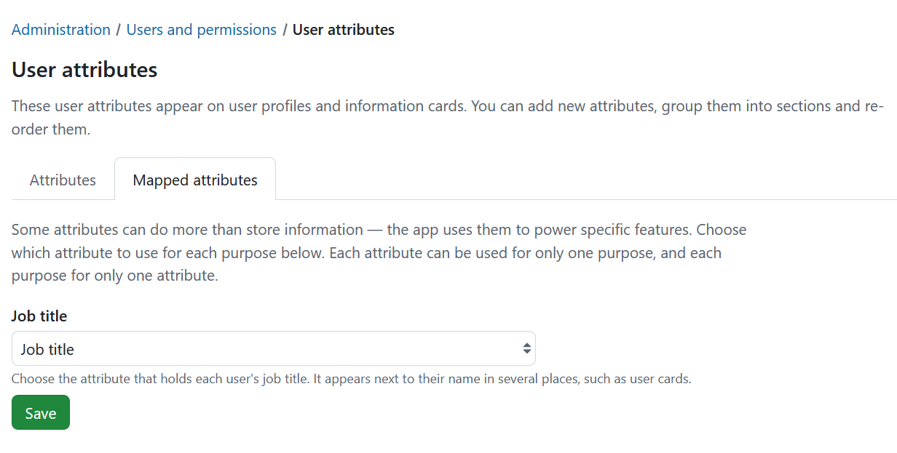
