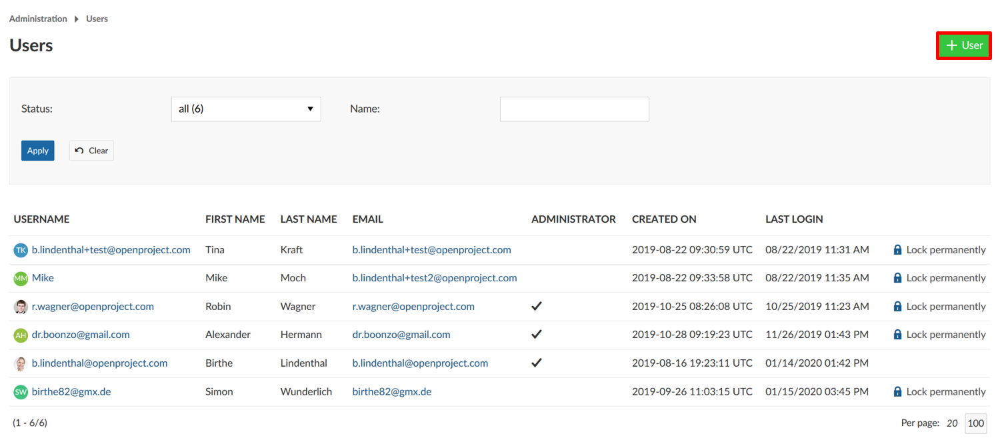
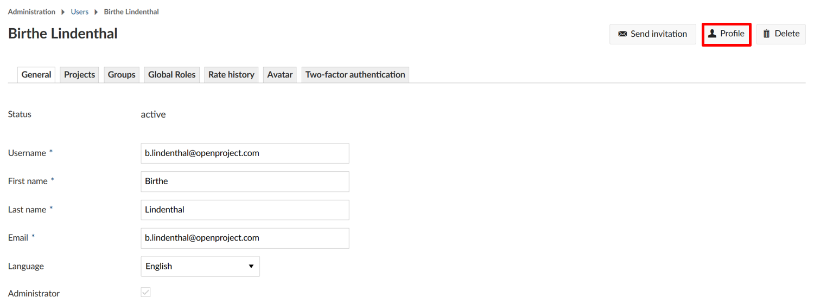
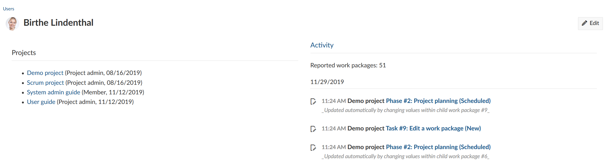
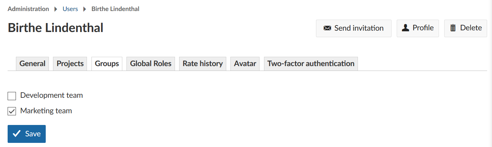

---
sidebar_navigation:
  title: Manage users
  priority: 990
description: Manage users in OpenProject.
robots: index, follow
keywords: manage users, lock, unlock, invite, language
---

# Manage Users

The users list provides an overview of all users in OpenProject. You can create new users, make changes to existing user accounts, block or delete users from the system. The number of users for your subscription is thus not bound to names. For example, if you block a user you can add a new one without upgrading.

**User** is defined as a person (described by an identifier) who uses OpenProject. New users can be created in the admin settings. Users can become project members by assigning them a role and adding them via the project settings.

| Topic                                           | Content                                                      |
| ----------------------------------------------- | ------------------------------------------------------------ |
| [User list](#user-list)                         | Manage all users in OpenProject.                             |
| [Lock and unlock users](#lock-and-unlock-users) | Block a user permanently in the system or unlock a user.     |
| [Filter users](#filter-users)                   | Filter users in the list.                                    |
| [Invite new users](#invite-new-users)           | Add new users to your OpenProject and invite them via email. Resend and delete user invitations. |
| [Manage user settings](#manage-user-settings)   | Manage user settings, e.g. language, projects, groups, global roles, rate history, avatar, two-factor authentication. |
| [Delete users](#delete-users)                   | Delete a user from the system.                               |

## User list

You will see the list of all users in your OpenProject with detailed information, such as user name, first name, last name, e-mail address.

You will also see if a user is an Administrator in the system.

Also, you get the information when the user has been created, and when the user had his last login.

## Lock and unlock users

If you want to **block users permanently** in the system, you can click the **Lock permanently** link next to a user.

If you are using [Enterprise cloud](../../../cloud-edition-guide) or [Enterprise on-premises](../../../enterprise-edition-guide) you will then have a new user available to add to the system within your booked plan.

**Note**: The previous activities from these locked users will still be displayed in the system.

The way to unlock users is basically the same. Use the **Unlock** link at the right. 
Here you can also **unlock users who have been locked temporarily due to multiple failed login attempts**. 

## Filter users

Especially if you have a very long user list, it is essential to filter in this list.

At the top of the list, you can choose to filter for all, active, or locked users.
You can then search for the name or email of a user. Click the blue **Apply** button to filter the list.

## Invite new users

To invite new users to your system, click the green **+ User** button at the top right.

Enter the Email address, first name, and last name of the new user. Check whether the new user should get system administration rights.

Click the blue **Create** button in order to invite the new user via email.

The **Create and continue** button will bring you to the form to add another new user.

### Resend user invitation via email

If a user did not receive the email invitation, you can send the invitation to the user again if needed. In the user list, click on the user name to whom you want to resend the email with the invitation link to the system.

In the top right, click the **Send invitation** button in order to send the email once again.

### Delete user invitations
To invalidate or revoke a user's invitation click on the user name and then on **Delete** in the upper right corner. This will prevent the invited user from logging in.
Please note: This only works for users who haven't logged in yet. If the user is already active this will delete his/her whole profile and account. Deleting users can't be easily revoked.

## View user profile

If you want to see the user profile, click on the user name in the user list to display the activities across all projects from a certain user. Click the **Profile** button on the top right of a user.

You will see all the Activities across all projects from this user, as well as the amount of reported work packages in the system.

## Manage user settings

### General settings

You can manage individual user settings if you click on the user name in the list. The settings will overwrite the individual user settings set in the [My Account settings](../../../getting-started/my-account/).

(1) Change username, first name, last name, email address or language. Activate or deactivate **Administrator** permission.

(2) See user based custom fields.

(3) Display last given [user consent](../settings/#user-consent).

(4) Display **authentication provider**.

(5) Change e-mail **notification** settings.

(6) Set **preferences** for time zone and display of comments.

(7) Do not forget to **Save** your changes.

### Add users to a project

In order to see and work in a project, a user has to be a member of a project and needs to be added with a certain role to this project.

On the **Projects** tab, select the new project from the drop-down list, choose a **role** for this project and click the blue **Add** button.

### Add users to groups

In order to add a user to a group, at least [one group needs to be created](../groups) in the system.

Select or de-select the groups a user should be a member of. Click the blue **Save** button.

## Delete users

In order to delete users from the system, open the [user list](#user-list).

Click on the **user name** of the user which you want to delete.

To delete a user permanently from the system, press the **Delete** button at the top right.

You will then be asked to type in the user's email address in order to delete the user permanently from the system.

**Note**: Deleting a user account is an irreversible action and cannot easily be restored via the frontend.

