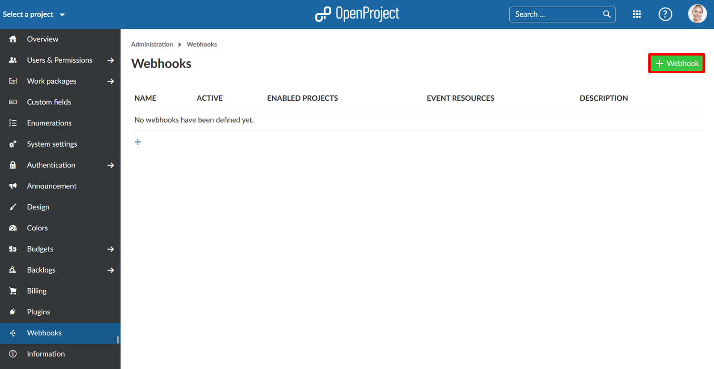
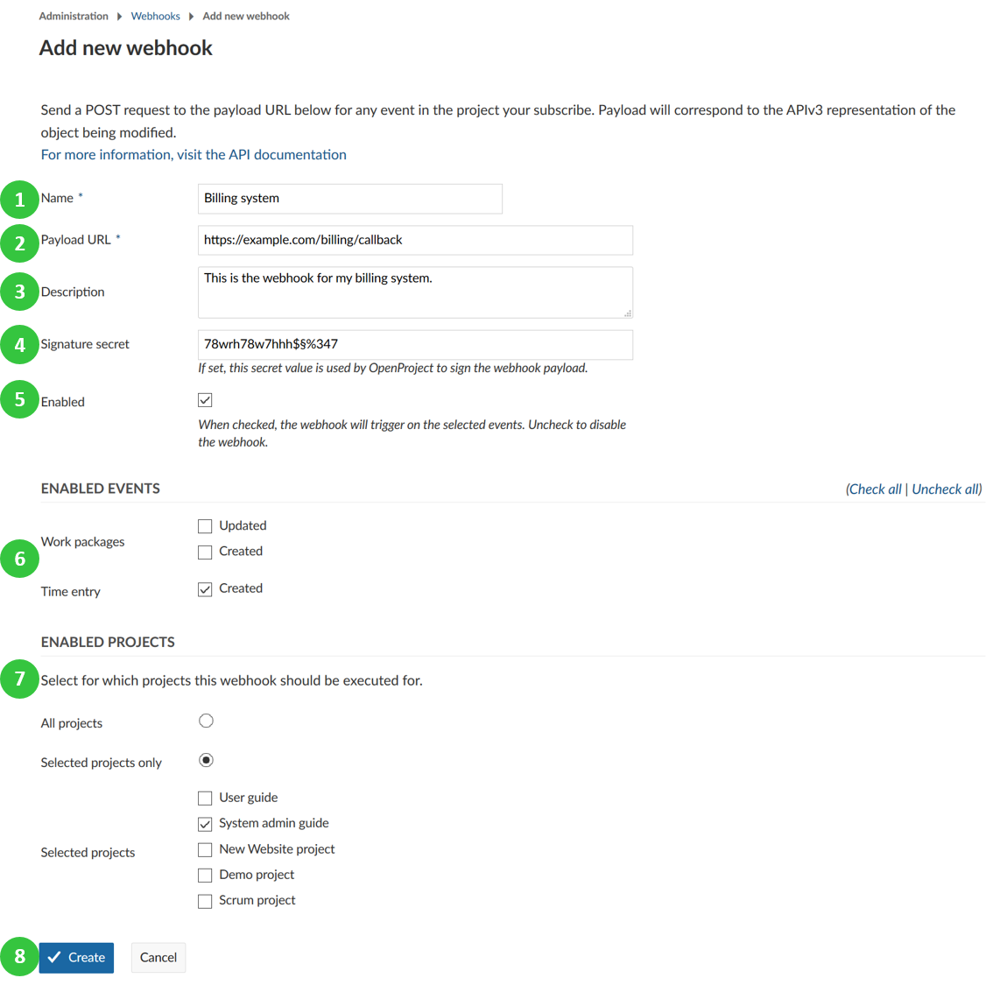

---
sidebar_navigation:
  title: Webhooks
  priority: 600
description: Configure webhooks in OpenProject.
robots: index, follow
keywords: webhooks
---
# Webhooks

You can set up webhooks for OpenProject in order to integrate OpenProject with other applications. A scenario is for example to signal the creation of a time log in OpenProject to a billing application.

Navigate to -> *Administration* -> *Webhooks* to set up your webhooks in OpenProject.

Press the green **+ Webhook** button to add a new webhook to OpenProject.

You can configure the following options for webhooks:

1. Choose a **name** identifying the webhook.
2. **Payload URL** defines the endpoint, called when the webhook is triggered.
3. Freely choose an additonal **description** to further identify the intent of the respective webhook.
4. By defining a **Siganture secret** you guarantee that the sender of the payload request is actually OpenProject. The client will then check this signature secret.
5. Enable if the webhook should be active.
6. Set the events for which the webhook should be activate, i.e. webhook for updating or creating work packages, or for creating time entries.
7. **Select for which projects the webhook should be active**. You can choose all projects or only specific projects. For example if you select the project "System admin guide", an event (ie. create a new time entry) will be fired via the webhook. This will only happen if a user logs time within the selected projects.
8. Press the blue **Create** button to save your changes.

