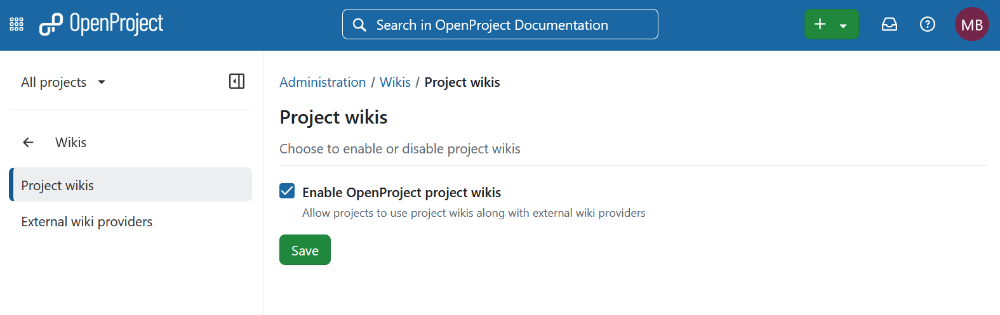

---
sidebar_navigation:
  title: Wikis
  priority: 835
description: Wiki providers in OpenProject.
keywords: wikis, xwiki, wiki integration, wiki provider, project wikis
---

# Wikis

Under **Administration → Wikis** you can configure the wiki providers that OpenProject uses when linking to or creating wiki pages from work packages.

OpenProject supports two types of wiki providers:

- **Project wikis**: the built-in OpenProject wiki as a wiki provider.
- **External wikis**: third-party wiki systems, such as XWiki.

Wiki providers are configured globally and are available to all projects. Each provider may expose one or more wikis, depending on configuration.

## Project wikis

The **Project wikis** setting enables the built-in OpenProject wiki as a **wiki provider** for the wiki integration used in work packages.

When project wikis are enabled:

- The OpenProject wiki is available as a wiki provider when linking to or creating wiki pages from a work package.
- Each project's existing wiki can be selected through this integration.

When project wikis are disabled:

- The OpenProject wiki is no longer available as a wiki provider for work packages.
- Existing project wikis remain available through the project's **Wiki** module, provided that module is enabled.

Permissions for pages accessed through project wikis are determined by the user's role in the corresponding project.



### Configuration using environment variables

Project wikis can also be configured using environment variables, if this better suits your deployment scenario.

It is configured via a JSON object passed to `OPENPROJECT_INTERNAL__WIKI__PROVIDER`. At the moment there is only one option that can be configured:

- `enabled`: A boolean indicating, whether project wikis should be enabled or not

This example shows how to disable it:

```
{ "enabled": false }
```

## External wikis

Under [External wiki providers](./wiki-providers) you can configure external wiki providers. External wiki providers manage their own user permissions, so each OpenProject user must be connected to a corresponding user account on the external wiki instance.

To learn how to link a wiki page to a work package or create a new one, refer to [this user guide](../../user-guide/work-packages/edit-work-package#link-to-or-create-a-wiki-page).
