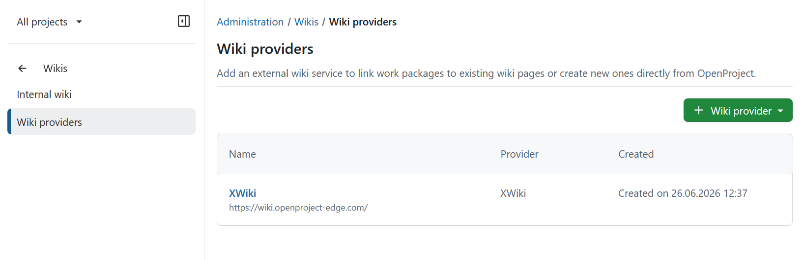

---
sidebar_navigation:
  title: External wiki providers
  priority: 100
description: External wiki providers for OpenProject
keywords: wikis, xwiki, wiki integration, wiki provider, external wiki
---

# External wiki providers

OpenProject lets you connect external wiki providers to your instance, making wiki content available throughout
OpenProject.

To manage external wiki providers, navigate to **Administration → Wikis → External wiki providers**. This page lists
all configured providers. Click **+ Wiki provider** to add a new provider from the list of supported options.

Once configured, a wiki provider is available across your entire OpenProject instance.

| Topic                                                | Description                                                 |
|------------------------------------------------------|:------------------------------------------------------------|
| [XWiki](#xwiki)                                      | Overview of the XWiki integration                           |
| [Set up an XWiki provider](../../integrations/xwiki) | Configure an XWiki provider and authentication              |
| [Delete a wiki provider](#delete-a-wiki-provider)    | Remove a configured wiki provider and understand the impact |

## XWiki

[feature: xwiki_integration ]

OpenProject offers an integration with XWiki to allow users to:

- Link and create XWiki pages inside rich text areas
- Link and create XWiki pages as relations to work packages
- Link work packages as project management relations to an XWiki page
- Link and create work packages from inside XWiki page content

For detailed setup instructions, see the [XWiki integration setup guide](../../integrations/xwiki).

## Delete a wiki provider

You can delete a wiki provider by clicking on the provider's name in the list. This will open the details page of the
provider. There you can click the **Delete** button in the top right corner.

> [!IMPORTANT]
> Deleting a wiki provider will remove all wiki page links created as relation for a work package. In addition, all wiki
> page links that are mentioned in rich text areas will show an error, as OpenProject will no longer be able to fetch
> information about the linked wiki page.
