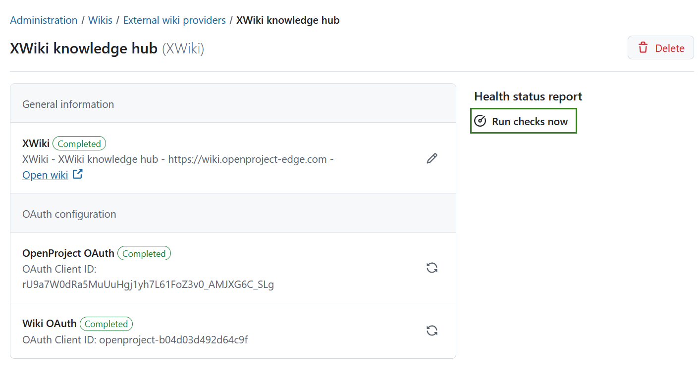
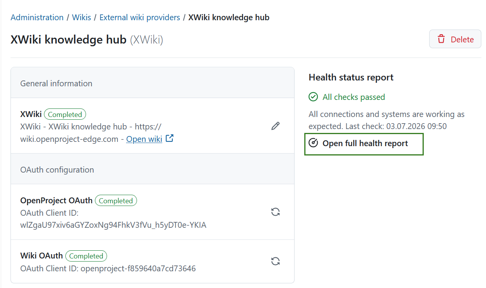
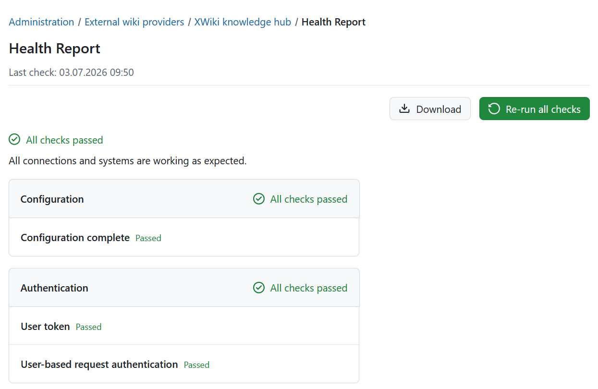

---
sidebar_navigation:
  title: Health status / Troubleshooting
  priority: 999
description: Health status checks and troubleshooting for wiki providers in OpenProject.
keywords: wiki, wiki providers, health, health status, error, troubleshooting, XWiki, Connection validation, Connection test
---

# Health status checks and troubleshooting

If a wiki provider is not working as expected, you can find additional information about possible errors in the details view of the wiki provider. You can access this view by clicking on the wiki provider's name in the list under _Administration_ → _Wikis_ → _External wiki providers_. There, administrators can manually trigger a connection validation and receive a health status report.

## Connection validation

Every wiki provider is able to run connection checks. This test is triggered manually by clicking on **Run checks now** in the sidebar on the right side of the wiki provider's details view.

Once the check is finished, a full health report will be generated and a brief summary will be displayed. Click **Open full health report** to see the report in full detail and to download it.

The full health status report will give an overview of all checks that were performed grouped into two categories:

- Basic configuration
- Authentication

In the top right corner you can **Re-run all checks** or **Download** the health report in a text format by clicking the
respective buttons.

> [!TIP]
> If you’re experiencing issues with the wiki provider, please download the **health status report** and include it in your support request. This will help us diagnose the problem more efficiently.

### Error codes

There are several possible errors that can occur during the connection test. While some errors can occur for all types of wiki providers, most errors are quite specific for the provider type. The following table lists the error codes that can happen for all wiki providers.

| Error code         | Error description                         | Possible reasons                                                            | Next steps and solutions                                                                                                                 |
|--------------------|-------------------------------------------|-----------------------------------------------------------------------------|------------------------------------------------------------------------------------------------------------------------------------------|
| ERR_NOT_CONFIGURED | The wiki provider is not fully configured. | Important data is missing, so the wiki provider is labelled incomplete. | Check the input fields and fill in the missing data.                                                                                     |
| WRN_UID_MISMATCH   | The universal identifier of the provider does not match the one initially stored for it. | The URL might have changed to point to another wiki instance or the wiki provider was reinstalled from scratch. | If you accidentally switched the URL from one instance to another, switch it back. If you intended to point to a new instance, create a new wiki provider instead. |
| ERR_UNKNOWN_ERROR  | An unknown error occurred.                | There can be multiple reasons, and the error source was not anticipated.        | Errors of this kind are logged to the server logs. Look for a log entry starting with `Connection validation failed with unknown error:` |

### Error codes specific to XWiki

| Error code         | Error description                         | Possible reasons                                                            | Next steps and solutions                                                                                                                 |
|--------------------|-------------------------------------------|-----------------------------------------------------------------------------|------------------------------------------------------------------------------------------------------------------------------------------|
| WRN_XWIKI_OAUTH_TOKEN_MISSING | The user performing the self-test has no authentication token. | The user probably never did a successful login from OpenProject to XWiki, or the token was deleted from the account details. | On the provider edit page, click the "Connect … account" button at the top of the page to connect your OpenProject and XWiki accounts. |
| ERR_XWIKI_OAUTH_CONNECTION_ERROR | OpenProject could not establish a network connection to the wiki provider. | Either the wiki provider is offline or a firewall or network outage between OpenProject and the wiki provider prevents communication. | Check network-level connectivity between OpenProject and the wiki provider. |
| ERR_XWIKI_OAUTH_UNAUTHORIZED | The token of the user performing the self-test is invalid. | The token of the user could not be used for accessing the wiki provider, or refreshing it failed. Or the wrong authenticator is configured in XWiki. | Remove the user token from **Account settings → Access tokens** of this wiki provider and redo the login. Also confirm that the "Token based authenticator" is configured in XWiki under **Administration → Authentication**. |
| ERR_XWIKI_OAUTH_REQUEST_ERROR | The response from the wiki provider was unexpected. | Network connectivity was achieved, but the wiki provider responded in an unexpected way. This can happen if a proxy or middleware intercepts responses, or due to incompatibility between OpenProject and XWiki. | Make sure that XWiki is properly reachable under the given URL. |

If the suggested troubleshooting solutions did not resolve your issue, please reach out to the [OpenProject community](https://community.openproject.org/projects/openproject/forums) or [support team](https://www.openproject.org/contact/) for further assistance.
