---
sidebar_navigation:
  title: Portfolio Management and Custom Reporting
  priority: 950
description: Step-by-step instruction about portfolio management and custom reporting
keywords: use-case, portfolio management
---

# Use Case: Portfolio management and custom reporting options

If you have a lot of projects running at the same time it can be helpful and even necessary to have a meta level overview of your projects, keep track of the project status and due dates. With OpenProject you can do just that.

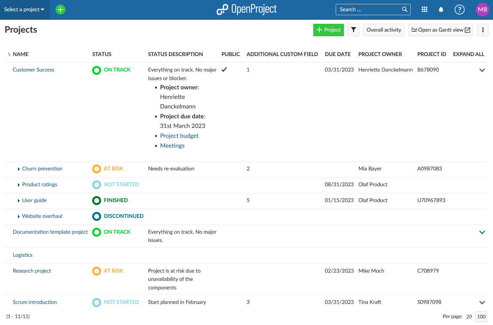

## Creating projects overview

Step 1: To view all projects, first select the **Select a project** dropdown menu, then click on the **Projects list** button.

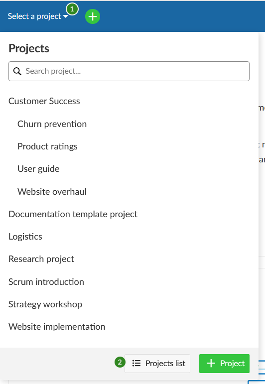

Step 2: You will get a list of all the projects that exist in your organization. You can filter the list by various project attributes, such as **project owner** or **creation date**. You can also use project custom fields as filters (please keep in mind that this is an enterprise add-on).  If you have not added any custom fields yet, please see [here](../../system-admin-guide/custom-fields/) how to do it.

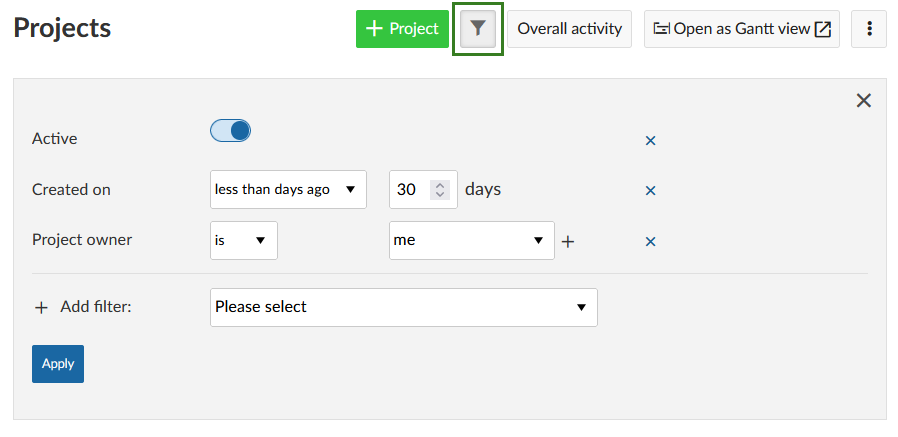

You can then sort the project list by clicking on a column heading, for example by project status.

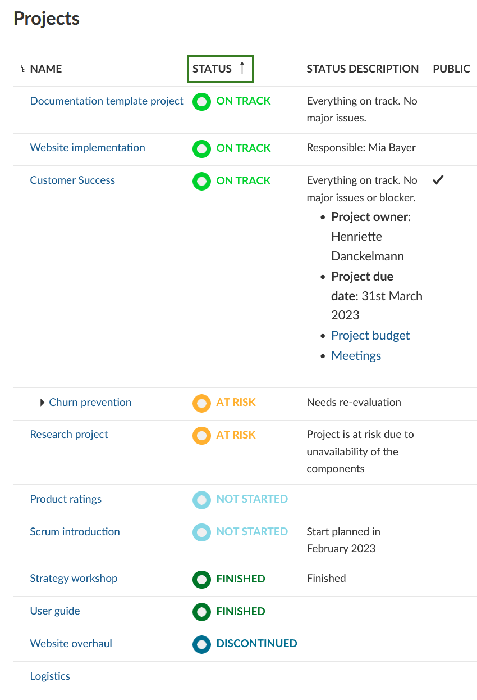

You can add a visual component to the overview by clicking on the **Open as Gantt view** button.

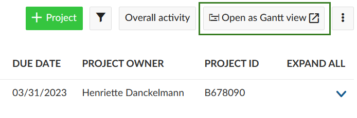

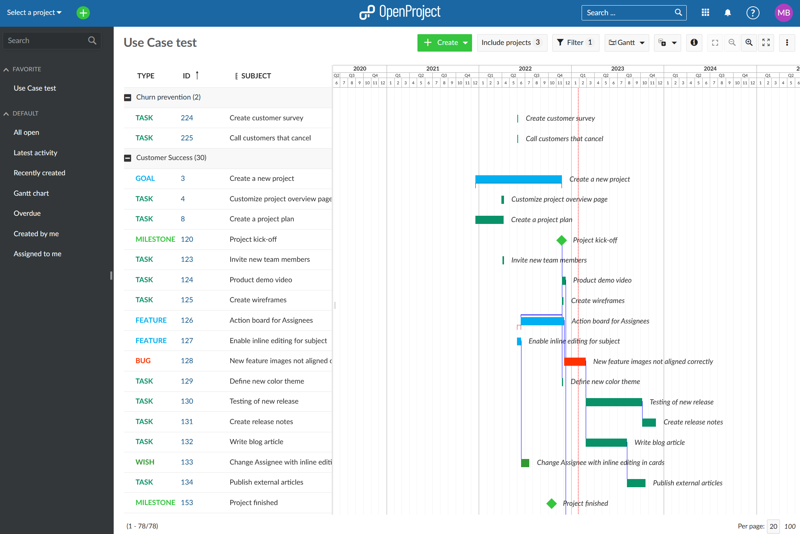

Step 3: You can also configure this view using the button with the three dots at the upper right corner and select **Configure**.

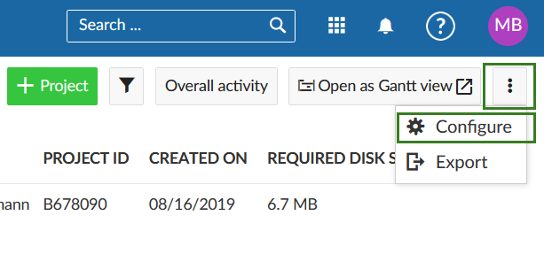

You will then be led to the **System settings** of the global Administration. If you scroll down the page, you can select which columns are to be displayed in the project list in the section **Settings for project overview list** (you will need to scroll down the page). Please save your changes via the blue **Save** button, at the bottom of the page.

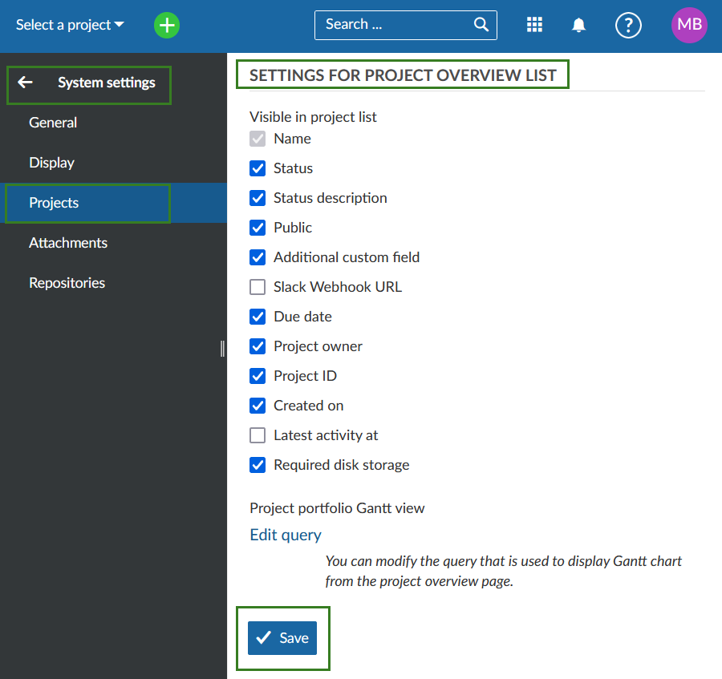

If you click on **Edit query** you can adjust the project overview when using the Gantt chart option.

## Creating custom reports

### Exporting reports

For creating custom project reports you can use the export function in the work packages view.

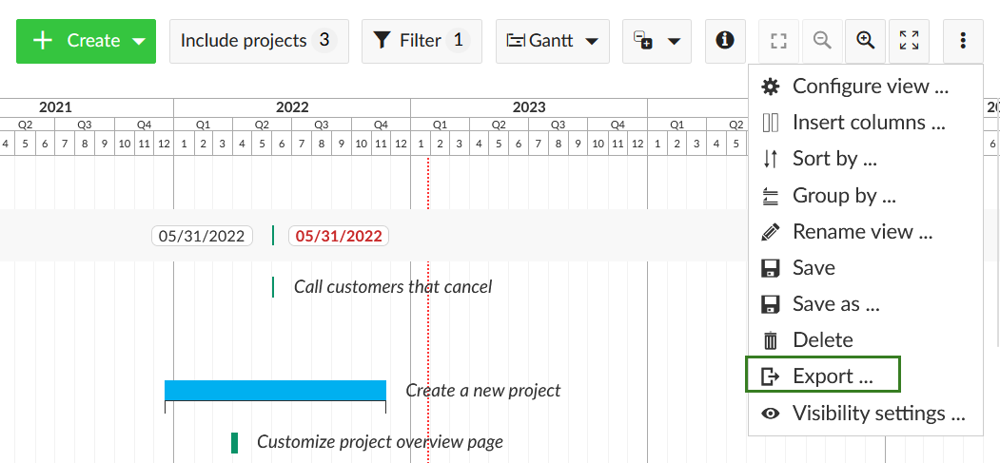

You can export the work packages in one of the following formats.

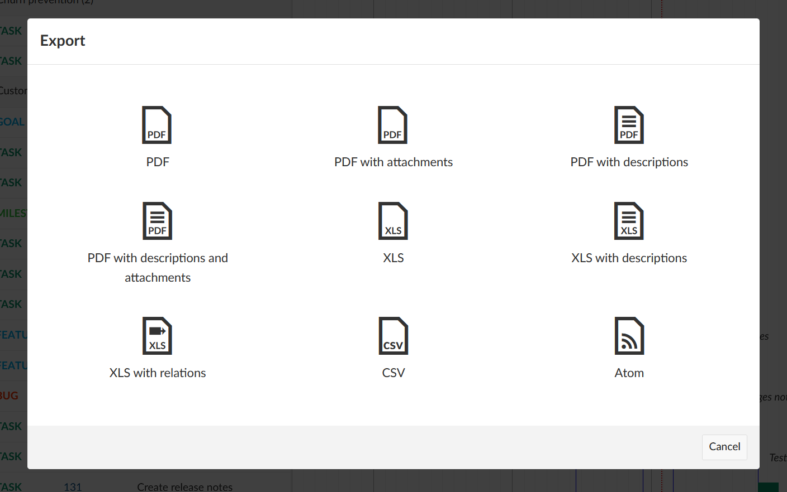

To export or print a Gantt chart use the print function (**CTRL+P**) and then save it as PDF. Only information displayed in the main screen area is included. None of the designs or side or top menus are in it. Please see here [how to print a Gantt chart in OpenProject](../../user-guide/gantt-chart/#how-to-print-a-gantt-chart).

### Project status reporting

You can [display and configure the individual project status](../../user-guide/projects/project-status/) on the project overview page.

For more advanced project reporting requirements, using the Wiki module is another powerful tool. The Wiki allows you to build complete custom reports using embedded work package tables, macros and even embedded calculations.

Here is an example of how a project report wiki could look:

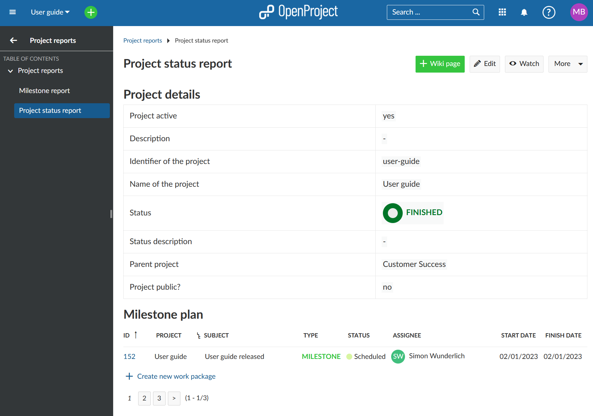

And how the dynamic data, such as calculations, filters, macros and reference language work behind the scenes:

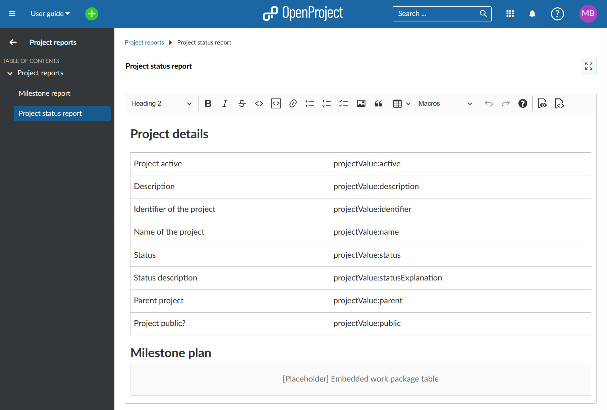

For more information about the syntax and how the attributes work please look [here](../../user-guide/wysiwyg/).

If you want to work with multiple Wiki-based reports, you can create a parent Wiki page as a table of contents, for example, on which all the other reports are listed.

See more info on Wiki and the use of Macros [here](../../user-guide/wiki/).
