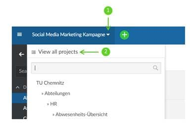
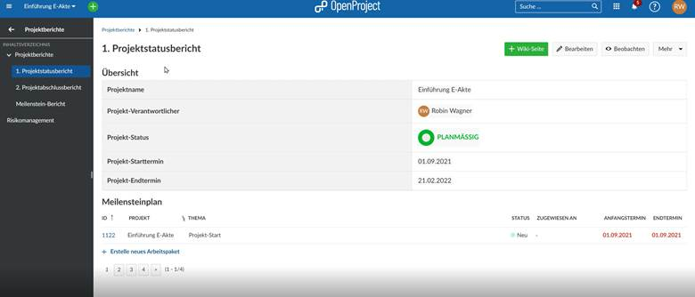
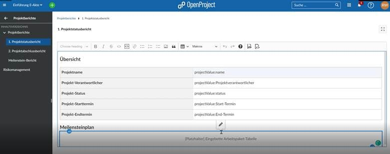

---
sidebar_navigation:
  title: Portfolio Management and Custom Reporting
  priority: 900
description: Step-by-step instruction about portfolio management and custom reporting
robots: index, follow
keywords: use-case, portfolio management
---

# Use Case: Portfolio Management and Custom Reporting Options

Step 1: To view all projects, first select the *project chooser drop-down*, the chose *View all projects*

Step 2: You can sort and filter this view using custom fields, such as *Initiative* or *Status.* If you have not added useful custom fields, please see [here](../../system-admin-guide/custom-fields/).

Step 3: Press the **floppy disk icon** to save and name your view once you are happy with the information that is displayed. You can also add this view as a favorite to the black bar on the left.

## Creating Custom Reports

You can create advanced project reports by using the same techniques and the print function (**CTRL+P**), then saving as PDF, for example. The print function in OpenProject is optimized for reporting purposes. Only information displayed in the main screen area is included. None of the designs or side or top menus are in it.

For more advanced requirements, using the Wiki is another powerful tool. For more information about how to use the Wiki function, please consult: [Wiki](../../user-guide/wiki/)

The Wiki function allows you to build complete custom reports using embedded work package tables, macros and even embedded calculations.

Here is an example of how a wiki could look:

And how the dynamic data, such as calculations, filters, macros and reference language work behind the scenes:

For more information about the syntax and how the attributes work [here](../../user-guide/wysiwyg/).

If you like to work with multiple Wiki-based reports, you can create an umbrella Wiki page as a table of content, for example, on which all the other reports are listed. See more info on Wiki and the use of Macros [here](../../user-guide/wiki/).
